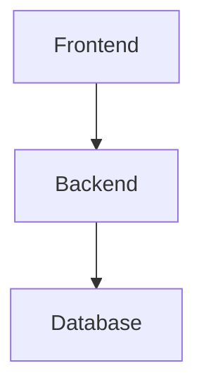

# 🎨 Script Node.js Moderne - Générateur d'Images Mermaid

## 📋 Vue d'ensemble

J'ai créé un script Node.js moderne complet pour automatiser la génération d'images à partir de vos diagrammes Mermaid. Ce script résout le problème de l'affichage des diagrammes Mermaid sur les profils GitHub.

## 🚀 Installation Rapide

### Windows
```bash
cd scripts
install.bat
```

### Linux/Mac
```bash
cd scripts
chmod +x install.sh
./install.sh
```

### Manuel
```bash
cd scripts
npm install
```

## 📁 Structure Créée

```
scripts/
├── generate-mermaid-images.js  # 🎯 Script principal
├── config.js                   # ⚙️ Gestionnaire de configuration
├── test.js                     # 🧪 Script de test
├── install.js                  # 📦 Installation automatique
├── install.bat                 # 🪟 Installation Windows
├── install.sh                  # 🐧 Installation Linux/Mac
├── package.json               # 📦 Dépendances et scripts
├── README.md                  # 📚 Documentation détaillée
└── .gitignore                # 🚫 Fichiers à ignorer

assets/
└── mermaid/                  # 🖼️ Images générées
    ├── *.png                 # Images PNG
    ├── *.svg                 # Images SVG
    └── generation-report.json # 📊 Rapport de génération
```

## 🎯 Utilisation

### 1. Génération des images
```bash
cd scripts
npm run generate
```

### 2. Test du système
```bash
npm run test
```

### 3. Configuration
```bash
node config.js theme dark
node config.js format svg
node config.js scale 3
```

## ✨ Fonctionnalités

### 🔍 Scan automatique
- Trouve tous les fichiers `.md` dans `docs/`
- Extrait automatiquement les blocs ````mermaid`
- Génère des noms de fichiers uniques

### 🖼️ Génération d'images
- **PNG** : Images haute résolution avec transparence
- **SVG** : Images vectorielles scalables
- **Thèmes** : default, dark, forest, neutral, base
- **Échelle** : 1x à 5x pour haute résolution

### 🔄 Remplacement automatique
- Remplace les blocs Mermaid par des images
- Génère des liens relatifs corrects
- Préserve le contenu existant

### 📊 Rapport détaillé
- Liste des fichiers traités
- Images générées avec tailles
- Configuration utilisée
- Timestamp de génération

## 🎨 Exemple de transformation

### Avant
````markdown

````

### Après
```markdown

```

## ⚙️ Configuration avancée

Le fichier `mermaid-config.json` permet de personnaliser :

```json
{
  "imageFormat": "png",        // Format de sortie
  "imageScale": 2,             // Échelle (haute résolution)
  "theme": "default",          // Thème Mermaid
  "backgroundColor": "white",    // Couleur de fond
  "width": 1200,               // Largeur de page
  "height": 800,                // Hauteur de page
  "quality": 90,                // Qualité PNG
  "customCSS": "",             // CSS personnalisé
  "mermaidConfig": {           // Configuration Mermaid
    "flowchart": {
      "useMaxWidth": true,
      "htmlLabels": true
    }
  }
}
```

## 🛠️ Scripts disponibles

```bash
# Génération
npm run generate          # Génère toutes les images
npm run generate:svg      # Force le format SVG
npm run generate:png      # Force le format PNG

# Test et configuration
npm run test             # Test complet du système
node config.js show      # Afficher la configuration
node config.js reset     # Réinitialiser la config

# Nettoyage
npm run clean           # Supprimer toutes les images
```

## 🚨 Résolution de problèmes

### Erreur Puppeteer sur Linux
```bash
sudo apt-get install -y gconf-service libasound2 libatk1.0-0 libc6 libcairo2 libcups2 libdbus-1-3 libexpat1 libfontconfig1 libgcc1 libgconf-2-4 libgdk-pixbuf2.0-0 libglib2.0-0 libgtk-3-0 libnspr4 libpango-1.0-0 libpangocairo-1.0-0 libstdc++6 libx11-6 libx11-xcb1 libxcb1 libxcomposite1 libxcursor1 libxdamage1 libxext6 libxfixes3 libxi6 libxrandr2 libxrender1 libxss1 libxtst6 ca-certificates fonts-liberation libappindicator1 libnss3 lsb-release xdg-utils wget
```

### Erreur de mémoire
```bash
node --max-old-space-size=4096 generate-mermaid-images.js
```

## 📈 Performance

- **Vitesse** : 2-5 secondes par diagramme
- **Mémoire** : 100-200MB par diagramme
- **Taille** : PNG ~50-200KB, SVG ~10-50KB
- **Qualité** : Images haute résolution et nettes

## 🎯 Avantages

### ✅ Pour votre profil GitHub
- Images statiques compatibles avec tous les navigateurs
- Chargement rapide et fiable
- Pas de dépendance externe
- Contrôle total sur l'apparence

### ✅ Pour votre documentation
- Diagrammes visuellement attrayants
- Cohérence visuelle
- Facile à maintenir
- Versioning des images

### ✅ Pour le développement
- Automatisation complète
- Configuration flexible
- Tests intégrés
- Rapports détaillés

## 🚀 Prochaines étapes

1. **Installer** : `cd scripts && npm install`
2. **Tester** : `npm run test`
3. **Configurer** : `node config.js theme dark`
4. **Générer** : `npm run generate`
5. **Vérifier** : Regarder les images dans `assets/mermaid/`

## 📞 Support

Le script inclut :
- Logs détaillés pour le debugging
- Rapport de génération complet
- Gestion d'erreurs robuste
- Tests automatiques

---

*Script créé avec Node.js moderne (ES Modules) et Puppeteer pour automatiser la génération d'images Mermaid*
