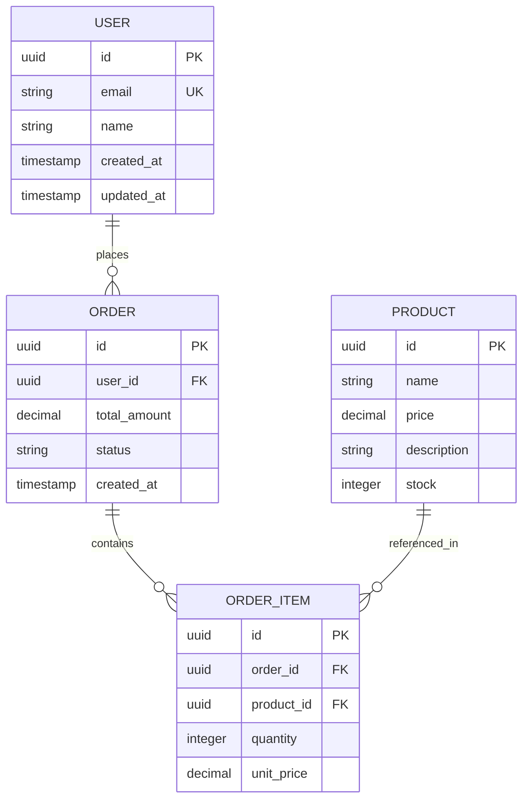

# 🗄️ Bases de Données - Documentation Complète

## 🏗️ Architecture des Bases de Données

## 📚 Documentation Disponible

### Bases de Données

- **[PostgreSQL](./postgresql.md)** - Guide complet PostgreSQL
- **[PostgreSQL Expert](./postgresql-expert.md)** - Guide expert PostgreSQL (extensions, performance, monitoring)
- **[MongoDB](./mongodb.md)** - Guide complet MongoDB
- **[MongoDB Expert](./mongodb-expert.md)** - Guide expert MongoDB (sharding, replication, performance)
- **[Prisma](./prisma.md)** - ORM Prisma

## 🎯 Niveaux de Documentation

### Niveau Débutant
- Types de données de base
- Requêtes SQL/NoSQL essentielles
- Opérations CRUD
- Index et contraintes

### Niveau Intermédiaire
- Requêtes complexes
- Jointures et agrégations
- Optimisation des performances
- Gestion des transactions

### Niveau Expert
- Extensions et plugins
- Sharding et réplication
- Monitoring et observabilité
- Backup et récupération
- Sécurité avancée

## 🚀 Technologies Couvertes

### PostgreSQL
- **Extensions** : PostGIS, pg_stat_statements, pg_cron
- **Performance** : Index avancés, requêtes optimisées
- **Monitoring** : Métriques système, alertes
- **Sécurité** : RLS, audit, chiffrement

### MongoDB
- **Sharding** : Configuration et gestion
- **Réplication** : Replica sets, élections
- **Performance** : Index, agrégation pipeline
- **Sécurité** : Authentification, autorisation

### Prisma
- **ORM** : Modèles, relations, migrations
- **Requêtes** : Query builder, agrégations
- **Performance** : Optimisation, cache
- **Déploiement** : Production, monitoring

## 📖 Comment Utiliser Cette Documentation

1. **Commencez par le guide de base** pour comprendre les concepts fondamentaux
2. **Passez au niveau expert** pour les fonctionnalités avancées
3. **Consultez les exemples pratiques** pour l'implémentation
4. **Suivez les bonnes pratiques** pour la production

## 🔧 Outils et Ressources

### Outils de Développement
- **pgAdmin** - Interface graphique PostgreSQL
- **MongoDB Compass** - Interface graphique MongoDB
- **Prisma Studio** - Interface graphique Prisma

### Outils de Monitoring
- **pg_stat_statements** - Statistiques des requêtes PostgreSQL
- **MongoDB Profiler** - Profiling des requêtes MongoDB
- **Prometheus** - Métriques et alertes

### Outils de Backup
- **pg_dump** - Sauvegarde PostgreSQL
- **mongodump** - Sauvegarde MongoDB
- **Prisma Migrate** - Migrations de schéma

## 🎓 Apprentissage Progressif

### Étape 1 : Fondamentaux
- Comprendre les types de données
- Maîtriser les requêtes de base
- Apprendre les opérations CRUD

### Étape 2 : Intermédiaire
- Optimiser les requêtes
- Gérer les relations
- Implémenter les index

### Étape 3 : Expert
- Configurer la haute disponibilité
- Implémenter la sécurité
- Monitorer les performances

## 📝 Exemples Pratiques

Chaque guide contient des exemples pratiques et des cas d'usage réels pour faciliter l'apprentissage et l'implémentation.

## 🤝 Contribution

Cette documentation est en constante évolution. N'hésitez pas à contribuer avec vos propres exemples et bonnes pratiques.

---

