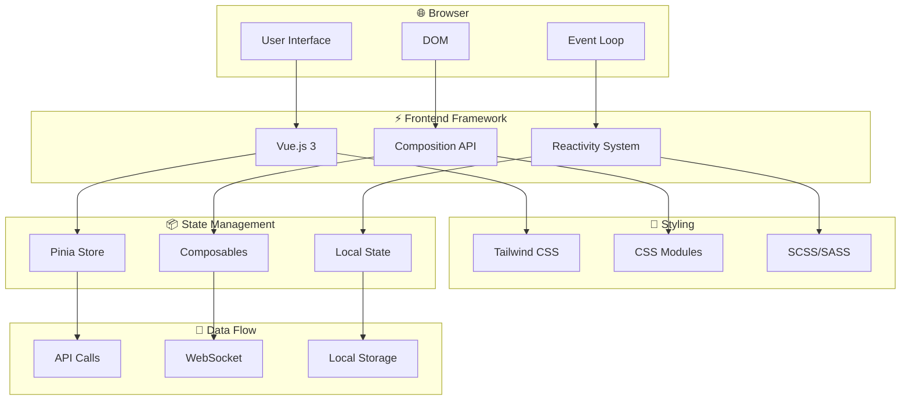

# 🎨 Frontend - Documentation

Bienvenue dans la section **Frontend** de la documentation. Cette section couvre les technologies et frameworks essentiels pour le développement d'interfaces web modernes et accessibles.

## 🏗️ Architecture Frontend Moderne

## 📚 Documentation disponible

### 🌐 HTML5
Le langage de balisage standard pour structurer le contenu web avec une approche sémantique et accessible.

**Niveaux couverts :** Débutant → Expert

**Lien :** [HTML5 - Guide Complet](./html5.md)

**Concepts clés :**
- Structure sémantique et éléments HTML5
- Formulaires et validation
- API HTML5 (Géolocalisation, Storage, etc.)
- Web Components et PWA
- Accessibilité et SEO

---

### 🎨 CSS3
Le langage de style moderne pour la mise en page et le design des interfaces web.

**Niveaux couverts :** Débutant → Expert

**Lien :** [CSS3 - Guide Complet](./css3.md)

**Concepts clés :**
- Sélecteurs et propriétés CSS
- Flexbox et Grid Layout
- Animations et transitions
- Performance et optimisation
- CSS avancé (Custom Properties, Container Queries)

---

### ⚡ Tailwind CSS
Framework CSS utility-first pour créer rapidement des interfaces personnalisées.

**Niveaux couverts :** Débutant → Expert

**Lien :** [Tailwind CSS - Guide Complet](./tailwind.md)

**Concepts clés :**
- Installation et configuration
- Classes utilitaires et responsive design
- Personnalisation et composants
- Optimisation pour la production
- Plugins personnalisés

---

## 🎯 Par où commencer ?

### 👶 Débutant
Commencez par les bases :
1. [HTML5 - Structure et Éléments de Base](./html5.md#-débutant---structure-et-éléments-de-base)
2. [CSS3 - Sélecteurs et Propriétés](./css3.md#-débutant---sélecteurs-et-propriétés-de-base)
3. [Tailwind CSS - Installation et Classes de Base](./tailwind.md#-débutant---installation-et-classes-de-base)

### 🟡 Intermédiaire
Approfondissez vos connaissances :
1. [HTML5 - Sémantique et Accessibilité](./html5.md#-intermédiaire---sémantique-et-accessibilité)
2. [CSS3 - Layout et Responsive](./css3.md#-intermédiaire---layout-et-responsive)
3. [Tailwind CSS - Layout et Responsive](./tailwind.md#-intermédiaire---layout-et-responsive)

### 🟠 Confirmé
Maîtrisez les concepts avancés :
1. [HTML5 - Formulaires et API](./html5.md#-confirmé---formulaires-et-api)
2. [CSS3 - Animations et Transitions](./css3.md#-confirmé---animations-et-transitions)
3. [Tailwind CSS - Personnalisation](./tailwind.md#-confirmé---personnalisation-et-components)

### 🔴 Senior
Optimisez et professionnalisez :
1. [HTML5 - Performance et SEO](./html5.md#-senior---performance-et-seo)
2. [CSS3 - Performance et Accessibilité](./css3.md#-senior---performance-et-accessibilité)
3. [Tailwind CSS - Optimisation](./tailwind.md#-senior---optimisation-et-production)

### ⚫ Expert
Techniques avancées et architectures :
1. [HTML5 - Web Components et PWA](./html5.md#-expert---web-components-et-pwa)
2. [CSS3 - CSS Avancé](./css3.md#-expert---css-avancé-et-techniques-modernes)
3. [Tailwind CSS - Plugins](./tailwind.md#-expert---plugins-et-architecture)

---

## ♿ Focus Accessibilité

Toutes les documentations de cette section mettent l'accent sur l'accessibilité web en suivant les recommandations WCAG 2.1 :

- **HTML5** : Structure sémantique, attributs ARIA, labels appropriés
- **CSS3** : Contraste suffisant, respect des préférences utilisateur, focus visible
- **Tailwind CSS** : Classes utilitaires pour l'accessibilité, composants accessibles

---

## 🔗 Ressources externes

### Standards et spécifications
- [MDN Web Docs](https://developer.mozilla.org/fr/)
- [W3C Standards](https://www.w3.org/standards/)
- [WCAG Guidelines](https://www.w3.org/WAI/WCAG21/quickref/)

### Outils de développement
- [Can I Use](https://caniuse.com/) - Compatibilité des navigateurs
- [CSS Validator](https://jigsaw.w3.org/css-validator/)
- [HTML Validator](https://validator.w3.org/)
- [Lighthouse](https://developers.google.com/web/tools/lighthouse) - Audit de performance

### Communautés
- [Stack Overflow](https://stackoverflow.com/)
- [CSS-Tricks](https://css-tricks.com/)
- [Smashing Magazine](https://www.smashingmagazine.com/)

---

*Dernière mise à jour : Janvier 2024*

