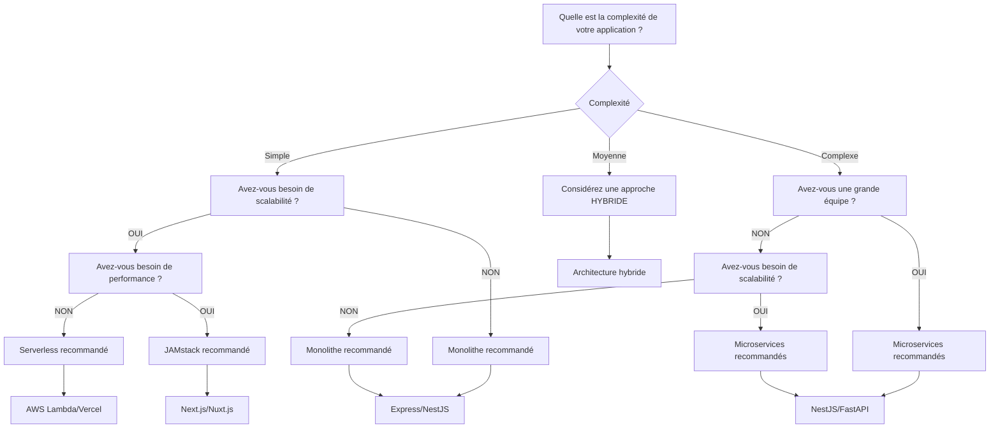
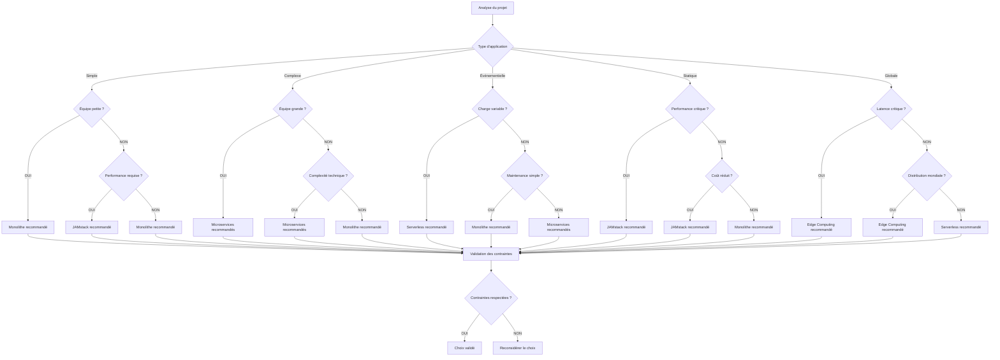

# 🚀 Arbre de Décision : Choix du Backend

## 📋 Table des matières
- [Introduction](#introduction)
- [Types de backends](#types-de-backends)
- [Critères de décision](#critères-de-décision)
- [Arbre de décision](#arbre-de-décision)
- [Comparaison détaillée](#comparaison-détaillée)
- [Cas d'usage par type](#cas-dusage-par-type)
- [Architecture backend](#architecture-backend)
- [Migration et évolution](#migration-et-évolution)
- [Checklist de validation](#checklist-de-validation)
- [Ressources](#ressources)

## 🎯 Introduction

Le choix du backend est une décision architecturale fondamentale qui détermine les performances, la scalabilité et la maintenabilité de votre application. Ce guide vous aide à choisir la solution backend la plus adaptée à vos besoins.

### 🎯 Objectifs

- **Comprendre** les différents types de backends
- **Identifier** les critères de décision
- **Guider** le choix selon le contexte
- **Anticiper** l'impact sur l'architecture
- **Planifier** les migrations si nécessaire

---

## 🚀 Types de backends

### 📊 Classification des backends

| Type | Description | Exemples | Cas d'usage |
|------|-------------|----------|-------------|
| **Monolithe** | Application unique | Express, Django, Spring | Applications simples |
| **Microservices** | Services indépendants | NestJS, FastAPI, Go | Applications complexes |
| **Serverless** | Fonctions sans serveur | AWS Lambda, Vercel | Applications événementielles |
| **JAMstack** | JavaScript, APIs, Markup | Next.js, Nuxt.js | Sites statiques |
| **Edge Computing** | Calcul à la périphérie | Cloudflare Workers | Applications globales |

### 🔍 Caractéristiques principales

#### Backend monolithe

**Avantages**
- Simplicité de développement
- Déploiement simple
- Debugging facile
- Transactions ACID
- Cohérence des données

**Inconvénients**
- Scalabilité limitée
- Couplage fort
- Point de défaillance unique
- Déploiement monolithique
- Équipe unique requise

**Technologies**
- **Node.js + Express** : JavaScript, simple, rapide
- **Node.js + NestJS** : TypeScript, architecture, évolutif
- **Python + Django** : Python, batteries included
- **Python + FastAPI** : Python, moderne, performant
- **Java + Spring** : Java, enterprise, robuste

#### Backend microservices

**Avantages**
- Scalabilité indépendante
- Déploiement indépendant
- Technologies multiples
- Résilience
- Équipes autonomes

**Inconvénients**
- Complexité de gestion
- Réseau distribué
- Transactions distribuées
- Monitoring complexe
- Debugging difficile

**Technologies**
- **NestJS** : Node.js, architecture, TypeScript
- **FastAPI** : Python, moderne, performant
- **Go + Gin** : Go, performant, simple
- **Rust + Actix** : Rust, ultra-performant
- **Java + Spring Boot** : Java, enterprise

#### Backend serverless

**Avantages**
- Pas de gestion de serveur
- Scalabilité automatique
- Paiement à l'usage
- Déploiement simple
- Haute disponibilité

**Inconvénients**
- Cold start
- Limites d'exécution
- Vendor lock-in
- Debugging difficile
- Coût imprévisible

**Technologies**
- **AWS Lambda** : AWS, leader, écosystème
- **Vercel Functions** : Vercel, simple, intégré
- **Netlify Functions** : Netlify, simple, intégré
- **Azure Functions** : Microsoft, intégration Azure
- **Google Cloud Functions** : Google, intégration GCP

#### Backend JAMstack

**Avantages**
- Performance élevée
- Sécurité renforcée
- Coût réduit
- Déploiement simple
- CDN intégré

**Inconvénients**
- Limites de dynamisme
- Dépendance aux APIs
- Complexité de développement
- Limites de personnalisation
- Vendor lock-in

**Technologies**
- **Next.js** : React, SSR, SSG
- **Nuxt.js** : Vue.js, SSR, SSG
- **Gatsby** : React, SSG, optimisé
- **SvelteKit** : Svelte, moderne, performant
- **Astro** : Multi-framework, optimisé

#### Backend Edge Computing

**Avantages**
- Latence ultra-faible
- Distribution globale
- Scalabilité automatique
- Sécurité renforcée
- Performance optimale

**Inconvénients**
- Limites d'exécution
- Vendor lock-in
- Debugging difficile
- Coût imprévisible
- Écosystème limité

**Technologies**
- **Cloudflare Workers** : Cloudflare, leader, performant
- **Vercel Edge Functions** : Vercel, simple, intégré
- **AWS Lambda@Edge** : AWS, intégration CloudFront
- **Azure Front Door** : Microsoft, intégration Azure
- **Google Cloud CDN** : Google, intégration GCP

---

## 🎯 Critères de décision

### 📝 Questions clés

| Critère | Monolithe | Microservices | Serverless | JAMstack | Edge | Question clé |
|---------|-----------|---------------|------------|----------|------|--------------|
| **Complexité** | Simple | Complexe | Simple | Simple | Simple | Quelle est la complexité de votre application ? |
| **Scalabilité** | Limitée | Excellente | Automatique | Limitée | Automatique | Avez-vous besoin de scalabilité ? |
| **Performance** | Bonne | Bonne | Variable | Excellente | Excellente | Quelles sont vos exigences de performance ? |
| **Coût** | Prévisible | Variable | Imprévisible | Faible | Variable | Quel est votre budget ? |
| **Équipe** | Petite | Grande | Petite | Petite | Petite | Quelle est la taille de votre équipe ? |
| **Déploiement** | Simple | Complexe | Simple | Simple | Simple | Avez-vous besoin de déploiement simple ? |
| **Maintenance** | Simple | Complexe | Simple | Simple | Simple | Avez-vous besoin de maintenance simple ? |
| **Évolutivité** | Limitée | Excellente | Limitée | Limitée | Limitée | Avez-vous besoin d'évolutivité ? |

### 🔍 Analyse contextuelle

#### 1. Nature du projet

**Projets adaptés au monolithe**
- Applications simples
- Équipe petite
- Développement rapide
- Budget limité
- Maintenance simple

**Projets adaptés aux microservices**
- Applications complexes
- Équipe grande
- Scalabilité requise
- Technologies multiples
- Déploiement indépendant

**Projets adaptés au serverless**
- Applications événementielles
- Charge variable
- Budget flexible
- Déploiement simple
- Maintenance minimale

**Projets adaptés au JAMstack**
- Sites statiques
- Performance critique
- Sécurité importante
- Coût réduit
- Déploiement simple

**Projets adaptés à l'edge**
- Applications globales
- Latence critique
- Performance optimale
- Distribution mondiale
- Sécurité renforcée

#### 2. Contraintes techniques

**Contraintes favorisant le monolithe**
- Équipe petite
- Budget limité
- Développement rapide
- Maintenance simple
- Technologies uniques

**Contraintes favorisant les microservices**
- Équipe grande
- Scalabilité requise
- Technologies multiples
- Déploiement indépendant
- Résilience importante

**Contraintes favorisant le serverless**
- Charge variable
- Budget flexible
- Déploiement simple
- Maintenance minimale
- Scalabilité automatique

**Contraintes favorisant le JAMstack**
- Performance critique
- Sécurité importante
- Coût réduit
- Déploiement simple
- CDN intégré

**Contraintes favorisant l'edge**
- Latence critique
- Performance optimale
- Distribution mondiale
- Sécurité renforcée
- Scalabilité automatique

#### 3. Contraintes organisationnelles

**Facteurs organisationnels**
- Taille de l'équipe
- Expertise technique
- Budget disponible
- Temps de développement
- Maintenance requise

---

## 🌳 Arbre de décision

### 🎯 Arbre principal



### 🔍 Arbre détaillé



### 📋 Tableau de décision détaillé

| Critère | Monolithe | Microservices | Serverless | JAMstack | Edge | Recommandation |
|---------|-----------|---------------|------------|----------|------|----------------|
| **Complexité** | ✅ Simple | ❌ Complexe | ✅ Simple | ✅ Simple | ✅ Simple | Monolithe/Serverless/JAMstack/Edge |
| **Scalabilité** | ❌ Limitée | ✅ Excellente | ✅ Automatique | ❌ Limitée | ✅ Automatique | Microservices/Serverless/Edge |
| **Performance** | ✅ Bonne | ✅ Bonne | ❌ Variable | ✅ Excellente | ✅ Excellente | JAMstack/Edge |
| **Coût** | ✅ Prévisible | ❌ Variable | ❌ Imprévisible | ✅ Faible | ❌ Variable | Monolithe/JAMstack |
| **Équipe** | ✅ Petite | ❌ Grande | ✅ Petite | ✅ Petite | ✅ Petite | Monolithe/Serverless/JAMstack/Edge |
| **Déploiement** | ✅ Simple | ❌ Complexe | ✅ Simple | ✅ Simple | ✅ Simple | Monolithe/Serverless/JAMstack/Edge |
| **Maintenance** | ✅ Simple | ❌ Complexe | ✅ Simple | ✅ Simple | ✅ Simple | Monolithe/Serverless/JAMstack/Edge |
| **Évolutivité** | ❌ Limitée | ✅ Excellente | ❌ Limitée | ❌ Limitée | ❌ Limitée | Microservices |
| **Résilience** | ❌ Limitée | ✅ Excellente | ✅ Bonne | ✅ Bonne | ✅ Excellente | Microservices/Edge |
| **Flexibilité** | ❌ Limitée | ✅ Excellente | ❌ Limitée | ❌ Limitée | ❌ Limitée | Microservices |

---

## 🔍 Comparaison détaillée

### 📊 Comparaison des technologies

#### Backends monolithes

| Critère | Node.js + Express | Node.js + NestJS | Python + Django | Python + FastAPI | Java + Spring |
|---------|-------------------|------------------|-----------------|------------------|----------------|
| **Langage** | JavaScript | TypeScript | Python | Python | Java |
| **Performance** | Bonne | Bonne | Bonne | Excellente | Excellente |
| **Écosystème** | Très riche | Riche | Riche | Riche | Très riche |
| **Courbe d'apprentissage** | Facile | Moyenne | Facile | Moyenne | Difficile |
| **Développement** | Rapide | Rapide | Rapide | Rapide | Lent |
| **Maintenance** | Simple | Simple | Simple | Simple | Complexe |
| **Scalabilité** | Limitée | Limitée | Limitée | Limitée | Limitée |
| **Recommandation** | Simple | Évolutif | Batteries included | Moderne | Enterprise |

#### Backends microservices

| Critère | NestJS | FastAPI | Go + Gin | Rust + Actix | Java + Spring Boot |
|---------|--------|---------|----------|--------------|-------------------|
| **Langage** | TypeScript | Python | Go | Rust | Java |
| **Performance** | Bonne | Excellente | Excellente | Ultra | Excellente |
| **Écosystème** | Riche | Riche | Bon | Limité | Très riche |
| **Courbe d'apprentissage** | Moyenne | Moyenne | Facile | Difficile | Difficile |
| **Développement** | Rapide | Rapide | Rapide | Lent | Lent |
| **Maintenance** | Simple | Simple | Simple | Complexe | Complexe |
| **Scalabilité** | Excellente | Excellente | Excellente | Excellente | Excellente |
| **Recommandation** | Node.js | Python | Go | Rust | Java |

#### Backends serverless

| Critère | AWS Lambda | Vercel Functions | Netlify Functions | Azure Functions | Google Cloud Functions |
|---------|------------|------------------|-------------------|-----------------|----------------------|
| **Provider** | AWS | Vercel | Netlify | Microsoft | Google |
| **Performance** | Bonne | Bonne | Bonne | Bonne | Bonne |
| **Écosystème** | Très riche | Riche | Bon | Riche | Riche |
| **Intégration** | AWS | Vercel | Netlify | Azure | GCP |
| **Coût** | Variable | Prévisible | Prévisible | Variable | Variable |
| **Limites** | Élevées | Moyennes | Moyennes | Élevées | Élevées |
| **Recommandation** | AWS | Vercel | Netlify | Azure | GCP |

#### Backends JAMstack

| Critère | Next.js | Nuxt.js | Gatsby | SvelteKit | Astro |
|---------|---------|---------|--------|-----------|-------|
| **Framework** | React | Vue.js | React | Svelte | Multi |
| **Performance** | Excellente | Excellente | Excellente | Excellente | Excellente |
| **Écosystème** | Très riche | Riche | Riche | Bon | Bon |
| **SSR** | ✅ | ✅ | ❌ | ✅ | ✅ |
| **SSG** | ✅ | ✅ | ✅ | ✅ | ✅ |
| **Développement** | Rapide | Rapide | Rapide | Rapide | Rapide |
| **Recommandation** | React | Vue.js | React | Svelte | Multi |

#### Backends Edge Computing

| Critère | Cloudflare Workers | Vercel Edge | AWS Lambda@Edge | Azure Front Door | Google Cloud CDN |
|---------|-------------------|-------------|-----------------|------------------|------------------|
| **Provider** | Cloudflare | Vercel | AWS | Microsoft | Google |
| **Performance** | Excellente | Excellente | Excellente | Excellente | Excellente |
| **Latence** | Ultra-faible | Ultra-faible | Ultra-faible | Ultra-faible | Ultra-faible |
| **Écosystème** | Riche | Riche | Très riche | Riche | Riche |
| **Intégration** | Cloudflare | Vercel | AWS | Azure | GCP |
| **Coût** | Variable | Prévisible | Variable | Variable | Variable |
| **Recommandation** | Cloudflare | Vercel | AWS | Azure | GCP |

### 🎯 Recommandations par cas d'usage

#### Applications simples
**Recommandation** : Node.js + Express ou Python + Django
- Développement rapide
- Maintenance simple
- Équipe petite
- Budget limité

#### Applications évolutives
**Recommandation** : Node.js + NestJS ou Python + FastAPI
- Architecture évolutive
- TypeScript/Python
- Performance bonne
- Équipe moyenne

#### Applications complexes
**Recommandation** : Microservices (NestJS, FastAPI, Go)
- Scalabilité indépendante
- Technologies multiples
- Équipe grande
- Déploiement indépendant

#### Applications événementielles
**Recommandation** : Serverless (AWS Lambda, Vercel)
- Charge variable
- Scalabilité automatique
- Déploiement simple
- Maintenance minimale

#### Sites statiques
**Recommandation** : JAMstack (Next.js, Nuxt.js)
- Performance excellente
- Sécurité renforcée
- Coût réduit
- CDN intégré

#### Applications globales
**Recommandation** : Edge Computing (Cloudflare Workers)
- Latence ultra-faible
- Distribution mondiale
- Performance optimale
- Sécurité renforcée

---

## 🎯 Cas d'usage par type

### 1️⃣ Backend monolithe

#### Application de gestion simple
```typescript
// Structure monolithe avec Express
import express from 'express';
import { UserController } from './controllers/UserController';
import { ProductController } from './controllers/ProductController';
import { OrderController } from './controllers/OrderController';

const app = express();

// Middleware
app.use(express.json());
app.use(express.urlencoded({ extended: true }));

// Routes
app.use('/api/users', UserController);
app.use('/api/products', ProductController);
app.use('/api/orders', OrderController);

// Démarrage
app.listen(3000, () => {
  console.log('Server running on port 3000');
});
```

**Pourquoi monolithe ?**
- Application simple
- Équipe petite
- Développement rapide
- Maintenance simple

#### Application avec NestJS
```typescript
// Structure monolithe avec NestJS
import { Module } from '@nestjs/common';
import { UserModule } from './user/user.module';
import { ProductModule } from './product/product.module';
import { OrderModule } from './order/order.module';

@Module({
  imports: [UserModule, ProductModule, OrderModule],
  controllers: [],
  providers: [],
})
export class AppModule {}
```

**Pourquoi NestJS ?**
- Architecture évolutive
- TypeScript
- Décorateurs
- Évolutivité

### 2️⃣ Backend microservices

#### Service utilisateur
```typescript
// Microservice utilisateur avec NestJS
import { Module } from '@nestjs/common';
import { UserController } from './user.controller';
import { UserService } from './user.service';
import { UserRepository } from './user.repository';

@Module({
  controllers: [UserController],
  providers: [UserService, UserRepository],
})
export class UserModule {}
```

**Pourquoi microservices ?**
- Scalabilité indépendante
- Déploiement indépendant
- Technologies multiples
- Équipe grande

#### Service produit
```typescript
// Microservice produit avec FastAPI
from fastapi import FastAPI
from .controllers import ProductController
from .services import ProductService
from .repositories import ProductRepository

app = FastAPI()

# Injection de dépendances
product_repository = ProductRepository()
product_service = ProductService(product_repository)
product_controller = ProductController(product_service)

# Routes
app.include_router(product_controller.router)
```

**Pourquoi FastAPI ?**
- Python moderne
- Performance excellente
- Documentation automatique
- Type hints

### 3️⃣ Backend serverless

#### Fonction Lambda
```typescript
// Fonction AWS Lambda
import { APIGatewayProxyEvent, APIGatewayProxyResult } from 'aws-lambda';
import { UserService } from './services/UserService';

export const handler = async (
  event: APIGatewayProxyEvent
): Promise<APIGatewayProxyResult> => {
  try {
    const userService = new UserService();
    const result = await userService.getUser(event.pathParameters?.id);
    
    return {
      statusCode: 200,
      body: JSON.stringify(result),
    };
  } catch (error) {
    return {
      statusCode: 500,
      body: JSON.stringify({ error: error.message }),
    };
  }
};
```

**Pourquoi serverless ?**
- Pas de gestion de serveur
- Scalabilité automatique
- Paiement à l'usage
- Déploiement simple

#### Fonction Vercel
```typescript
// Fonction Vercel
import { VercelRequest, VercelResponse } from '@vercel/node';
import { UserService } from './services/UserService';

export default async function handler(
  req: VercelRequest,
  res: VercelResponse
) {
  try {
    const userService = new UserService();
    const result = await userService.getUser(req.query.id as string);
    
    res.status(200).json(result);
  } catch (error) {
    res.status(500).json({ error: error.message });
  }
}
```

**Pourquoi Vercel ?**
- Intégration simple
- Déploiement automatique
- CDN intégré
- Coût prévisible

### 4️⃣ Backend JAMstack

#### Next.js avec API Routes
```typescript
// API Route Next.js
import { NextApiRequest, NextApiResponse } from 'next';
import { UserService } from '../../../services/UserService';

export default async function handler(
  req: NextApiRequest,
  res: NextApiResponse
) {
  try {
    const userService = new UserService();
    
    switch (req.method) {
      case 'GET':
        const user = await userService.getUser(req.query.id as string);
        res.status(200).json(user);
        break;
      case 'POST':
        const newUser = await userService.createUser(req.body);
        res.status(201).json(newUser);
        break;
      default:
        res.setHeader('Allow', ['GET', 'POST']);
        res.status(405).end(`Method ${req.method} Not Allowed`);
    }
  } catch (error) {
    res.status(500).json({ error: error.message });
  }
}
```

**Pourquoi JAMstack ?**
- Performance excellente
- Sécurité renforcée
- Coût réduit
- CDN intégré

#### Nuxt.js avec API
```typescript
// API Nuxt.js
export default defineEventHandler(async (event) => {
  try {
    const userService = new UserService();
    
    if (event.node.req.method === 'GET') {
      const user = await userService.getUser(getQuery(event).id as string);
      return user;
    } else if (event.node.req.method === 'POST') {
      const body = await readBody(event);
      const newUser = await userService.createUser(body);
      return newUser;
    }
  } catch (error) {
    throw createError({
      statusCode: 500,
      statusMessage: error.message,
    });
  }
});
```

**Pourquoi Nuxt.js ?**
- Vue.js
- SSR/SSG
- Performance excellente
- Développement rapide

### 5️⃣ Backend Edge Computing

#### Cloudflare Worker
```typescript
// Cloudflare Worker
export default {
  async fetch(request: Request): Promise<Response> {
    try {
      const userService = new UserService();
      const url = new URL(request.url);
      const userId = url.searchParams.get('id');
      
      if (request.method === 'GET') {
        const user = await userService.getUser(userId);
        return new Response(JSON.stringify(user), {
          headers: { 'Content-Type': 'application/json' },
        });
      } else if (request.method === 'POST') {
        const body = await request.json();
        const newUser = await userService.createUser(body);
        return new Response(JSON.stringify(newUser), {
          headers: { 'Content-Type': 'application/json' },
        });
      }
      
      return new Response('Method not allowed', { status: 405 });
    } catch (error) {
      return new Response(JSON.stringify({ error: error.message }), {
        status: 500,
        headers: { 'Content-Type': 'application/json' },
      });
    }
  },
};
```

**Pourquoi Edge Computing ?**
- Latence ultra-faible
- Distribution mondiale
- Performance optimale
- Sécurité renforcée

#### Vercel Edge Function
```typescript
// Vercel Edge Function
import { NextRequest } from 'next/server';
import { UserService } from './services/UserService';

export default async function handler(request: NextRequest) {
  try {
    const userService = new UserService();
    const url = new URL(request.url);
    const userId = url.searchParams.get('id');
    
    if (request.method === 'GET') {
      const user = await userService.getUser(userId);
      return new Response(JSON.stringify(user), {
        headers: { 'Content-Type': 'application/json' },
      });
    } else if (request.method === 'POST') {
      const body = await request.json();
      const newUser = await userService.createUser(body);
      return new Response(JSON.stringify(newUser), {
        headers: { 'Content-Type': 'application/json' },
      });
    }
    
    return new Response('Method not allowed', { status: 405 });
  } catch (error) {
    return new Response(JSON.stringify({ error: error.message }), {
      status: 500,
      headers: { 'Content-Type': 'application/json' },
    });
  }
}
```

**Pourquoi Vercel Edge ?**
- Intégration simple
- Performance excellente
- Déploiement automatique
- Coût prévisible

---

## 🏗️ Architecture backend

### 🎯 Architecture monolithe

#### Structure typique
```
src/
├── controllers/       # Contrôleurs
├── services/          # Services métier
├── repositories/      # Accès aux données
├── models/           # Modèles de données
├── middleware/       # Middleware
├── routes/           # Routes
├── utils/            # Utilitaires
└── config/           # Configuration
```

#### Patterns utilisés
- **MVC Pattern** : Modèle-Vue-Contrôleur
- **Service Layer** : Logique métier
- **Repository Pattern** : Abstraction de l'accès aux données
- **Middleware Pattern** : Traitement des requêtes

#### Avantages architecturaux
- Simplicité de développement
- Déploiement simple
- Debugging facile
- Cohérence des données

#### Inconvénients architecturaux
- Scalabilité limitée
- Couplage fort
- Point de défaillance unique
- Équipe unique requise

### 🎯 Architecture microservices

#### Structure typique
```
services/
├── user-service/     # Service utilisateur
├── product-service/  # Service produit
├── order-service/    # Service commande
├── payment-service/  # Service paiement
└── notification-service/ # Service notification
```

#### Patterns utilisés
- **API Gateway** : Point d'entrée unique
- **Service Discovery** : Découverte des services
- **Circuit Breaker** : Résilience
- **Event Sourcing** : Gestion des événements

#### Avantages architecturaux
- Scalabilité indépendante
- Déploiement indépendant
- Technologies multiples
- Résilience

#### Inconvénients architecturaux
- Complexité de gestion
- Réseau distribué
- Transactions distribuées
- Monitoring complexe

### 🎯 Architecture serverless

#### Structure typique
```
functions/
├── user/             # Fonctions utilisateur
├── product/          # Fonctions produit
├── order/            # Fonctions commande
├── payment/          # Fonctions paiement
└── notification/     # Fonctions notification
```

#### Patterns utilisés
- **Function as a Service** : Fonctions sans serveur
- **Event-Driven** : Architecture événementielle
- **Stateless** : Sans état
- **Auto-scaling** : Scalabilité automatique

#### Avantages architecturaux
- Pas de gestion de serveur
- Scalabilité automatique
- Paiement à l'usage
- Haute disponibilité

#### Inconvénients architecturaux
- Cold start
- Limites d'exécution
- Vendor lock-in
- Debugging difficile

### 🎯 Architecture JAMstack

#### Structure typique
```
src/
├── pages/            # Pages
├── components/       # Composants
├── api/              # API Routes
├── lib/              # Bibliothèques
├── styles/           # Styles
└── public/           # Assets statiques
```

#### Patterns utilisés
- **Static Site Generation** : Génération de sites statiques
- **Server-Side Rendering** : Rendu côté serveur
- **API Routes** : Routes API
- **CDN** : Content Delivery Network

#### Avantages architecturaux
- Performance excellente
- Sécurité renforcée
- Coût réduit
- CDN intégré

#### Inconvénients architecturaux
- Limites de dynamisme
- Dépendance aux APIs
- Complexité de développement
- Vendor lock-in

### 🎯 Architecture Edge Computing

#### Structure typique
```
workers/
├── user/             # Workers utilisateur
├── product/          # Workers produit
├── order/            # Workers commande
├── payment/          # Workers paiement
└── notification/     # Workers notification
```

#### Patterns utilisés
- **Edge Functions** : Fonctions à la périphérie
- **Global Distribution** : Distribution mondiale
- **Low Latency** : Latence ultra-faible
- **Auto-scaling** : Scalabilité automatique

#### Avantages architecturaux
- Latence ultra-faible
- Distribution mondiale
- Performance optimale
- Sécurité renforcée

#### Inconvénients architecturaux
- Limites d'exécution
- Vendor lock-in
- Debugging difficile
- Coût imprévisible

### 📋 Template d'architecture backend

```markdown
# Architecture Backend - [Nom du projet]

## Vue d'ensemble
[Description de l'architecture globale]

## Type d'architecture
- **Monolithe** : [Description]
- **Microservices** : [Description]
- **Serverless** : [Description]
- **JAMstack** : [Description]
- **Edge Computing** : [Description]

## Services

### Service principal
- **Nom** : [Nom du service]
- **Technologie** : [Node.js/Python/Go/etc.]
- **Framework** : [Express/NestJS/FastAPI/etc.]
- **Base de données** : [PostgreSQL/MongoDB/etc.]
- **Cache** : [Redis/Memcached/etc.]

### Services secondaires
- **Service A** : [Description]
- **Service B** : [Description]
- **Service C** : [Description]

## API

### Endpoints
- **GET /api/users** : [Description]
- **POST /api/users** : [Description]
- **PUT /api/users/:id** : [Description]
- **DELETE /api/users/:id** : [Description]

### Authentification
- **Méthode** : [JWT/OAuth/etc.]
- **Provider** : [Auth0/Firebase/etc.]
- **Sessions** : [Gestion des sessions]

### Validation
- **Côté client** : [Validation]
- **Côté serveur** : [Validation]
- **Schémas** : [Zod/Joi/etc.]

## Base de données

### Base de données principale
- **Type** : [SQL/NoSQL]
- **Technologie** : [PostgreSQL/MongoDB/etc.]
- **ORM** : [Prisma/TypeORM/etc.]
- **Migrations** : [Gestion des migrations]

### Bases de données secondaires
- **Cache** : [Redis/Memcached]
- **Sessions** : [Redis/DynamoDB]
- **Logs** : [Elasticsearch/InfluxDB]

## Déploiement

### Environnements
- **Développement** : [Description]
- **Staging** : [Description]
- **Production** : [Description]

### CI/CD
- **Build** : [GitHub Actions/GitLab CI/etc.]
- **Test** : [Jest/Vitest/etc.]
- **Déploiement** : [Docker/Kubernetes/etc.]

### Monitoring
- **Logs** : [Winston/Pino/etc.]
- **Métriques** : [Prometheus/Grafana/etc.]
- **Alertes** : [PagerDuty/Slack/etc.]

## Sécurité

### Authentification
- [Méthode d'authentification]

### Autorisation
- [Méthode d'autorisation]

### Protection
- [Protection CSRF/XSS/etc.]

### Audit
- [Logs d'audit]
```

---

## 🔄 Migration et évolution

### 🎯 Stratégies de migration

#### 1. Migration progressive

**Étape 1 : Préparation**
- Analyse de l'existant
- Planification de la migration
- Préparation des environnements
- Formation de l'équipe

**Étape 2 : Migration par étapes**
- Migration des services
- Migration des données
- Tests de validation
- Mise en production

**Étape 3 : Optimisation**
- Optimisation des performances
- Ajustement de la configuration
- Monitoring et alertes
- Documentation

#### 2. Migration par services

**Service par service**
- Identifier les services
- Migrer un service à la fois
- Tester chaque service
- Intégrer progressivement

**Validation continue**
- Tests de régression
- Validation des performances
- Validation de la cohérence
- Validation de la sécurité

#### 3. Migration par fonctionnalités

**Fonctionnalité par fonctionnalité**
- Identifier les fonctionnalités
- Migrer par fonctionnalité
- Valider chaque migration
- Intégrer progressivement

**Cohérence des données**
- Validation de l'intégrité
- Synchronisation des données
- Gestion des conflits
- Audit des changements

### 📋 Template de plan de migration

```markdown
# Plan de Migration - [Nom du projet]

## Objectif
[Migrer de [source] vers [destination]]

## Stratégie
[Migration progressive/par services/par fonctionnalités]

## Étapes

### Phase 1 : Préparation
- [ ] Analyse de l'existant
- [ ] Planification de la migration
- [ ] Préparation des environnements
- [ ] Formation de l'équipe

### Phase 2 : Migration
- [ ] Migration des services
- [ ] Migration des données
- [ ] Tests de validation
- [ ] Mise en production

### Phase 3 : Optimisation
- [ ] Optimisation des performances
- [ ] Ajustement de la configuration
- [ ] Monitoring et alertes
- [ ] Documentation

## Risques

### Risques techniques
- [Risque 1] - [Impact] - [Probabilité] - [Mitigation]
- [Risque 2] - [Impact] - [Probabilité] - [Mitigation]

### Risques de performance
- [Risque 1] - [Impact] - [Probabilité] - [Mitigation]
- [Risque 2] - [Impact] - [Probabilité] - [Mitigation]

### Risques de sécurité
- [Risque 1] - [Impact] - [Probabilité] - [Mitigation]
- [Risque 2] - [Impact] - [Probabilité] - [Mitigation]

## Ressources

### Humaines
- [X] développeurs
- [X] DevOps
- [X] testeurs
- [X] architectes

### Techniques
- [Environnements de test]
- [Outils de migration]
- [Outils de validation]
- [Outils de monitoring]

## Planning

### Durée estimée
- [X] semaines

### Jalons
- [Jalon 1] : [Date]
- [Jalon 2] : [Date]
- [Jalon 3] : [Date]

## Validation

### Critères de succès
- [ ] Migration terminée
- [ ] Services fonctionnels
- [ ] Performances maintenues
- [ ] Sécurité validée
- [ ] Disponibilité maintenue
```

---

## ✅ Checklist de validation

### 📋 Analyse des besoins

- [ ] **Type d'application** identifié (simple, complexe, événementielle, statique, globale)
- [ ] **Complexité** évaluée (simple, moyenne, complexe)
- [ ] **Scalabilité** requise (limitée, bonne, excellente)
- [ ] **Performance** requise (bonne, excellente, critique)
- [ ] **Équipe** analysée (petite, moyenne, grande)

### 📋 Évaluation des options

- [ ] **Monolithe évalué** selon les critères
- [ ] **Microservices évalués** selon les critères
- [ ] **Serverless évalué** selon les critères
- [ ] **JAMstack évalué** selon les critères
- [ ] **Edge Computing évalué** selon les critères

### 📋 Validation du choix

- [ ] **Choix justifié** par les critères
- [ ] **Contraintes respectées** (équipe, budget, temps)
- [ ] **Risques identifiés** et mitigés
- [ ] **Plan de migration** défini si nécessaire
- [ ] **Formation de l'équipe** planifiée

### 📋 Implémentation

- [ ] **Architecture définie** selon le choix
- [ ] **Technologies sélectionnées** et configurées
- [ ] **Services implémentés** et testés
- [ ] **APIs développées** et documentées
- [ ] **Base de données** configurée et optimisée

### 📋 Déploiement

- [ ] **Environnements** préparés (dev, staging, prod)
- [ ] **CI/CD** configuré et testé
- [ ] **Monitoring** mis en place
- [ ] **Sécurité** implémentée et validée
- [ ] **Documentation** mise à jour

### 📋 Suivi et évolution

- [ ] **Métriques de performance** définies
- [ ] **Alertes** configurées
- [ ] **Plan de scalabilité** établi
- [ ] **Évolution** prévue et documentée
- [ ] **Retours d'expérience** collectés

---

## 📚 Ressources

### 🎓 Formation
- [Architecture backend](../03-architecture/backend-architecture.md)
- [Node.js](../../nodejs/README.md)
- [NestJS](../../nestjs/README.md)
- [Docker](../../docker/README.md)

### 🛠️ Outils
- [Node.js](https://nodejs.org/) - Runtime JavaScript
- [NestJS](https://nestjs.com/) - Framework Node.js
- [FastAPI](https://fastapi.tiangolo.com/) - Framework Python
- [Docker](https://www.docker.com/) - Containerisation

### 📖 Références
- [Clean Architecture](https://www.oreilly.com/library/view/clean-architecture/9780134278842/) - Robert C. Martin
- [Microservices Patterns](https://www.oreilly.com/library/view/microservices-patterns/9781617294549/) - Chris Richardson
- [Serverless Architectures](https://www.oreilly.com/library/view/serverless-architectures/9781491984108/) - Mike Roberts
- [JAMstack](https://jamstack.org/) - Site officiel JAMstack

---

<div align="center">

[](../../../README.md)

</div>

---

*Dernière mise à jour : Janvier 2024*
