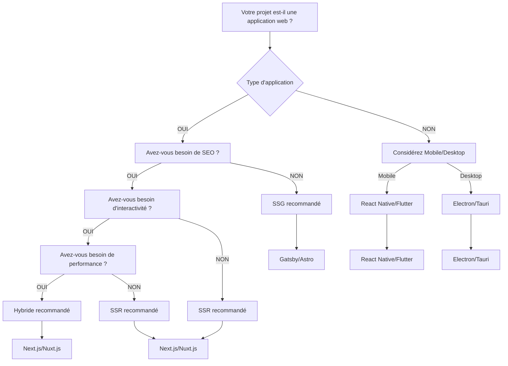
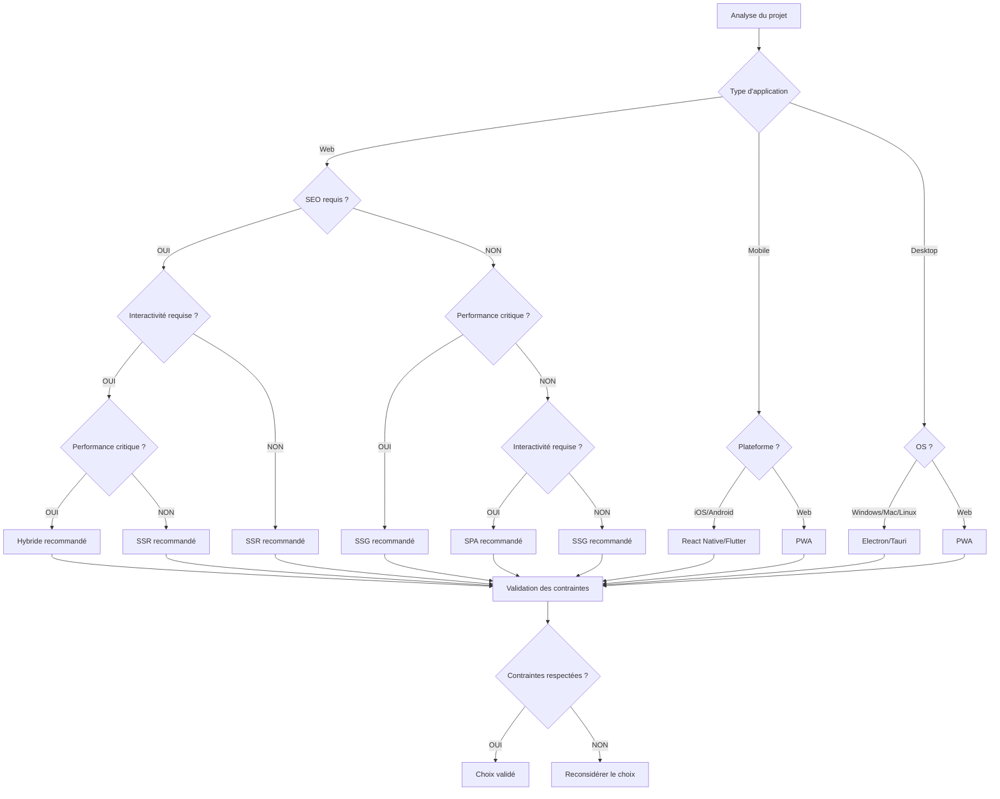

# 🎨 Arbre de Décision : Choix du Frontend

## 📋 Table des matières
- [Introduction](#introduction)
- [Types de frontends](#types-de-frontends)
- [Critères de décision](#critères-de-décision)
- [Arbre de décision](#arbre-de-décision)
- [Comparaison détaillée](#comparaison-détaillée)
- [Cas d'usage par type](#cas-dusage-par-type)
- [Architecture frontend](#architecture-frontend)
- [Migration et évolution](#migration-et-évolution)
- [Checklist de validation](#checklist-de-validation)
- [Ressources](#ressources)

## 🎯 Introduction

Le choix du frontend est une décision architecturale cruciale qui influence l'expérience utilisateur, les performances et la maintenabilité de votre application. Ce guide vous aide à choisir la solution frontend la plus adaptée à vos besoins.

### 🎯 Objectifs

- **Comprendre** les différents types de frontends
- **Identifier** les critères de décision
- **Guider** le choix selon le contexte
- **Anticiper** l'impact sur l'architecture
- **Planifier** les migrations si nécessaire

---

## 🎨 Types de frontends

### 📊 Classification des frontends

| Type | Description | Exemples | Cas d'usage |
|------|-------------|----------|-------------|
| **SPA** | Single Page Application | React, Vue, Angular | Applications interactives |
| **SSR** | Server-Side Rendering | Next.js, Nuxt.js | SEO, performance |
| **SSG** | Static Site Generation | Gatsby, Astro | Sites statiques |
| **Hybride** | Combinaison SPA/SSR/SSG | Next.js, Nuxt.js | Applications complexes |
| **Mobile** | Applications mobiles | React Native, Flutter | Applications mobiles |
| **Desktop** | Applications desktop | Electron, Tauri | Applications desktop |

### 🔍 Caractéristiques principales

#### Single Page Application (SPA)

**Avantages**
- Expérience utilisateur fluide
- Interactivité élevée
- Développement rapide
- Réutilisabilité des composants
- Écosystème riche

**Inconvénients**
- SEO limité
- Temps de chargement initial
- JavaScript requis
- Complexité de routage
- Gestion d'état complexe

**Technologies**
- **React** : Facebook, populaire, écosystème riche
- **Vue.js** : Progressif, simple, performant
- **Angular** : Google, enterprise, complet
- **Svelte** : Compilé, performant, simple

#### Server-Side Rendering (SSR)

**Avantages**
- SEO optimisé
- Temps de chargement rapide
- Accessibilité améliorée
- Performance initiale
- Partage social optimisé

**Inconvénients**
- Complexité de déploiement
- Coût serveur
- Hydratation nécessaire
- Gestion d'état complexe
- Debugging difficile

**Technologies**
- **Next.js** : React, SSR, SSG, API Routes
- **Nuxt.js** : Vue.js, SSR, SSG, modules
- **SvelteKit** : Svelte, moderne, performant
- **Remix** : React, moderne, performant

#### Static Site Generation (SSG)

**Avantages**
- Performance excellente
- Sécurité renforcée
- Coût réduit
- CDN intégré
- Déploiement simple

**Inconvénients**
- Limites de dynamisme
- Build time
- Pas de données temps réel
- Complexité de développement
- Limites de personnalisation

**Technologies**
- **Gatsby** : React, SSG, optimisé
- **Astro** : Multi-framework, optimisé
- **Hugo** : Go, rapide, simple
- **Jekyll** : Ruby, simple, populaire

#### Architecture hybride

**Avantages**
- Meilleur des deux mondes
- Flexibilité maximale
- Performance optimale
- SEO optimisé
- Évolutivité

**Inconvénients**
- Complexité accrue
- Courbe d'apprentissage
- Maintenance plus complexe
- Coût de développement
- Risque de confusion

**Technologies**
- **Next.js** : React, hybride, évolutif
- **Nuxt.js** : Vue.js, hybride, modulaire
- **SvelteKit** : Svelte, moderne, performant
- **Remix** : React, moderne, performant

#### Applications mobiles

**Avantages**
- Expérience native
- Performance optimale
- Accès aux APIs natives
- Offline-first
- Notifications push

**Inconvénients**
- Développement complexe
- Coût élevé
- Maintenance multiple
- App stores
- Updates complexes

**Technologies**
- **React Native** : Facebook, JavaScript, populaire
- **Flutter** : Google, Dart, performant
- **Ionic** : Web technologies, simple
- **Xamarin** : Microsoft, C#, enterprise

#### Applications desktop

**Avantages**
- Accès système
- Performance native
- Offline-first
- Intégration OS
- Développement web

**Inconvénients**
- Déploiement complexe
- Updates manuelles
- Sécurité
- Maintenance
- Coût de développement

**Technologies**
- **Electron** : Web technologies, populaire
- **Tauri** : Rust, performant, sécurisé
- **Flutter Desktop** : Dart, cross-platform
- **Qt** : C++, performant, enterprise

---

## 🎯 Critères de décision

### 📝 Questions clés

| Critère | SPA | SSR | SSG | Hybride | Mobile | Desktop | Question clé |
|---------|-----|-----|-----|---------|--------|---------|--------------|
| **SEO** | ❌ Limité | ✅ Excellent | ✅ Excellent | ✅ Excellent | ❌ N/A | ❌ N/A | Avez-vous besoin de SEO ? |
| **Performance** | ✅ Bonne | ✅ Bonne | ✅ Excellente | ✅ Excellente | ✅ Excellente | ✅ Excellente | Quelles sont vos exigences de performance ? |
| **Interactivité** | ✅ Excellente | ✅ Bonne | ❌ Limitée | ✅ Excellente | ✅ Excellente | ✅ Excellente | Avez-vous besoin d'interactivité ? |
| **Développement** | ✅ Rapide | ❌ Complexe | ✅ Rapide | ❌ Complexe | ❌ Complexe | ❌ Complexe | Avez-vous besoin de développement rapide ? |
| **Coût** | ✅ Faible | ❌ Élevé | ✅ Faible | ❌ Élevé | ❌ Élevé | ❌ Élevé | Quel est votre budget ? |
| **Équipe** | ✅ Petite | ❌ Grande | ✅ Petite | ❌ Grande | ❌ Grande | ❌ Grande | Quelle est la taille de votre équipe ? |
| **Maintenance** | ✅ Simple | ❌ Complexe | ✅ Simple | ❌ Complexe | ❌ Complexe | ❌ Complexe | Avez-vous besoin de maintenance simple ? |
| **Évolutivité** | ✅ Bonne | ✅ Excellente | ❌ Limitée | ✅ Excellente | ✅ Bonne | ✅ Bonne | Avez-vous besoin d'évolutivité ? |

### 🔍 Analyse contextuelle

#### 1. Nature du projet

**Projets adaptés au SPA**
- Applications interactives
- Dashboards
- Outils de productivité
- Applications internes
- Prototypes rapides

**Projets adaptés au SSR**
- Sites e-commerce
- Blogs
- Sites d'entreprise
- Applications avec SEO
- Contenu dynamique

**Projets adaptés au SSG**
- Sites statiques
- Documentation
- Blogs simples
- Landing pages
- Sites de portfolio

**Projets adaptés à l'hybride**
- Applications complexes
- E-commerce avancé
- Applications d'entreprise
- Sites avec contenu mixte
- Applications évolutives

**Projets adaptés au mobile**
- Applications mobiles
- Applications offline
- Applications avec notifications
- Applications natives
- Applications cross-platform

**Projets adaptés au desktop**
- Applications desktop
- Outils de développement
- Applications d'entreprise
- Applications offline
- Applications avec accès système

#### 2. Contraintes techniques

**Contraintes favorisant le SPA**
- Équipe petite
- Budget limité
- Développement rapide
- Maintenance simple
- Interactivité importante

**Contraintes favorisant le SSR**
- SEO important
- Performance initiale
- Contenu dynamique
- Équipe expérimentée
- Budget suffisant

**Contraintes favorisant le SSG**
- Performance critique
- Sécurité importante
- Coût réduit
- Contenu statique
- Déploiement simple

**Contraintes favorisant l'hybride**
- Complexité élevée
- Évolutivité requise
- Performance optimale
- Équipe expérimentée
- Budget suffisant

**Contraintes favorisant le mobile**
- Applications mobiles
- Offline-first
- Notifications push
- Équipe expérimentée
- Budget suffisant

**Contraintes favorisant le desktop**
- Applications desktop
- Accès système
- Offline-first
- Équipe expérimentée
- Budget suffisant

#### 3. Contraintes organisationnelles

**Facteurs organisationnels**
- Taille de l'équipe
- Expertise technique
- Budget disponible
- Temps de développement
- Maintenance requise

---

## 🌳 Arbre de décision

### 🎯 Arbre principal



### 🔍 Arbre détaillé



### 📋 Tableau de décision détaillé

| Critère | SPA | SSR | SSG | Hybride | Mobile | Desktop | Recommandation |
|---------|-----|-----|-----|---------|--------|---------|----------------|
| **SEO** | ❌ Limité | ✅ Excellent | ✅ Excellent | ✅ Excellent | ❌ N/A | ❌ N/A | SSR/SSG/Hybride |
| **Performance** | ✅ Bonne | ✅ Bonne | ✅ Excellente | ✅ Excellente | ✅ Excellente | ✅ Excellente | SSG/Hybride/Mobile/Desktop |
| **Interactivité** | ✅ Excellente | ✅ Bonne | ❌ Limitée | ✅ Excellente | ✅ Excellente | ✅ Excellente | SPA/Hybride/Mobile/Desktop |
| **Développement** | ✅ Rapide | ❌ Complexe | ✅ Rapide | ❌ Complexe | ❌ Complexe | ❌ Complexe | SPA/SSG |
| **Coût** | ✅ Faible | ❌ Élevé | ✅ Faible | ❌ Élevé | ❌ Élevé | ❌ Élevé | SPA/SSG |
| **Équipe** | ✅ Petite | ❌ Grande | ✅ Petite | ❌ Grande | ❌ Grande | ❌ Grande | SPA/SSG |
| **Maintenance** | ✅ Simple | ❌ Complexe | ✅ Simple | ❌ Complexe | ❌ Complexe | ❌ Complexe | SPA/SSG |
| **Évolutivité** | ✅ Bonne | ✅ Excellente | ❌ Limitée | ✅ Excellente | ✅ Bonne | ✅ Bonne | SSR/Hybride |
| **Accessibilité** | ❌ Limitée | ✅ Bonne | ✅ Bonne | ✅ Bonne | ✅ Bonne | ✅ Bonne | SSR/SSG/Hybride |
| **Offline** | ❌ Limitée | ❌ Limitée | ❌ Limitée | ❌ Limitée | ✅ Excellent | ✅ Excellent | Mobile/Desktop |

---

## 🔍 Comparaison détaillée

### 📊 Comparaison des frameworks

#### Frameworks SPA

| Critère | React | Vue.js | Angular | Svelte |
|---------|-------|--------|---------|--------|
| **Langage** | JavaScript/TypeScript | JavaScript/TypeScript | TypeScript | JavaScript/TypeScript |
| **Performance** | Bonne | Excellente | Bonne | Excellente |
| **Écosystème** | Très riche | Riche | Très riche | Bon |
| **Courbe d'apprentissage** | Moyenne | Facile | Difficile | Facile |
| **Développement** | Rapide | Rapide | Lent | Rapide |
| **Maintenance** | Simple | Simple | Complexe | Simple |
| **Scalabilité** | Bonne | Bonne | Excellente | Bonne |
| **Recommandation** | Populaire | Simple | Enterprise | Performant |

#### Frameworks SSR/SSG

| Critère | Next.js | Nuxt.js | SvelteKit | Remix |
|---------|---------|---------|-----------|-------|
| **Framework** | React | Vue.js | Svelte | React |
| **Performance** | Excellente | Excellente | Excellente | Excellente |
| **Écosystème** | Très riche | Riche | Bon | Bon |
| **SSR** | ✅ | ✅ | ✅ | ✅ |
| **SSG** | ✅ | ✅ | ✅ | ✅ |
| **API Routes** | ✅ | ✅ | ✅ | ✅ |
| **Développement** | Rapide | Rapide | Rapide | Rapide |
| **Recommandation** | React | Vue.js | Svelte | React moderne |

#### Frameworks SSG

| Critère | Gatsby | Astro | Hugo | Jekyll |
|---------|--------|-------|------|--------|
| **Langage** | JavaScript | JavaScript | Go | Ruby |
| **Performance** | Excellente | Excellente | Excellente | Bonne |
| **Écosystème** | Riche | Bon | Bon | Bon |
| **Build time** | Lent | Rapide | Rapide | Rapide |
| **Développement** | Rapide | Rapide | Rapide | Rapide |
| **Maintenance** | Simple | Simple | Simple | Simple |
| **Scalabilité** | Bonne | Bonne | Bonne | Bonne |
| **Recommandation** | React | Multi | Go | Ruby |

#### Frameworks mobiles

| Critère | React Native | Flutter | Ionic | Xamarin |
|---------|--------------|---------|-------|---------|
| **Langage** | JavaScript | Dart | Web | C# |
| **Performance** | Bonne | Excellente | Bonne | Excellente |
| **Écosystème** | Très riche | Riche | Bon | Bon |
| **Courbe d'apprentissage** | Moyenne | Moyenne | Facile | Difficile |
| **Développement** | Rapide | Rapide | Rapide | Lent |
| **Maintenance** | Simple | Simple | Simple | Complexe |
| **Cross-platform** | ✅ | ✅ | ✅ | ✅ |
| **Recommandation** | JavaScript | Dart | Web | C# |

#### Frameworks desktop

| Critère | Electron | Tauri | Flutter Desktop | Qt |
|---------|----------|-------|-----------------|----|
| **Langage** | Web | Rust | Dart | C++ |
| **Performance** | Bonne | Excellente | Excellente | Excellente |
| **Écosystème** | Très riche | Bon | Bon | Riche |
| **Courbe d'apprentissage** | Facile | Difficile | Moyenne | Difficile |
| **Développement** | Rapide | Lent | Rapide | Lent |
| **Maintenance** | Simple | Complexe | Simple | Complexe |
| **Taille** | Grande | Petite | Moyenne | Petite |
| **Recommandation** | Web | Rust | Dart | C++ |

### 🎯 Recommandations par cas d'usage

#### Applications interactives
**Recommandation** : React ou Vue.js
- Interactivité élevée
- Écosystème riche
- Développement rapide
- Équipe petite

#### Sites e-commerce
**Recommandation** : Next.js ou Nuxt.js
- SEO important
- Performance critique
- Contenu dynamique
- Évolutivité

#### Sites statiques
**Recommandation** : Gatsby ou Astro
- Performance excellente
- Coût réduit
- Déploiement simple
- Contenu statique

#### Applications complexes
**Recommandation** : Next.js ou Nuxt.js
- Architecture hybride
- Performance optimale
- Évolutivité
- Équipe expérimentée

#### Applications mobiles
**Recommandation** : React Native ou Flutter
- Cross-platform
- Performance native
- Écosystème riche
- Équipe expérimentée

#### Applications desktop
**Recommandation** : Electron ou Tauri
- Accès système
- Développement web
- Cross-platform
- Équipe expérimentée

---

## 🎯 Cas d'usage par type

### 1️⃣ Single Page Application (SPA)

#### Dashboard interactif
```typescript
// Dashboard avec React
import React, { useState, useEffect } from 'react';
import { Dashboard } from './components/Dashboard';
import { Sidebar } from './components/Sidebar';
import { Header } from './components/Header';

const App: React.FC = () => {
  const [user, setUser] = useState(null);
  const [data, setData] = useState([]);

  useEffect(() => {
    // Chargement des données
    fetchUserData();
    fetchDashboardData();
  }, []);

  const fetchUserData = async () => {
    const response = await fetch('/api/user');
    const userData = await response.json();
    setUser(userData);
  };

  const fetchDashboardData = async () => {
    const response = await fetch('/api/dashboard');
    const dashboardData = await response.json();
    setData(dashboardData);
  };

  return (
    <div className="app">
      <Header user={user} />
      <div className="main-content">
        <Sidebar />
        <Dashboard data={data} />
      </div>
    </div>
  );
};

export default App;
```

**Pourquoi SPA ?**
- Interactivité élevée
- Expérience utilisateur fluide
- Développement rapide
- Équipe petite

#### Application de gestion
```vue
<!-- Application avec Vue.js -->
<template>
  <div class="app">
    <header class="header">
      <h1>{{ title }}</h1>
      <nav class="navigation">
        <router-link to="/users">Utilisateurs</router-link>
        <router-link to="/products">Produits</router-link>
        <router-link to="/orders">Commandes</router-link>
      </nav>
    </header>
    
    <main class="main">
      <router-view />
    </main>
  </div>
</template>

<script setup lang="ts">
import { ref, onMounted } from 'vue';
import { useRouter } from 'vue-router';

const title = ref('Application de Gestion');
const router = useRouter();

onMounted(() => {
  // Initialisation de l'application
  console.log('Application initialisée');
});
</script>
```

**Pourquoi Vue.js ?**
- Simplicité
- Performance excellente
- Développement rapide
- Écosystème riche

### 2️⃣ Server-Side Rendering (SSR)

#### Site e-commerce
```typescript
// Page produit avec Next.js
import { GetServerSideProps } from 'next';
import { Product } from '../../types/Product';
import { ProductDetails } from '../../components/ProductDetails';
import { ProductReviews } from '../../components/ProductReviews';

interface ProductPageProps {
  product: Product;
  reviews: Review[];
}

const ProductPage: React.FC<ProductPageProps> = ({ product, reviews }) => {
  return (
    <div className="product-page">
      <ProductDetails product={product} />
      <ProductReviews reviews={reviews} />
    </div>
  );
};

export const getServerSideProps: GetServerSideProps = async (context) => {
  const { id } = context.params!;
  
  // Récupération des données côté serveur
  const product = await fetchProduct(id as string);
  const reviews = await fetchProductReviews(id as string);
  
  return {
    props: {
      product,
      reviews,
    },
  };
};

export default ProductPage;
```

**Pourquoi SSR ?**
- SEO optimisé
- Performance initiale
- Contenu dynamique
- Partage social

#### Blog avec Nuxt.js
```vue
<!-- Article de blog avec Nuxt.js -->
<template>
  <article class="blog-post">
    <header class="post-header">
      <h1>{{ post.title }}</h1>
      <div class="post-meta">
        <span class="author">{{ post.author }}</span>
        <span class="date">{{ formatDate(post.date) }}</span>
      </div>
    </header>
    
    <div class="post-content" v-html="post.content"></div>
    
    <footer class="post-footer">
      <div class="tags">
        <span v-for="tag in post.tags" :key="tag" class="tag">
          {{ tag }}
        </span>
      </div>
    </footer>
  </article>
</template>

<script setup lang="ts">
import { Post } from '~/types/Post';

interface Props {
  post: Post;
}

const props = defineProps<Props>();

const formatDate = (date: string) => {
  return new Date(date).toLocaleDateString('fr-FR');
};
</script>
```

**Pourquoi Nuxt.js ?**
- Vue.js
- SSR/SSG
- Performance excellente
- Développement rapide

### 3️⃣ Static Site Generation (SSG)

#### Site de portfolio
```typescript
// Page portfolio avec Gatsby
import React from 'react';
import { graphql } from 'gatsby';
import { Portfolio } from '../components/Portfolio';
import { SEO } from '../components/SEO';

interface PortfolioPageProps {
  data: {
    allProjects: {
      nodes: Project[];
    };
  };
}

const PortfolioPage: React.FC<PortfolioPageProps> = ({ data }) => {
  const projects = data.allProjects.nodes;
  
  return (
    <div className="portfolio-page">
      <SEO title="Portfolio" />
      <Portfolio projects={projects} />
    </div>
  );
};

export const query = graphql`
  query {
    allProjects {
      nodes {
        id
        title
        description
        image
        technologies
        github
        demo
      }
    }
  }
`;

export default PortfolioPage;
```

**Pourquoi SSG ?**
- Performance excellente
- Sécurité renforcée
- Coût réduit
- Déploiement simple

#### Documentation avec Astro
```astro
---
// Page documentation avec Astro
import { Layout } from '../layouts/Layout.astro';
import { TableOfContents } from '../components/TableOfContents.astro';
import { Content } from '../components/Content.astro';

const { content, frontmatter } = Astro.props;
---

<Layout title={frontmatter.title}>
  <div class="documentation">
    <aside class="sidebar">
      <TableOfContents />
    </aside>
    
    <main class="content">
      <Content content={content} />
    </main>
  </div>
</Layout>

<style>
  .documentation {
    display: grid;
    grid-template-columns: 250px 1fr;
    gap: 2rem;
  }
  
  .sidebar {
    position: sticky;
    top: 2rem;
  }
  
  .content {
    max-width: 800px;
  }
</style>
```

**Pourquoi Astro ?**
- Multi-framework
- Performance excellente
- Développement rapide
- Optimisé

### 4️⃣ Architecture hybride

#### Application e-commerce complexe
```typescript
// Page produit hybride avec Next.js
import { GetStaticProps, GetStaticPaths } from 'next';
import { Product } from '../../types/Product';
import { ProductDetails } from '../../components/ProductDetails';
import { ProductReviews } from '../../components/ProductReviews';
import { RelatedProducts } from '../../components/RelatedProducts';

interface ProductPageProps {
  product: Product;
  reviews: Review[];
  relatedProducts: Product[];
}

const ProductPage: React.FC<ProductPageProps> = ({ 
  product, 
  reviews, 
  relatedProducts 
}) => {
  return (
    <div className="product-page">
      <ProductDetails product={product} />
      <ProductReviews reviews={reviews} />
      <RelatedProducts products={relatedProducts} />
    </div>
  );
};

// SSG pour les pages produits
export const getStaticProps: GetStaticProps = async (context) => {
  const { id } = context.params!;
  
  const product = await fetchProduct(id as string);
  const reviews = await fetchProductReviews(id as string);
  const relatedProducts = await fetchRelatedProducts(id as string);
  
  return {
    props: {
      product,
      reviews,
      relatedProducts,
    },
    revalidate: 3600, // Revalidation toutes les heures
  };
};

// Génération des pages statiques
export const getStaticPaths: GetStaticPaths = async () => {
  const products = await fetchAllProducts();
  
  const paths = products.map((product) => ({
    params: { id: product.id },
  }));
  
  return {
    paths,
    fallback: 'blocking', // Génération à la demande
  };
};

export default ProductPage;
```

**Pourquoi hybride ?**
- Performance optimale
- SEO optimisé
- Évolutivité
- Flexibilité

### 5️⃣ Applications mobiles

#### Application React Native
```typescript
// Écran principal avec React Native
import React, { useState, useEffect } from 'react';
import { View, Text, FlatList, StyleSheet } from 'react-native';
import { ProductCard } from '../components/ProductCard';
import { Product } from '../types/Product';

const HomeScreen: React.FC = () => {
  const [products, setProducts] = useState<Product[]>([]);
  const [loading, setLoading] = useState(true);

  useEffect(() => {
    fetchProducts();
  }, []);

  const fetchProducts = async () => {
    try {
      const response = await fetch('/api/products');
      const data = await response.json();
      setProducts(data);
    } catch (error) {
      console.error('Erreur lors du chargement des produits:', error);
    } finally {
      setLoading(false);
    }
  };

  const renderProduct = ({ item }: { item: Product }) => (
    <ProductCard product={item} />
  );

  if (loading) {
    return (
      <View style={styles.loading}>
        <Text>Chargement...</Text>
      </View>
    );
  }

  return (
    <View style={styles.container}>
      <Text style={styles.title}>Produits</Text>
      <FlatList
        data={products}
        renderItem={renderProduct}
        keyExtractor={(item) => item.id}
        numColumns={2}
        contentContainerStyle={styles.list}
      />
    </View>
  );
};

const styles = StyleSheet.create({
  container: {
    flex: 1,
    padding: 16,
  },
  title: {
    fontSize: 24,
    fontWeight: 'bold',
    marginBottom: 16,
  },
  list: {
    paddingBottom: 16,
  },
  loading: {
    flex: 1,
    justifyContent: 'center',
    alignItems: 'center',
  },
});

export default HomeScreen;
```

**Pourquoi React Native ?**
- JavaScript
- Cross-platform
- Écosystème riche
- Développement rapide

#### Application Flutter
```dart
// Écran principal avec Flutter
import 'package:flutter/material.dart';
import 'package:http/http.dart' as http;
import 'dart:convert';
import 'models/product.dart';
import 'widgets/product_card.dart';

class HomeScreen extends StatefulWidget {
  @override
  _HomeScreenState createState() => _HomeScreenState();
}

class _HomeScreenState extends State<HomeScreen> {
  List<Product> products = [];
  bool loading = true;

  @override
  void initState() {
    super.initState();
    fetchProducts();
  }

  Future<void> fetchProducts() async {
    try {
      final response = await http.get(Uri.parse('/api/products'));
      if (response.statusCode == 200) {
        final List<dynamic> data = json.decode(response.body);
        setState(() {
          products = data.map((json) => Product.fromJson(json)).toList();
          loading = false;
        });
      }
    } catch (error) {
      print('Erreur lors du chargement des produits: $error');
      setState(() {
        loading = false;
      });
    }
  }

  @override
  Widget build(BuildContext context) {
    return Scaffold(
      appBar: AppBar(
        title: Text('Produits'),
      ),
      body: loading
          ? Center(child: CircularProgressIndicator())
          : GridView.builder(
              padding: EdgeInsets.all(16),
              gridDelegate: SliverGridDelegateWithFixedCrossAxisCount(
                crossAxisCount: 2,
                childAspectRatio: 0.8,
                crossAxisSpacing: 16,
                mainAxisSpacing: 16,
              ),
              itemCount: products.length,
              itemBuilder: (context, index) {
                return ProductCard(product: products[index]);
              },
            ),
    );
  }
}
```

**Pourquoi Flutter ?**
- Dart
- Performance excellente
- Cross-platform
- Développement rapide

### 6️⃣ Applications desktop

#### Application Electron
```typescript
// Application Electron
import { app, BrowserWindow, ipcMain } from 'electron';
import * as path from 'path';

let mainWindow: BrowserWindow;

function createWindow(): void {
  mainWindow = new BrowserWindow({
    width: 1200,
    height: 800,
    webPreferences: {
      nodeIntegration: true,
      contextIsolation: false,
    },
  });

  // Chargement de l'application React
  mainWindow.loadFile('dist/index.html');

  // Ouverture des DevTools en développement
  if (process.env.NODE_ENV === 'development') {
    mainWindow.webContents.openDevTools();
  }
}

// Gestion des événements IPC
ipcMain.handle('get-app-version', () => {
  return app.getVersion();
});

ipcMain.handle('save-file', async (event, data) => {
  // Logique de sauvegarde de fichier
  return { success: true };
});

app.whenReady().then(createWindow);

app.on('window-all-closed', () => {
  if (process.platform !== 'darwin') {
    app.quit();
  }
});

app.on('activate', () => {
  if (BrowserWindow.getAllWindows().length === 0) {
    createWindow();
  }
});
```

**Pourquoi Electron ?**
- Web technologies
- Cross-platform
- Écosystème riche
- Développement rapide

#### Application Tauri
```rust
// Application Tauri
use tauri::Manager;
use serde::{Deserialize, Serialize};

#[derive(Serialize, Deserialize)]
struct Product {
    id: String,
    name: String,
    price: f64,
}

#[tauri::command]
async fn get_products() -> Result<Vec<Product>, String> {
    // Logique de récupération des produits
    let products = vec![
        Product {
            id: "1".to_string(),
            name: "Produit 1".to_string(),
            price: 29.99,
        },
        Product {
            id: "2".to_string(),
            name: "Produit 2".to_string(),
            price: 39.99,
        },
    ];
    
    Ok(products)
}

#[tauri::command]
async fn save_product(product: Product) -> Result<String, String> {
    // Logique de sauvegarde
    Ok("Produit sauvegardé".to_string())
}

fn main() {
    tauri::Builder::default()
        .invoke_handler(tauri::generate_handler![get_products, save_product])
        .run(tauri::generate_context!())
        .expect("error while running tauri application");
}
```

**Pourquoi Tauri ?**
- Rust
- Performance excellente
- Sécurité renforcée
- Taille réduite

---

## 🏗️ Architecture frontend

### 🎯 Architecture SPA

#### Structure typique
```
src/
├── components/       # Composants réutilisables
├── pages/           # Pages de l'application
├── hooks/           # Hooks personnalisés
├── services/        # Services API
├── store/           # Gestion d'état
├── utils/           # Utilitaires
├── styles/          # Styles
└── types/           # Types TypeScript
```

#### Patterns utilisés
- **Component Pattern** : Composants réutilisables
- **Hook Pattern** : Logique réutilisable
- **Service Pattern** : Abstraction des APIs
- **State Management** : Gestion d'état centralisée

#### Avantages architecturaux
- Développement rapide
- Réutilisabilité
- Écosystème riche
- Maintenance simple

#### Inconvénients architecturaux
- SEO limité
- Temps de chargement initial
- Complexité de routage
- Gestion d'état complexe

### 🎯 Architecture SSR/SSG

#### Structure typique
```
src/
├── pages/           # Pages (Next.js/Nuxt.js)
├── components/      # Composants
├── layouts/         # Layouts
├── middleware/      # Middleware
├── plugins/         # Plugins
├── store/           # Gestion d'état
├── utils/           # Utilitaires
└── types/           # Types TypeScript
```

#### Patterns utilisés
- **Page Pattern** : Pages avec SSR/SSG
- **Layout Pattern** : Layouts réutilisables
- **Middleware Pattern** : Traitement des requêtes
- **Plugin Pattern** : Extensions

#### Avantages architecturaux
- SEO optimisé
- Performance initiale
- Accessibilité améliorée
- Partage social optimisé

#### Inconvénients architecturaux
- Complexité de déploiement
- Coût serveur
- Hydratation nécessaire
- Gestion d'état complexe

### 🎯 Architecture mobile

#### Structure typique
```
src/
├── screens/         # Écrans de l'application
├── components/      # Composants réutilisables
├── navigation/      # Navigation
├── services/        # Services API
├── store/           # Gestion d'état
├── utils/           # Utilitaires
├── assets/          # Assets (images, fonts)
└── types/           # Types TypeScript
```

#### Patterns utilisés
- **Screen Pattern** : Écrans de l'application
- **Navigation Pattern** : Navigation entre écrans
- **Service Pattern** : Abstraction des APIs
- **State Management** : Gestion d'état

#### Avantages architecturaux
- Expérience native
- Performance optimale
- Accès aux APIs natives
- Offline-first

#### Inconvénients architecturaux
- Développement complexe
- Coût élevé
- Maintenance multiple
- App stores

### 🎯 Architecture desktop

#### Structure typique
```
src/
├── main/            # Processus principal
├── renderer/        # Processus de rendu
├── components/      # Composants
├── services/        # Services
├── utils/           # Utilitaires
├── assets/          # Assets
└── types/           # Types TypeScript
```

#### Patterns utilisés
- **Main Process** : Processus principal
- **Renderer Process** : Processus de rendu
- **IPC Pattern** : Communication inter-processus
- **Service Pattern** : Services système

#### Avantages architecturaux
- Accès système
- Performance native
- Offline-first
- Intégration OS

#### Inconvénients architecturaux
- Déploiement complexe
- Updates manuelles
- Sécurité
- Maintenance

### 📋 Template d'architecture frontend

```markdown
# Architecture Frontend - [Nom du projet]

## Vue d'ensemble
[Description de l'architecture globale]

## Type d'architecture
- **SPA** : [Description]
- **SSR** : [Description]
- **SSG** : [Description]
- **Hybride** : [Description]
- **Mobile** : [Description]
- **Desktop** : [Description]

## Structure

### Composants
- **Composants de base** : [Description]
- **Composants de page** : [Description]
- **Composants de layout** : [Description]
- **Composants réutilisables** : [Description]

### Pages
- **Pages statiques** : [Description]
- **Pages dynamiques** : [Description]
- **Pages protégées** : [Description]
- **Pages d'erreur** : [Description]

### Services
- **API Service** : [Description]
- **Auth Service** : [Description]
- **Storage Service** : [Description]
- **Notification Service** : [Description]

## Gestion d'état

### État global
- **Store** : [Redux/Zustand/etc.]
- **Actions** : [Description]
- **Reducers** : [Description]
- **Selectors** : [Description]

### État local
- **Composants** : [useState/useReducer]
- **Hooks** : [Hooks personnalisés]
- **Context** : [React Context]

## Routing

### Navigation
- **Router** : [React Router/Vue Router/etc.]
- **Routes** : [Description des routes]
- **Guards** : [Protection des routes]
- **Lazy Loading** : [Chargement paresseux]

## Styling

### Méthodologie
- **CSS Modules** : [Description]
- **Styled Components** : [Description]
- **Tailwind CSS** : [Description]
- **SCSS** : [Description]

### Design System
- **Tokens** : [Couleurs, typographie, espacement]
- **Composants** : [Boutons, formulaires, etc.]
- **Layouts** : [Grilles, conteneurs]

## Performance

### Optimisations
- **Code Splitting** : [Description]
- **Lazy Loading** : [Description]
- **Image Optimization** : [Description]
- **Bundle Optimization** : [Description]

### Monitoring
- **Métriques** : [Core Web Vitals]
- **Outils** : [Lighthouse, WebPageTest]
- **Alertes** : [Seuils de performance]

## Tests

### Stratégie
- **Tests unitaires** : [Jest/Vitest]
- **Tests d'intégration** : [Testing Library]
- **Tests E2E** : [Cypress/Playwright]
- **Tests visuels** : [Chromatic]

### Coverage
- **Objectif** : [X]%
- **Outils** : [Istanbul/C8]
- **Rapports** : [Fréquence]

## Déploiement

### Environnements
- **Développement** : [Description]
- **Staging** : [Description]
- **Production** : [Description]

### CI/CD
- **Build** : [Vite/Webpack/etc.]
- **Test** : [Jest/Vitest]
- **Déploiement** : [Vercel/Netlify/etc.]

### Monitoring
- **Logs** : [Console/Service]
- **Métriques** : [Performance/Erreurs]
- **Alertes** : [Seuils]
```

---

## 🔄 Migration et évolution

### 🎯 Stratégies de migration

#### 1. Migration progressive

**Étape 1 : Préparation**
- Analyse de l'existant
- Planification de la migration
- Préparation des environnements
- Formation de l'équipe

**Étape 2 : Migration par étapes**
- Migration des composants
- Migration des pages
- Tests de validation
- Mise en production

**Étape 3 : Optimisation**
- Optimisation des performances
- Ajustement de la configuration
- Monitoring et alertes
- Documentation

#### 2. Migration par composants

**Composant par composant**
- Identifier les composants
- Migrer un composant à la fois
- Tester chaque composant
- Intégrer progressivement

**Validation continue**
- Tests de régression
- Validation des performances
- Validation de l'accessibilité
- Validation de la compatibilité

#### 3. Migration par pages

**Page par page**
- Identifier les pages
- Migrer par page
- Valider chaque migration
- Intégrer progressivement

**Cohérence de l'expérience**
- Validation de la navigation
- Validation des interactions
- Validation des performances
- Validation de l'accessibilité

### 📋 Template de plan de migration

```markdown
# Plan de Migration - [Nom du projet]

## Objectif
[Migrer de [source] vers [destination]]

## Stratégie
[Migration progressive/par composants/par pages]

## Étapes

### Phase 1 : Préparation
- [ ] Analyse de l'existant
- [ ] Planification de la migration
- [ ] Préparation des environnements
- [ ] Formation de l'équipe

### Phase 2 : Migration
- [ ] Migration des composants
- [ ] Migration des pages
- [ ] Tests de validation
- [ ] Mise en production

### Phase 3 : Optimisation
- [ ] Optimisation des performances
- [ ] Ajustement de la configuration
- [ ] Monitoring et alertes
- [ ] Documentation

## Risques

### Risques techniques
- [Risque 1] - [Impact] - [Probabilité] - [Mitigation]
- [Risque 2] - [Impact] - [Probabilité] - [Mitigation]

### Risques de performance
- [Risque 1] - [Impact] - [Probabilité] - [Mitigation]
- [Risque 2] - [Impact] - [Probabilité] - [Mitigation]

### Risques d'expérience utilisateur
- [Risque 1] - [Impact] - [Probabilité] - [Mitigation]
- [Risque 2] - [Impact] - [Probabilité] - [Mitigation]

## Ressources

### Humaines
- [X] développeurs
- [X] designers
- [X] testeurs
- [X] DevOps

### Techniques
- [Environnements de test]
- [Outils de migration]
- [Outils de validation]
- [Outils de monitoring]

## Planning

### Durée estimée
- [X] semaines

### Jalons
- [Jalon 1] : [Date]
- [Jalon 2] : [Date]
- [Jalon 3] : [Date]

## Validation

### Critères de succès
- [ ] Migration terminée
- [ ] Composants fonctionnels
- [ ] Performances maintenues
- [ ] Accessibilité validée
- [ ] Expérience utilisateur préservée
```

---

## ✅ Checklist de validation

### 📋 Analyse des besoins

- [ ] **Type d'application** identifié (web, mobile, desktop)
- [ ] **SEO** requis (oui, non, critique)
- [ ] **Performance** requise (bonne, excellente, critique)
- [ ] **Interactivité** requise (limitée, bonne, excellente)
- [ ] **Équipe** analysée (petite, moyenne, grande)

### 📋 Évaluation des options

- [ ] **SPA évalué** selon les critères
- [ ] **SSR évalué** selon les critères
- [ ] **SSG évalué** selon les critères
- [ ] **Hybride évalué** selon les critères
- [ ] **Mobile évalué** selon les critères
- [ ] **Desktop évalué** selon les critères

### 📋 Validation du choix

- [ ] **Choix justifié** par les critères
- [ ] **Contraintes respectées** (équipe, budget, temps)
- [ ] **Risques identifiés** et mitigés
- [ ] **Plan de migration** défini si nécessaire
- [ ] **Formation de l'équipe** planifiée

### 📋 Implémentation

- [ ] **Architecture définie** selon le choix
- [ ] **Technologies sélectionnées** et configurées
- [ ] **Composants développés** et testés
- [ ] **Pages implémentées** et validées
- [ ] **Services configurés** et testés

### 📋 Déploiement

- [ ] **Environnements** préparés (dev, staging, prod)
- [ ] **CI/CD** configuré et testé
- [ ] **Monitoring** mis en place
- [ ] **Performance** optimisée et validée
- [ ] **Documentation** mise à jour

### 📋 Suivi et évolution

- [ ] **Métriques de performance** définies
- [ ] **Alertes** configurées
- [ ] **Plan d'évolution** établi
- [ ] **Évolutivité** prévue et documentée
- [ ] **Retours d'expérience** collectés

---

## 📚 Ressources

### 🎓 Formation
- [Architecture frontend](../03-architecture/frontend-architecture.md)
- [Vue.js](../../vuejs/README.md)
- [TypeScript](../../typescript/README.md)
- [CSS Methodologies](../../frontend/css-methodologies.md)

### 🛠️ Outils
- [React](https://reactjs.org/) - Bibliothèque UI
- [Vue.js](https://vuejs.org/) - Framework progressif
- [Next.js](https://nextjs.org/) - Framework React
- [Nuxt.js](https://nuxtjs.org/) - Framework Vue.js

### 📖 Références
- [Frontend Architecture](https://www.oreilly.com/library/view/frontend-architecture/9781491929436/) - O'Reilly
- [React Patterns](https://reactpatterns.com/) - Michael Chan
- [Vue.js Guide](https://vuejs.org/guide/) - Guide officiel
- [Web Performance](https://web.dev/performance/) - Google Web Dev

---

<div align="center">

[](../../../README.md)

</div>

---

*Dernière mise à jour : Janvier 2024*
