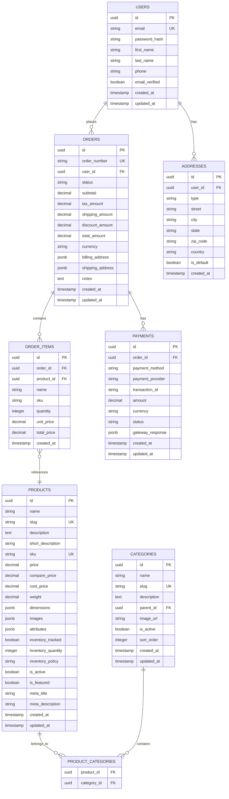

# 🗄️ Architecture Base de Données : Modélisation et Optimisation

## 📋 Table des matières
- [Introduction](#introduction)
- [Types de bases de données](#types-de-bases-de-données)
- [Modélisation des données](#modélisation-des-données)
- [Relations et contraintes](#relations-et-contraintes)
- [Normalisation et dénormalisation](#normalisation-et-dénormalisation)
- [Indexation et performance](#indexation-et-performance)
- [Migrations et versioning](#migrations-et-versioning)
- [Backup et réplication](#backup-et-réplication)
- [Exemples concrets](#exemples-concrets)
- [Templates d'architecture](#templates-darchitecture)
- [Checklist de validation](#checklist-de-validation)
- [Ressources](#ressources)

## 🎯 Introduction

L'architecture de base de données définit la structure, l'organisation et l'optimisation des données pour assurer la performance, la scalabilité et la maintenabilité de votre application.

### 🎯 Objectifs

- **Modéliser** les données selon les besoins métier
- **Optimiser** les performances de requêtes
- **Assurer** la cohérence et l'intégrité des données
- **Planifier** la scalabilité et l'évolution
- **Sécuriser** et sauvegarder les données

---

## 🗃️ Types de bases de données

### 📊 Classification des bases de données

| Type | Description | Avantages | Inconvénients | Cas d'usage |
|------|-------------|-----------|---------------|-------------|
| **Relationnelles** | Données structurées en tables | Cohérence, ACID, requêtes complexes | Scalabilité limitée, schéma rigide | Applications transactionnelles |
| **NoSQL Document** | Documents JSON flexibles | Flexibilité, scalabilité | Cohérence éventuelle | Applications web modernes |
| **NoSQL Clé-valeur** | Stockage simple clé-valeur | Performance, simplicité | Fonctionnalités limitées | Cache, sessions |
| **NoSQL Colonnes** | Stockage par colonnes | Performance analytique | Complexité de requêtes | Big data, analytics |
| **NoSQL Graphes** | Relations complexes | Requêtes relationnelles | Performance limitée | Réseaux sociaux, recommandations |

### 🔍 Types détaillés

#### Bases de données relationnelles (SQL)

**Caractéristiques**
- Données structurées en tables avec colonnes et lignes
- Relations entre tables via clés étrangères
- Transactions ACID (Atomicité, Cohérence, Isolation, Durabilité)
- Langage de requête SQL standardisé

**Avantages**
- **Cohérence forte** : Garantie d'intégrité des données
- **Requêtes complexes** : Jointures et agrégations puissantes
- **Maturité** : Outils et connaissances étendus
- **Standards** : SQL universellement supporté

**Inconvénients**
- **Scalabilité verticale** : Limitation par la machine
- **Schéma rigide** : Modifications structurelles coûteuses
- **Performance** : Requêtes complexes peuvent être lentes
- **Complexité** : Gestion des relations et contraintes

**Cas d'usage**
- Applications e-commerce avec transactions
- Systèmes de gestion d'entreprise
- Applications financières
- Systèmes de gestion de contenu

**Exemples**
- PostgreSQL
- MySQL
- SQL Server
- Oracle

#### Bases de données NoSQL Document

**Caractéristiques**
- Stockage de documents JSON/BSON
- Schéma flexible et évolutif
- Requêtes par champs imbriqués
- Scalabilité horizontale

**Avantages**
- **Flexibilité** : Schéma évolutif
- **Scalabilité** : Distribution horizontale
- **Performance** : Requêtes simples rapides
- **Développement** : Mapping objet-document naturel

**Inconvénients**
- **Cohérence éventuelle** : Pas de transactions ACID
- **Requêtes complexes** : Limitées par rapport à SQL
- **Duplication** : Données répétées
- **Maturité** : Outils moins matures

**Cas d'usage**
- Applications web modernes
- Systèmes de contenu
- Applications mobiles
- Prototypage rapide

**Exemples**
- MongoDB
- CouchDB
- DynamoDB
- CosmosDB

#### Bases de données NoSQL Clé-valeur

**Caractéristiques**
- Stockage simple clé-valeur
- Accès ultra-rapide par clé
- Pas de structure de données complexe
- Scalabilité horizontale

**Avantages**
- **Performance** : Accès ultra-rapide
- **Simplicité** : Modèle de données simple
- **Scalabilité** : Distribution facile
- **Latence** : Temps de réponse minimal

**Inconvénients**
- **Fonctionnalités limitées** : Pas de requêtes complexes
- **Pas de relations** : Données isolées
- **Pas de transactions** : Cohérence limitée
- **Utilisation limitée** : Cas d'usage spécifiques

**Cas d'usage**
- Cache d'application
- Sessions utilisateur
- Compteurs et métriques
- Configuration d'application

**Exemples**
- Redis
- Memcached
- DynamoDB
- Riak

#### Bases de données NoSQL Colonnes

**Caractéristiques**
- Stockage par colonnes plutôt que par lignes
- Optimisé pour les requêtes analytiques
- Compression efficace
- Scalabilité horizontale

**Avantages**
- **Performance analytique** : Requêtes d'agrégation rapides
- **Compression** : Stockage efficace
- **Scalabilité** : Distribution horizontale
- **Flexibilité** : Schéma évolutif

**Inconvénients**
- **Requêtes transactionnelles** : Performance limitée
- **Complexité** : Modèle de données complexe
- **Maturité** : Outils moins matures
- **Courbe d'apprentissage** : Concepts nouveaux

**Cas d'usage**
- Big data et analytics
- Data warehousing
- IoT et capteurs
- Logs et métriques

**Exemples**
- Cassandra
- HBase
- BigTable
- ScyllaDB

#### Bases de données NoSQL Graphes

**Caractéristiques**
- Stockage de nœuds et relations
- Requêtes par parcours de graphe
- Modélisation des relations complexes
- Optimisé pour les requêtes relationnelles

**Avantages**
- **Relations complexes** : Modélisation naturelle
- **Requêtes relationnelles** : Parcours de graphe efficace
- **Flexibilité** : Schéma évolutif
- **Performance** : Requêtes relationnelles rapides

**Inconvénients**
- **Performance limitée** : Requêtes non-relationnelles lentes
- **Complexité** : Modèle de données complexe
- **Maturité** : Outils moins matures
- **Utilisation limitée** : Cas d'usage spécifiques

**Cas d'usage**
- Réseaux sociaux
- Systèmes de recommandation
- Détection de fraude
- Gestion de connaissances

**Exemples**
- Neo4j
- Amazon Neptune
- ArangoDB
- OrientDB

---

## 📊 Modélisation des données

### 📝 Processus de modélisation

#### Étapes de modélisation

1. **Analyse des besoins**
   - Identification des entités métier
   - Définition des attributs
   - Compréhension des relations

2. **Conception conceptuelle**
   - Modèle entité-relation
   - Diagrammes UML
   - Validation avec les parties prenantes

3. **Conception logique**
   - Transformation en modèle relationnel
   - Normalisation
   - Optimisation des performances

4. **Conception physique**
   - Choix des types de données
   - Indexation
   - Partitionnement

#### Modèle entité-relation

**Entités**
```sql
-- Utilisateur
CREATE TABLE users (
    id UUID PRIMARY KEY,
    email VARCHAR(255) UNIQUE NOT NULL,
    name VARCHAR(255) NOT NULL,
    password_hash VARCHAR(255) NOT NULL,
    role VARCHAR(50) NOT NULL,
    created_at TIMESTAMP DEFAULT CURRENT_TIMESTAMP,
    updated_at TIMESTAMP DEFAULT CURRENT_TIMESTAMP
);

-- Produit
CREATE TABLE products (
    id UUID PRIMARY KEY,
    name VARCHAR(255) NOT NULL,
    description TEXT,
    price DECIMAL(10,2) NOT NULL,
    category_id UUID NOT NULL,
    stock_quantity INTEGER DEFAULT 0,
    created_at TIMESTAMP DEFAULT CURRENT_TIMESTAMP,
    updated_at TIMESTAMP DEFAULT CURRENT_TIMESTAMP
);

-- Commande
CREATE TABLE orders (
    id UUID PRIMARY KEY,
    user_id UUID NOT NULL,
    total_amount DECIMAL(10,2) NOT NULL,
    status VARCHAR(50) NOT NULL,
    shipping_address TEXT NOT NULL,
    created_at TIMESTAMP DEFAULT CURRENT_TIMESTAMP,
    updated_at TIMESTAMP DEFAULT CURRENT_TIMESTAMP
);
```

**Relations**
```sql
-- Relation User -> Orders (1:N)
ALTER TABLE orders ADD CONSTRAINT fk_orders_user_id 
    FOREIGN KEY (user_id) REFERENCES users(id);

-- Relation Product -> OrderItems (1:N)
CREATE TABLE order_items (
    id UUID PRIMARY KEY,
    order_id UUID NOT NULL,
    product_id UUID NOT NULL,
    quantity INTEGER NOT NULL,
    unit_price DECIMAL(10,2) NOT NULL,
    FOREIGN KEY (order_id) REFERENCES orders(id),
    FOREIGN KEY (product_id) REFERENCES products(id)
);

-- Relation Product -> Category (N:1)
CREATE TABLE categories (
    id UUID PRIMARY KEY,
    name VARCHAR(255) NOT NULL,
    description TEXT,
    parent_id UUID,
    FOREIGN KEY (parent_id) REFERENCES categories(id)
);

ALTER TABLE products ADD CONSTRAINT fk_products_category_id 
    FOREIGN KEY (category_id) REFERENCES categories(id);
```

#### Modèle NoSQL Document

**Collection Users**
```json
{
  "_id": ObjectId("507f1f77bcf86cd799439011"),
  "email": "user@example.com",
  "name": "John Doe",
  "profile": {
    "firstName": "John",
    "lastName": "Doe",
    "phone": "+1234567890",
    "address": {
      "street": "123 Main St",
      "city": "New York",
      "zipCode": "10001",
      "country": "USA"
    }
  },
  "preferences": {
    "language": "en",
    "timezone": "America/New_York",
    "notifications": {
      "email": true,
      "sms": false,
      "push": true
    }
  },
  "roles": ["user", "premium"],
  "createdAt": ISODate("2023-01-01T00:00:00Z"),
  "updatedAt": ISODate("2023-01-01T00:00:00Z")
}
```

**Collection Products**
```json
{
  "_id": ObjectId("507f1f77bcf86cd799439012"),
  "name": "Laptop Pro",
  "description": "High-performance laptop",
  "price": 1299.99,
  "category": {
    "id": ObjectId("507f1f77bcf86cd799439013"),
    "name": "Electronics",
    "path": "Electronics > Computers > Laptops"
  },
  "specifications": {
    "processor": "Intel i7",
    "memory": "16GB RAM",
    "storage": "512GB SSD",
    "display": "15.6 inch"
  },
  "inventory": {
    "stock": 50,
    "reserved": 5,
    "available": 45
  },
  "reviews": [
    {
      "userId": ObjectId("507f1f77bcf86cd799439011"),
      "rating": 5,
      "comment": "Excellent product!",
      "date": ISODate("2023-01-15T00:00:00Z")
    }
  ],
  "tags": ["laptop", "electronics", "computer"],
  "createdAt": ISODate("2023-01-01T00:00:00Z"),
  "updatedAt": ISODate("2023-01-01T00:00:00Z")
}
```

**Collection Orders**
```json
{
  "_id": ObjectId("507f1f77bcf86cd799439014"),
  "userId": ObjectId("507f1f77bcf86cd799439011"),
  "orderNumber": "ORD-2023-001",
  "items": [
    {
      "productId": ObjectId("507f1f77bcf86cd799439012"),
      "name": "Laptop Pro",
      "quantity": 1,
      "unitPrice": 1299.99,
      "totalPrice": 1299.99
    }
  ],
  "totals": {
    "subtotal": 1299.99,
    "tax": 104.00,
    "shipping": 0.00,
    "total": 1403.99
  },
  "shipping": {
    "address": {
      "street": "123 Main St",
      "city": "New York",
      "zipCode": "10001",
      "country": "USA"
    },
    "method": "standard",
    "estimatedDelivery": ISODate("2023-01-10T00:00:00Z")
  },
  "status": "shipped",
  "payment": {
    "method": "credit_card",
    "transactionId": "txn_123456789",
    "status": "completed"
  },
  "createdAt": ISODate("2023-01-05T00:00:00Z"),
  "updatedAt": ISODate("2023-01-05T00:00:00Z")
}
```

---

## 🔗 Relations et contraintes

### 📝 Types de relations

#### Relation Un-à-Un (1:1)

**Principe**
Une entité d'une table correspond à exactement une entité d'une autre table.

**Exemple SQL**
```sql
-- Table principale
CREATE TABLE users (
    id UUID PRIMARY KEY,
    email VARCHAR(255) UNIQUE NOT NULL,
    name VARCHAR(255) NOT NULL,
    created_at TIMESTAMP DEFAULT CURRENT_TIMESTAMP
);

-- Table liée (1:1)
CREATE TABLE user_profiles (
    id UUID PRIMARY KEY,
    user_id UUID UNIQUE NOT NULL,
    first_name VARCHAR(255),
    last_name VARCHAR(255),
    phone VARCHAR(20),
    date_of_birth DATE,
    bio TEXT,
    FOREIGN KEY (user_id) REFERENCES users(id)
);
```

**Exemple NoSQL**
```json
// Document User avec profil intégré
{
  "_id": ObjectId("507f1f77bcf86cd799439011"),
  "email": "user@example.com",
  "name": "John Doe",
  "profile": {
    "firstName": "John",
    "lastName": "Doe",
    "phone": "+1234567890",
    "dateOfBirth": "1990-01-01",
    "bio": "Software developer"
  }
}
```

#### Relation Un-à-Plusieurs (1:N)

**Principe**
Une entité d'une table peut correspondre à plusieurs entités d'une autre table.

**Exemple SQL**
```sql
-- Table principale
CREATE TABLE users (
    id UUID PRIMARY KEY,
    email VARCHAR(255) UNIQUE NOT NULL,
    name VARCHAR(255) NOT NULL
);

-- Table liée (1:N)
CREATE TABLE orders (
    id UUID PRIMARY KEY,
    user_id UUID NOT NULL,
    order_number VARCHAR(50) UNIQUE NOT NULL,
    total_amount DECIMAL(10,2) NOT NULL,
    status VARCHAR(50) NOT NULL,
    created_at TIMESTAMP DEFAULT CURRENT_TIMESTAMP,
    FOREIGN KEY (user_id) REFERENCES users(id)
);
```

**Exemple NoSQL**
```json
// Document User avec commandes intégrées
{
  "_id": ObjectId("507f1f77bcf86cd799439011"),
  "email": "user@example.com",
  "name": "John Doe",
  "orders": [
    {
      "id": ObjectId("507f1f77bcf86cd799439014"),
      "orderNumber": "ORD-2023-001",
      "totalAmount": 1403.99,
      "status": "shipped",
      "createdAt": ISODate("2023-01-05T00:00:00Z")
    },
    {
      "id": ObjectId("507f1f77bcf86cd799439015"),
      "orderNumber": "ORD-2023-002",
      "totalAmount": 299.99,
      "status": "pending",
      "createdAt": ISODate("2023-01-10T00:00:00Z")
    }
  ]
}
```

#### Relation Plusieurs-à-Plusieurs (N:N)

**Principe**
Plusieurs entités d'une table peuvent correspondre à plusieurs entités d'une autre table.

**Exemple SQL**
```sql
-- Tables principales
CREATE TABLE users (
    id UUID PRIMARY KEY,
    email VARCHAR(255) UNIQUE NOT NULL,
    name VARCHAR(255) NOT NULL
);

CREATE TABLE roles (
    id UUID PRIMARY KEY,
    name VARCHAR(255) UNIQUE NOT NULL,
    description TEXT
);

-- Table de liaison (N:N)
CREATE TABLE user_roles (
    id UUID PRIMARY KEY,
    user_id UUID NOT NULL,
    role_id UUID NOT NULL,
    assigned_at TIMESTAMP DEFAULT CURRENT_TIMESTAMP,
    FOREIGN KEY (user_id) REFERENCES users(id),
    FOREIGN KEY (role_id) REFERENCES roles(id),
    UNIQUE(user_id, role_id)
);
```

**Exemple NoSQL**
```json
// Document User avec rôles intégrés
{
  "_id": ObjectId("507f1f77bcf86cd799439011"),
  "email": "user@example.com",
  "name": "John Doe",
  "roles": [
    {
      "id": ObjectId("507f1f77bcf86cd799439016"),
      "name": "user",
      "description": "Regular user",
      "assignedAt": ISODate("2023-01-01T00:00:00Z")
    },
    {
      "id": ObjectId("507f1f77bcf86cd799439017"),
      "name": "premium",
      "description": "Premium user",
      "assignedAt": ISODate("2023-01-15T00:00:00Z")
    }
  ]
}
```

### 📝 Contraintes d'intégrité

#### Contraintes de clé primaire

```sql
-- Clé primaire simple
CREATE TABLE users (
    id UUID PRIMARY KEY,
    email VARCHAR(255) UNIQUE NOT NULL,
    name VARCHAR(255) NOT NULL
);

-- Clé primaire composite
CREATE TABLE order_items (
    order_id UUID NOT NULL,
    product_id UUID NOT NULL,
    quantity INTEGER NOT NULL,
    unit_price DECIMAL(10,2) NOT NULL,
    PRIMARY KEY (order_id, product_id),
    FOREIGN KEY (order_id) REFERENCES orders(id),
    FOREIGN KEY (product_id) REFERENCES products(id)
);
```

#### Contraintes de clé étrangère

```sql
-- Contrainte de clé étrangère simple
CREATE TABLE orders (
    id UUID PRIMARY KEY,
    user_id UUID NOT NULL,
    total_amount DECIMAL(10,2) NOT NULL,
    FOREIGN KEY (user_id) REFERENCES users(id)
);

-- Contrainte avec actions
CREATE TABLE order_items (
    id UUID PRIMARY KEY,
    order_id UUID NOT NULL,
    product_id UUID NOT NULL,
    quantity INTEGER NOT NULL,
    FOREIGN KEY (order_id) REFERENCES orders(id) 
        ON DELETE CASCADE ON UPDATE CASCADE,
    FOREIGN KEY (product_id) REFERENCES products(id) 
        ON DELETE RESTRICT ON UPDATE CASCADE
);
```

#### Contraintes de vérification

```sql
-- Contraintes de vérification
CREATE TABLE products (
    id UUID PRIMARY KEY,
    name VARCHAR(255) NOT NULL,
    price DECIMAL(10,2) NOT NULL CHECK (price > 0),
    stock_quantity INTEGER DEFAULT 0 CHECK (stock_quantity >= 0),
    status VARCHAR(50) NOT NULL CHECK (status IN ('active', 'inactive', 'discontinued'))
);

-- Contraintes de vérification complexes
CREATE TABLE orders (
    id UUID PRIMARY KEY,
    user_id UUID NOT NULL,
    total_amount DECIMAL(10,2) NOT NULL CHECK (total_amount > 0),
    status VARCHAR(50) NOT NULL CHECK (status IN ('pending', 'confirmed', 'shipped', 'delivered', 'cancelled')),
    created_at TIMESTAMP DEFAULT CURRENT_TIMESTAMP,
    updated_at TIMESTAMP DEFAULT CURRENT_TIMESTAMP,
    CHECK (updated_at >= created_at)
);
```

---

## 🔄 Normalisation et dénormalisation

### 📝 Normalisation

#### Première forme normale (1NF)

**Principe**
Éliminer les groupes répétitifs et assurer l'atomicité des données.

**Avant normalisation**
```sql
-- Table non normalisée
CREATE TABLE users (
    id UUID PRIMARY KEY,
    name VARCHAR(255) NOT NULL,
    email VARCHAR(255) NOT NULL,
    phone VARCHAR(20),
    address VARCHAR(255),
    city VARCHAR(100),
    zip_code VARCHAR(10),
    country VARCHAR(100)
);
```

**Après normalisation 1NF**
```sql
-- Table normalisée 1NF
CREATE TABLE users (
    id UUID PRIMARY KEY,
    name VARCHAR(255) NOT NULL,
    email VARCHAR(255) UNIQUE NOT NULL,
    phone VARCHAR(20),
    address VARCHAR(255),
    city VARCHAR(100),
    zip_code VARCHAR(10),
    country VARCHAR(100)
);
```

#### Deuxième forme normale (2NF)

**Principe**
Éliminer la dépendance partielle des attributs non-clés par rapport à la clé primaire.

**Avant normalisation 2NF**
```sql
-- Table non normalisée 2NF
CREATE TABLE order_items (
    order_id UUID,
    product_id UUID,
    product_name VARCHAR(255),
    product_price DECIMAL(10,2),
    quantity INTEGER,
    PRIMARY KEY (order_id, product_id)
);
```

**Après normalisation 2NF**
```sql
-- Table normalisée 2NF
CREATE TABLE products (
    id UUID PRIMARY KEY,
    name VARCHAR(255) NOT NULL,
    price DECIMAL(10,2) NOT NULL
);

CREATE TABLE order_items (
    order_id UUID,
    product_id UUID,
    quantity INTEGER,
    unit_price DECIMAL(10,2) NOT NULL,
    PRIMARY KEY (order_id, product_id),
    FOREIGN KEY (product_id) REFERENCES products(id)
);
```

#### Troisième forme normale (3NF)

**Principe**
Éliminer la dépendance transitive des attributs non-clés par rapport à la clé primaire.

**Avant normalisation 3NF**
```sql
-- Table non normalisée 3NF
CREATE TABLE orders (
    id UUID PRIMARY KEY,
    user_id UUID NOT NULL,
    user_name VARCHAR(255),
    user_email VARCHAR(255),
    total_amount DECIMAL(10,2) NOT NULL,
    created_at TIMESTAMP DEFAULT CURRENT_TIMESTAMP
);
```

**Après normalisation 3NF**
```sql
-- Table normalisée 3NF
CREATE TABLE users (
    id UUID PRIMARY KEY,
    name VARCHAR(255) NOT NULL,
    email VARCHAR(255) UNIQUE NOT NULL
);

CREATE TABLE orders (
    id UUID PRIMARY KEY,
    user_id UUID NOT NULL,
    total_amount DECIMAL(10,2) NOT NULL,
    created_at TIMESTAMP DEFAULT CURRENT_TIMESTAMP,
    FOREIGN KEY (user_id) REFERENCES users(id)
);
```

### 📝 Dénormalisation

#### Principe

La dénormalisation consiste à introduire intentionnellement de la redondance pour améliorer les performances.

#### Exemples de dénormalisation

**Dénormalisation pour les performances**
```sql
-- Table normalisée
CREATE TABLE orders (
    id UUID PRIMARY KEY,
    user_id UUID NOT NULL,
    total_amount DECIMAL(10,2) NOT NULL,
    created_at TIMESTAMP DEFAULT CURRENT_TIMESTAMP
);

CREATE TABLE order_items (
    id UUID PRIMARY KEY,
    order_id UUID NOT NULL,
    product_id UUID NOT NULL,
    quantity INTEGER NOT NULL,
    unit_price DECIMAL(10,2) NOT NULL,
    FOREIGN KEY (order_id) REFERENCES orders(id),
    FOREIGN KEY (product_id) REFERENCES products(id)
);

-- Table dénormalisée pour les performances
CREATE TABLE order_summary (
    id UUID PRIMARY KEY,
    user_id UUID NOT NULL,
    user_name VARCHAR(255) NOT NULL,
    user_email VARCHAR(255) NOT NULL,
    total_amount DECIMAL(10,2) NOT NULL,
    items_count INTEGER NOT NULL,
    created_at TIMESTAMP DEFAULT CURRENT_TIMESTAMP
);
```

**Dénormalisation pour les analytics**
```sql
-- Table dénormalisée pour les analytics
CREATE TABLE daily_sales_summary (
    id UUID PRIMARY KEY,
    date DATE NOT NULL,
    total_orders INTEGER NOT NULL,
    total_revenue DECIMAL(12,2) NOT NULL,
    average_order_value DECIMAL(10,2) NOT NULL,
    top_product_id UUID,
    top_product_name VARCHAR(255),
    created_at TIMESTAMP DEFAULT CURRENT_TIMESTAMP
);
```

---

## 📈 Indexation et performance

### 📝 Types d'index

#### Index primaire

```sql
-- Index primaire automatique
CREATE TABLE users (
    id UUID PRIMARY KEY,
    email VARCHAR(255) UNIQUE NOT NULL,
    name VARCHAR(255) NOT NULL
);
```

#### Index secondaire

```sql
-- Index simple
CREATE INDEX idx_users_email ON users(email);
CREATE INDEX idx_users_name ON users(name);

-- Index composite
CREATE INDEX idx_orders_user_date ON orders(user_id, created_at);
CREATE INDEX idx_products_category_price ON products(category_id, price);
```

#### Index partiel

```sql
-- Index partiel pour les données actives
CREATE INDEX idx_products_active ON products(category_id, price) 
WHERE status = 'active';

-- Index partiel pour les commandes récentes
CREATE INDEX idx_orders_recent ON orders(user_id, created_at) 
WHERE created_at >= '2023-01-01';
```

#### Index de texte

```sql
-- Index de texte pour la recherche
CREATE INDEX idx_products_search ON products USING gin(to_tsvector('english', name || ' ' || description));

-- Requête avec recherche de texte
SELECT * FROM products 
WHERE to_tsvector('english', name || ' ' || description) @@ plainto_tsquery('english', 'laptop computer');
```

### 📝 Optimisation des requêtes

#### Analyse des performances

```sql
-- Analyse d'une requête
EXPLAIN ANALYZE 
SELECT u.name, COUNT(o.id) as order_count
FROM users u
LEFT JOIN orders o ON u.id = o.user_id
WHERE u.created_at >= '2023-01-01'
GROUP BY u.id, u.name
HAVING COUNT(o.id) > 0
ORDER BY order_count DESC;
```

#### Optimisation des jointures

```sql
-- Requête non optimisée
SELECT u.name, p.name, oi.quantity
FROM users u
JOIN orders o ON u.id = o.user_id
JOIN order_items oi ON o.id = oi.order_id
JOIN products p ON oi.product_id = p.id
WHERE u.created_at >= '2023-01-01';

-- Requête optimisée avec index
CREATE INDEX idx_orders_user_date ON orders(user_id, created_at);
CREATE INDEX idx_order_items_order ON order_items(order_id);
CREATE INDEX idx_users_created ON users(created_at);

SELECT u.name, p.name, oi.quantity
FROM users u
JOIN orders o ON u.id = o.user_id
JOIN order_items oi ON o.id = oi.order_id
JOIN products p ON oi.product_id = p.id
WHERE u.created_at >= '2023-01-01';
```

#### Optimisation des agrégations

```sql
-- Agrégation non optimisée
SELECT category_id, COUNT(*), AVG(price)
FROM products
GROUP BY category_id;

-- Agrégation optimisée avec index
CREATE INDEX idx_products_category ON products(category_id, price);

SELECT category_id, COUNT(*), AVG(price)
FROM products
GROUP BY category_id;
```

---

## 🔄 Migrations et versioning

### 📝 Gestion des migrations

#### Migrations avec Prisma

**Configuration Prisma**
```prisma
// schema.prisma
generator client {
  provider = "prisma-client-js"
}

datasource db {
  provider = "postgresql"
  url      = env("DATABASE_URL")
}

model User {
  id        String   @id @default(uuid())
  email     String   @unique
  name      String
  createdAt DateTime @default(now())
  updatedAt DateTime @updatedAt
  orders    Order[]

  @@map("users")
}

model Order {
  id        String   @id @default(uuid())
  userId    String
  total     Decimal
  status    String
  createdAt DateTime @default(now())
  updatedAt DateTime @updatedAt
  user      User     @relation(fields: [userId], references: [id])
  items     OrderItem[]

  @@map("orders")
}

model OrderItem {
  id        String  @id @default(uuid())
  orderId   String
  productId String
  quantity  Int
  unitPrice Decimal
  order     Order   @relation(fields: [orderId], references: [id])

  @@map("order_items")
}
```

**Migration initiale**
```sql
-- Migration: 20230101000000_init
CREATE TABLE "users" (
    "id" TEXT NOT NULL,
    "email" TEXT NOT NULL,
    "name" TEXT NOT NULL,
    "createdAt" TIMESTAMP(3) NOT NULL DEFAULT CURRENT_TIMESTAMP,
    "updatedAt" TIMESTAMP(3) NOT NULL,

    CONSTRAINT "users_pkey" PRIMARY KEY ("id")
);

CREATE UNIQUE INDEX "users_email_key" ON "users"("email");

CREATE TABLE "orders" (
    "id" TEXT NOT NULL,
    "userId" TEXT NOT NULL,
    "total" DECIMAL(65,30) NOT NULL,
    "status" TEXT NOT NULL,
    "createdAt" TIMESTAMP(3) NOT NULL DEFAULT CURRENT_TIMESTAMP,
    "updatedAt" TIMESTAMP(3) NOT NULL,

    CONSTRAINT "orders_pkey" PRIMARY KEY ("id")
);

CREATE TABLE "order_items" (
    "id" TEXT NOT NULL,
    "orderId" TEXT NOT NULL,
    "productId" TEXT NOT NULL,
    "quantity" INTEGER NOT NULL,
    "unitPrice" DECIMAL(65,30) NOT NULL,

    CONSTRAINT "order_items_pkey" PRIMARY KEY ("id")
);

ALTER TABLE "orders" ADD CONSTRAINT "orders_userId_fkey" FOREIGN KEY ("userId") REFERENCES "users"("id") ON DELETE RESTRICT ON UPDATE CASCADE;

ALTER TABLE "order_items" ADD CONSTRAINT "order_items_orderId_fkey" FOREIGN KEY ("orderId") REFERENCES "orders"("id") ON DELETE RESTRICT ON UPDATE CASCADE;
```

**Migration d'ajout de colonne**
```sql
-- Migration: 20230115000000_add_user_phone
ALTER TABLE "users" ADD COLUMN "phone" TEXT;
```

**Migration de suppression de colonne**
```sql
-- Migration: 20230120000000_remove_user_phone
ALTER TABLE "users" DROP COLUMN "phone";
```

#### Migrations avec TypeORM

**Configuration TypeORM**
```typescript
// typeorm.config.ts
import { DataSource } from 'typeorm'
import { User } from './entities/User'
import { Order } from './entities/Order'
import { OrderItem } from './entities/OrderItem'

export const AppDataSource = new DataSource({
  type: 'postgres',
  host: process.env.DB_HOST,
  port: parseInt(process.env.DB_PORT),
  username: process.env.DB_USERNAME,
  password: process.env.DB_PASSWORD,
  database: process.env.DB_NAME,
  entities: [User, Order, OrderItem],
  migrations: ['src/migrations/*.ts'],
  synchronize: false
})
```

**Migration TypeORM**
```typescript
// migrations/20230101000000-Init.ts
import { MigrationInterface, QueryRunner } from 'typeorm'

export class Init1704067200000 implements MigrationInterface {
  name = 'Init1704067200000'

  public async up(queryRunner: QueryRunner): Promise<void> {
    await queryRunner.query(`
      CREATE TABLE "users" (
        "id" uuid NOT NULL DEFAULT uuid_generate_v4(),
        "email" character varying NOT NULL,
        "name" character varying NOT NULL,
        "createdAt" TIMESTAMP NOT NULL DEFAULT now(),
        "updatedAt" TIMESTAMP NOT NULL DEFAULT now(),
        CONSTRAINT "UQ_users_email" UNIQUE ("email"),
        CONSTRAINT "PK_users_id" PRIMARY KEY ("id")
      )
    `)

    await queryRunner.query(`
      CREATE TABLE "orders" (
        "id" uuid NOT NULL DEFAULT uuid_generate_v4(),
        "userId" uuid NOT NULL,
        "total" numeric NOT NULL,
        "status" character varying NOT NULL,
        "createdAt" TIMESTAMP NOT NULL DEFAULT now(),
        "updatedAt" TIMESTAMP NOT NULL DEFAULT now(),
        CONSTRAINT "PK_orders_id" PRIMARY KEY ("id")
      )
    `)

    await queryRunner.query(`
      ALTER TABLE "orders" 
      ADD CONSTRAINT "FK_orders_userId" 
      FOREIGN KEY ("userId") REFERENCES "users"("id") ON DELETE NO ACTION ON UPDATE NO ACTION
    `)
  }

  public async down(queryRunner: QueryRunner): Promise<void> {
    await queryRunner.query(`ALTER TABLE "orders" DROP CONSTRAINT "FK_orders_userId"`)
    await queryRunner.query(`DROP TABLE "orders"`)
    await queryRunner.query(`DROP TABLE "users"`)
  }
}
```

---

## 💾 Backup et réplication

### 📝 Stratégies de backup

#### Backup complet

```bash
# Backup PostgreSQL
pg_dump -h localhost -U username -d database_name > backup_$(date +%Y%m%d_%H%M%S).sql

# Backup avec compression
pg_dump -h localhost -U username -d database_name | gzip > backup_$(date +%Y%m%d_%H%M%S).sql.gz

# Backup MongoDB
mongodump --host localhost:27017 --db database_name --out /backup/$(date +%Y%m%d_%H%M%S)
```

#### Backup incrémental

```bash
# Backup incrémental PostgreSQL
pg_dump -h localhost -U username -d database_name --format=custom --compress=9 --file=backup_$(date +%Y%m%d_%H%M%S).dump

# Backup incrémental MongoDB
mongodump --host localhost:27017 --db database_name --out /backup/$(date +%Y%m%d_%H%M%S) --query='{"updatedAt": {"$gte": ISODate("2023-01-01T00:00:00Z")}}'
```

#### Script de backup automatique

```bash
#!/bin/bash
# backup.sh

# Configuration
DB_HOST="localhost"
DB_USER="username"
DB_NAME="database_name"
BACKUP_DIR="/backup"
RETENTION_DAYS=30

# Créer le répertoire de backup
mkdir -p $BACKUP_DIR

# Backup complet
pg_dump -h $DB_HOST -U $DB_USER -d $DB_NAME | gzip > $BACKUP_DIR/backup_$(date +%Y%m%d_%H%M%S).sql.gz

# Nettoyer les anciens backups
find $BACKUP_DIR -name "backup_*.sql.gz" -mtime +$RETENTION_DAYS -delete

echo "Backup completed: backup_$(date +%Y%m%d_%H%M%S).sql.gz"
```

### 📝 Réplication

#### Réplication PostgreSQL

**Configuration maître**
```sql
-- postgresql.conf
wal_level = replica
max_wal_senders = 3
wal_keep_segments = 64
hot_standby = on

-- pg_hba.conf
host replication replicator 192.168.1.100/32 md5
```

**Configuration esclave**
```bash
# Créer l'esclave
pg_basebackup -h master_host -D /var/lib/postgresql/data -U replicator -v -P -W

# Configuration postgresql.conf
hot_standby = on

# Configuration recovery.conf
standby_mode = 'on'
primary_conninfo = 'host=master_host port=5432 user=replicator password=password'
trigger_file = '/tmp/postgresql.trigger'
```

#### Réplication MongoDB

**Configuration réplica set**
```javascript
// Configuration réplica set
rs.initiate({
  _id: "rs0",
  members: [
    { _id: 0, host: "mongodb1:27017", priority: 2 },
    { _id: 1, host: "mongodb2:27017", priority: 1 },
    { _id: 2, host: "mongodb3:27017", priority: 1, arbiterOnly: true }
  ]
})

// Vérifier le statut
rs.status()
```

---

## 💡 Exemples concrets

### 🏗️ Architecture complète

#### Base de données e-commerce

**Schéma relationnel**
```sql
-- Utilisateurs
CREATE TABLE users (
    id UUID PRIMARY KEY DEFAULT gen_random_uuid(),
    email VARCHAR(255) UNIQUE NOT NULL,
    password_hash VARCHAR(255) NOT NULL,
    first_name VARCHAR(255) NOT NULL,
    last_name VARCHAR(255) NOT NULL,
    phone VARCHAR(20),
    email_verified BOOLEAN DEFAULT FALSE,
    created_at TIMESTAMP DEFAULT CURRENT_TIMESTAMP,
    updated_at TIMESTAMP DEFAULT CURRENT_TIMESTAMP
);

-- Adresses
CREATE TABLE addresses (
    id UUID PRIMARY KEY DEFAULT gen_random_uuid(),
    user_id UUID NOT NULL,
    type VARCHAR(50) NOT NULL CHECK (type IN ('billing', 'shipping')),
    street VARCHAR(255) NOT NULL,
    city VARCHAR(100) NOT NULL,
    state VARCHAR(100) NOT NULL,
    zip_code VARCHAR(20) NOT NULL,
    country VARCHAR(100) NOT NULL,
    is_default BOOLEAN DEFAULT FALSE,
    created_at TIMESTAMP DEFAULT CURRENT_TIMESTAMP,
    FOREIGN KEY (user_id) REFERENCES users(id) ON DELETE CASCADE
);

-- Catégories
CREATE TABLE categories (
    id UUID PRIMARY KEY DEFAULT gen_random_uuid(),
    name VARCHAR(255) NOT NULL,
    slug VARCHAR(255) UNIQUE NOT NULL,
    description TEXT,
    parent_id UUID,
    image_url VARCHAR(500),
    is_active BOOLEAN DEFAULT TRUE,
    sort_order INTEGER DEFAULT 0,
    created_at TIMESTAMP DEFAULT CURRENT_TIMESTAMP,
    updated_at TIMESTAMP DEFAULT CURRENT_TIMESTAMP,
    FOREIGN KEY (parent_id) REFERENCES categories(id) ON DELETE SET NULL
);

-- Produits
CREATE TABLE products (
    id UUID PRIMARY KEY DEFAULT gen_random_uuid(),
    name VARCHAR(255) NOT NULL,
    slug VARCHAR(255) UNIQUE NOT NULL,
    description TEXT,
    short_description VARCHAR(500),
    sku VARCHAR(100) UNIQUE NOT NULL,
    price DECIMAL(10,2) NOT NULL,
    compare_price DECIMAL(10,2),
    cost_price DECIMAL(10,2),
    weight DECIMAL(8,2),
    dimensions JSONB,
    images JSONB,
    attributes JSONB,
    inventory_tracked BOOLEAN DEFAULT TRUE,
    inventory_quantity INTEGER DEFAULT 0,
    inventory_policy VARCHAR(50) DEFAULT 'deny' CHECK (inventory_policy IN ('deny', 'continue')),
    is_active BOOLEAN DEFAULT TRUE,
    is_featured BOOLEAN DEFAULT FALSE,
    meta_title VARCHAR(255),
    meta_description VARCHAR(500),
    created_at TIMESTAMP DEFAULT CURRENT_TIMESTAMP,
    updated_at TIMESTAMP DEFAULT CURRENT_TIMESTAMP
);

-- Relations produit-catégorie
CREATE TABLE product_categories (
    product_id UUID NOT NULL,
    category_id UUID NOT NULL,
    PRIMARY KEY (product_id, category_id),
    FOREIGN KEY (product_id) REFERENCES products(id) ON DELETE CASCADE,
    FOREIGN KEY (category_id) REFERENCES categories(id) ON DELETE CASCADE
);

-- Commandes
CREATE TABLE orders (
    id UUID PRIMARY KEY DEFAULT gen_random_uuid(),
    order_number VARCHAR(50) UNIQUE NOT NULL,
    user_id UUID NOT NULL,
    status VARCHAR(50) NOT NULL DEFAULT 'pending' CHECK (status IN ('pending', 'confirmed', 'processing', 'shipped', 'delivered', 'cancelled', 'refunded')),
    subtotal DECIMAL(10,2) NOT NULL,
    tax_amount DECIMAL(10,2) DEFAULT 0,
    shipping_amount DECIMAL(10,2) DEFAULT 0,
    discount_amount DECIMAL(10,2) DEFAULT 0,
    total_amount DECIMAL(10,2) NOT NULL,
    currency VARCHAR(3) DEFAULT 'USD',
    billing_address JSONB NOT NULL,
    shipping_address JSONB NOT NULL,
    notes TEXT,
    created_at TIMESTAMP DEFAULT CURRENT_TIMESTAMP,
    updated_at TIMESTAMP DEFAULT CURRENT_TIMESTAMP,
    FOREIGN KEY (user_id) REFERENCES users(id) ON DELETE RESTRICT
);

-- Articles de commande
CREATE TABLE order_items (
    id UUID PRIMARY KEY DEFAULT gen_random_uuid(),
    order_id UUID NOT NULL,
    product_id UUID NOT NULL,
    variant_id UUID,
    name VARCHAR(255) NOT NULL,
    sku VARCHAR(100) NOT NULL,
    quantity INTEGER NOT NULL,
    unit_price DECIMAL(10,2) NOT NULL,
    total_price DECIMAL(10,2) NOT NULL,
    created_at TIMESTAMP DEFAULT CURRENT_TIMESTAMP,
    FOREIGN KEY (order_id) REFERENCES orders(id) ON DELETE CASCADE,
    FOREIGN KEY (product_id) REFERENCES products(id) ON DELETE RESTRICT
);

-- Paiements
CREATE TABLE payments (
    id UUID PRIMARY KEY DEFAULT gen_random_uuid(),
    order_id UUID NOT NULL,
    payment_method VARCHAR(50) NOT NULL,
    payment_provider VARCHAR(50) NOT NULL,
    transaction_id VARCHAR(255),
    amount DECIMAL(10,2) NOT NULL,
    currency VARCHAR(3) DEFAULT 'USD',
    status VARCHAR(50) NOT NULL CHECK (status IN ('pending', 'processing', 'completed', 'failed', 'cancelled', 'refunded')),
    gateway_response JSONB,
    created_at TIMESTAMP DEFAULT CURRENT_TIMESTAMP,
    updated_at TIMESTAMP DEFAULT CURRENT_TIMESTAMP,
    FOREIGN KEY (order_id) REFERENCES orders(id) ON DELETE CASCADE
);

-- Index pour les performances
CREATE INDEX idx_users_email ON users(email);
CREATE INDEX idx_users_created_at ON users(created_at);
CREATE INDEX idx_products_sku ON products(sku);
CREATE INDEX idx_products_active ON products(is_active) WHERE is_active = TRUE;
CREATE INDEX idx_products_featured ON products(is_featured) WHERE is_featured = TRUE;
CREATE INDEX idx_orders_user_id ON orders(user_id);
CREATE INDEX idx_orders_status ON orders(status);
CREATE INDEX idx_orders_created_at ON orders(created_at);
CREATE INDEX idx_order_items_order_id ON order_items(order_id);
CREATE INDEX idx_order_items_product_id ON order_items(product_id);
CREATE INDEX idx_payments_order_id ON payments(order_id);
CREATE INDEX idx_payments_status ON payments(status);
```

**Base de données NoSQL (MongoDB)**
```javascript
// Collection Users
{
  "_id": ObjectId("507f1f77bcf86cd799439011"),
  "email": "user@example.com",
  "passwordHash": "$2b$10$...",
  "profile": {
    "firstName": "John",
    "lastName": "Doe",
    "phone": "+1234567890",
    "dateOfBirth": "1990-01-01"
  },
  "addresses": [
    {
      "type": "billing",
      "street": "123 Main St",
      "city": "New York",
      "state": "NY",
      "zipCode": "10001",
      "country": "USA",
      "isDefault": true
    },
    {
      "type": "shipping",
      "street": "456 Oak Ave",
      "city": "New York",
      "state": "NY",
      "zipCode": "10002",
      "country": "USA",
      "isDefault": false
    }
  ],
  "preferences": {
    "language": "en",
    "timezone": "America/New_York",
    "notifications": {
      "email": true,
      "sms": false,
      "push": true
    }
  },
  "emailVerified": true,
  "createdAt": ISODate("2023-01-01T00:00:00Z"),
  "updatedAt": ISODate("2023-01-01T00:00:00Z")
}

// Collection Products
{
  "_id": ObjectId("507f1f77bcf86cd799439012"),
  "name": "Laptop Pro 15",
  "slug": "laptop-pro-15",
  "description": "High-performance laptop for professionals",
  "shortDescription": "Professional laptop with excellent performance",
  "sku": "LP-15-001",
  "price": 1299.99,
  "comparePrice": 1499.99,
  "costPrice": 800.00,
  "weight": 2.5,
  "dimensions": {
    "length": 35.5,
    "width": 24.5,
    "height": 2.0
  },
  "images": [
    {
      "url": "https://example.com/images/laptop-1.jpg",
      "alt": "Laptop Pro 15 front view",
      "isPrimary": true
    },
    {
      "url": "https://example.com/images/laptop-2.jpg",
      "alt": "Laptop Pro 15 side view",
      "isPrimary": false
    }
  ],
  "attributes": {
    "processor": "Intel i7",
    "memory": "16GB RAM",
    "storage": "512GB SSD",
    "display": "15.6 inch",
    "color": "Silver"
  },
  "categories": [
    {
      "id": ObjectId("507f1f77bcf86cd799439013"),
      "name": "Electronics",
      "slug": "electronics"
    },
    {
      "id": ObjectId("507f1f77bcf86cd799439014"),
      "name": "Computers",
      "slug": "computers"
    }
  ],
  "inventory": {
    "tracked": true,
    "quantity": 50,
    "reserved": 5,
    "available": 45,
    "policy": "deny"
  },
  "seo": {
    "metaTitle": "Laptop Pro 15 - Professional Laptop",
    "metaDescription": "High-performance laptop for professionals with excellent features"
  },
  "isActive": true,
  "isFeatured": true,
  "createdAt": ISODate("2023-01-01T00:00:00Z"),
  "updatedAt": ISODate("2023-01-01T00:00:00Z")
}

// Collection Orders
{
  "_id": ObjectId("507f1f77bcf86cd799439015"),
  "orderNumber": "ORD-2023-001",
  "userId": ObjectId("507f1f77bcf86cd799439011"),
  "status": "shipped",
  "totals": {
    "subtotal": 1299.99,
    "taxAmount": 104.00,
    "shippingAmount": 0.00,
    "discountAmount": 0.00,
    "totalAmount": 1403.99,
    "currency": "USD"
  },
  "billingAddress": {
    "street": "123 Main St",
    "city": "New York",
    "state": "NY",
    "zipCode": "10001",
    "country": "USA"
  },
  "shippingAddress": {
    "street": "456 Oak Ave",
    "city": "New York",
    "state": "NY",
    "zipCode": "10002",
    "country": "USA"
  },
  "items": [
    {
      "productId": ObjectId("507f1f77bcf86cd799439012"),
      "name": "Laptop Pro 15",
      "sku": "LP-15-001",
      "quantity": 1,
      "unitPrice": 1299.99,
      "totalPrice": 1299.99
    }
  ],
  "payments": [
    {
      "paymentMethod": "credit_card",
      "paymentProvider": "stripe",
      "transactionId": "txn_123456789",
      "amount": 1403.99,
      "currency": "USD",
      "status": "completed",
      "gatewayResponse": {
        "chargeId": "ch_123456789",
        "status": "succeeded"
      },
      "createdAt": ISODate("2023-01-05T00:00:00Z")
    }
  ],
  "shipping": {
    "method": "standard",
    "trackingNumber": "1Z999AA1234567890",
    "estimatedDelivery": ISODate("2023-01-10T00:00:00Z"),
    "carrier": "UPS"
  },
  "notes": "Please deliver during business hours",
  "createdAt": ISODate("2023-01-05T00:00:00Z"),
  "updatedAt": ISODate("2023-01-05T00:00:00Z")
}
```

---

## 📋 Templates d'architecture

### 🏗️ Template d'architecture relationnelle



### 🏗️ Template d'architecture NoSQL

```mermaid
graph TD
    A[Users Collection] --> B[Orders Collection]
    B --> C[Order Items]
    A --> D[Addresses]
    A --> E[Preferences]
    
    F[Products Collection] --> G[Categories]
    F --> H[Inventory]
    F --> I[Attributes]
    F --> J[Images]
    
    K[Categories Collection] --> L[Parent Categories]
    K --> M[Product Relations]
    
    N[Orders Collection] --> O[Order Items]
    N --> P[Payments]
    N --> Q[Shipping]
    
    A --> A1[Profile Data]
    A --> A2[Authentication]
    A --> A3[Addresses]
    A --> A4[Preferences]
    
    F --> F1[Product Info]
    F --> F2[Pricing]
    F --> F3[Inventory]
    F --> F4[SEO]
    
    N --> N1[Order Details]
    N --> N2[Totals]
    N --> N3[Addresses]
    N --> N4[Items]
    N --> N5[Payments]
```



---

## ✅ Checklist de validation

### 📋 Modélisation des données

- [ ] **Entités métier** identifiées et modélisées
- [ ] **Relations** entre entités définies
- [ ] **Contraintes d'intégrité** appliquées
- [ ] **Normalisation** appropriée
- [ ] **Dénormalisation** justifiée pour les performances

### 📋 Performance et optimisation

- [ ] **Index** créés pour les requêtes fréquentes
- [ ] **Requêtes** optimisées
- [ ] **Partitionnement** implémenté si nécessaire
- [ ] **Cache** mis en place
- [ ] **Monitoring** des performances configuré

### 📋 Sécurité et intégrité

- [ ] **Contraintes de clé** primaire et étrangère
- [ ] **Validation des données** implémentée
- [ ] **Accès sécurisé** configuré
- [ ] **Audit trail** mis en place
- [ ] **Backup et récupération** planifiés

### 📋 Évolutivité et maintenance

- [ ] **Migrations** planifiées et testées
- [ ] **Versioning** des schémas
- [ ] **Documentation** complète
- [ ] **Tests** de base de données
- [ ] **Monitoring** et alertes

---

## 📚 Ressources

### 🎓 Formation
- [Architecture globale](./global-architecture.md)
- [Architecture backend](./backend-architecture.md)
- [Architecture frontend](./frontend-architecture.md)
- [PostgreSQL](../../databases/postgresql.md)
- [MongoDB](../../databases/mongodb.md)
- [Prisma](../../databases/prisma.md)

### 🛠️ Outils
- [PostgreSQL](https://www.postgresql.org/) - Base de données relationnelle
- [MongoDB](https://www.mongodb.com/) - Base de données NoSQL
- [Prisma](https://www.prisma.io/) - ORM TypeScript
- [TypeORM](https://typeorm.io/) - ORM TypeScript

### 📖 Références
- [Database Design](https://www.oreilly.com/library/view/database-design/9781449331770/) - O'Reilly
- [MongoDB: The Definitive Guide](https://www.oreilly.com/library/view/mongodb-the-definitive/9781449344689/) - O'Reilly
- [PostgreSQL Documentation](https://www.postgresql.org/docs/) - Documentation officielle
- [MongoDB Documentation](https://docs.mongodb.com/) - Documentation officielle

---

<div align="center">

[](../../../README.md)

</div>

---

*Dernière mise à jour : Janvier 2024*
