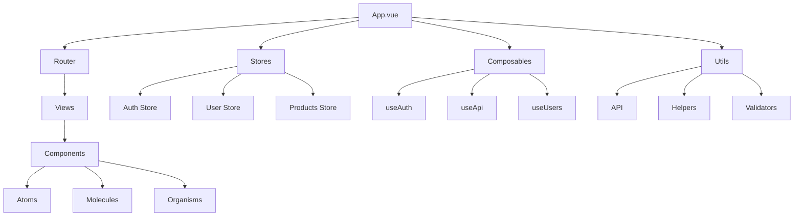
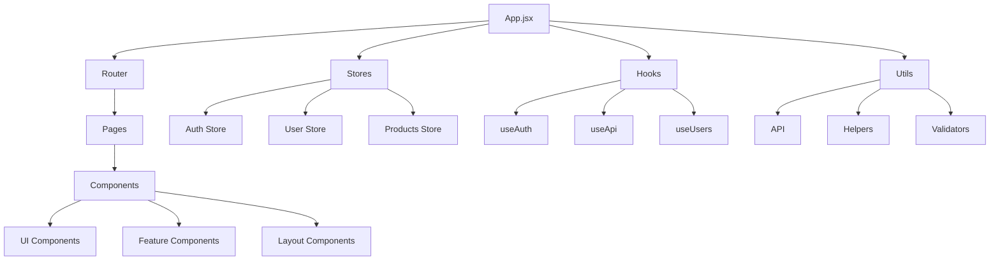
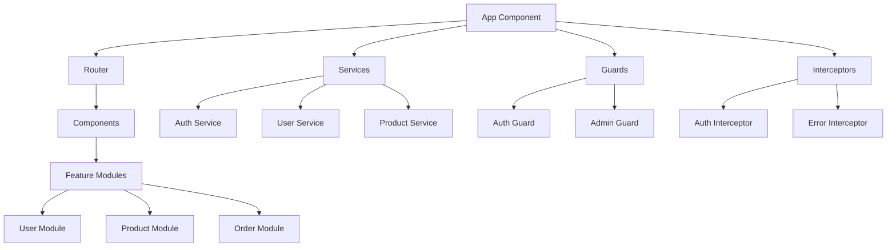

# 🎨 Architecture Frontend : Structure et Patterns

## 📋 Table des matières
- [Introduction](#introduction)
- [Structure des dossiers](#structure-des-dossiers)
- [Architecture des composants](#architecture-des-composants)
- [State management](#state-management)
- [Routing et navigation](#routing-et-navigation)
- [Gestion des API calls](#gestion-des-api-calls)
- [Performance et optimisation](#performance-et-optimisation)
- [Exemples concrets](#exemples-concrets)
- [Templates d'architecture](#templates-darchitecture)
- [Checklist de validation](#checklist-de-validation)
- [Ressources](#ressources)

## 🎯 Introduction

L'architecture frontend définit l'organisation du code côté client, la structure des composants et les patterns qui guident le développement d'une interface utilisateur moderne et maintenable.

### 🎯 Objectifs

- **Structurer** le code frontend de manière logique
- **Organiser** les composants selon les meilleures pratiques
- **Gérer** l'état de l'application efficacement
- **Optimiser** les performances et l'expérience utilisateur
- **Maintenir** la cohérence et la maintenabilité

---

## 📁 Structure des dossiers

### 📊 Approches d'organisation

| Approche | Description | Avantages | Inconvénients | Cas d'usage |
|----------|-------------|-----------|---------------|-------------|
| **Atomic Design** | Organisation par taille de composant | Réutilisabilité, cohérence | Complexité de navigation | Design systems |
| **Feature-based** | Organisation par fonctionnalité | Cohésion, évolutivité | Duplication possible | Applications complexes |
| **Layer-based** | Organisation par type de composant | Simplicité, séparation claire | Couplage entre features | Applications simples |
| **Hybride** | Combinaison des approches | Flexibilité, optimisation | Complexité de navigation | Applications évolutives |

### 🔍 Structures détaillées

#### Structure Atomic Design

```
src/
├── components/           # Composants atomiques
│   ├── atoms/           # Éléments de base
│   │   ├── Button/
│   │   │   ├── Button.vue
│   │   │   ├── Button.stories.js
│   │   │   └── Button.test.js
│   │   ├── Input/
│   │   │   ├── Input.vue
│   │   │   ├── Input.stories.js
│   │   │   └── Input.test.js
│   │   └── Typography/
│   │       ├── Typography.vue
│   │       ├── Typography.stories.js
│   │       └── Typography.test.js
│   ├── molecules/       # Combinaisons d'atomes
│   │   ├── SearchBox/
│   │   │   ├── SearchBox.vue
│   │   │   ├── SearchBox.stories.js
│   │   │   └── SearchBox.test.js
│   │   ├── UserCard/
│   │   │   ├── UserCard.vue
│   │   │   ├── UserCard.stories.js
│   │   │   └── UserCard.test.js
│   │   └── ProductCard/
│   │       ├── ProductCard.vue
│   │       ├── ProductCard.stories.js
│   │       └── ProductCard.test.js
│   └── organisms/       # Composants complexes
│       ├── Header/
│       │   ├── Header.vue
│       │   ├── Header.stories.js
│       │   └── Header.test.js
│       ├── Sidebar/
│       │   ├── Sidebar.vue
│       │   ├── Sidebar.stories.js
│       │   └── Sidebar.test.js
│       └── ProductList/
│           ├── ProductList.vue
│           ├── ProductList.stories.js
│           └── ProductList.test.js
├── templates/           # Templates de pages
│   ├── DefaultLayout/
│   │   ├── DefaultLayout.vue
│   │   └── DefaultLayout.stories.js
│   ├── AuthLayout/
│   │   ├── AuthLayout.vue
│   │   └── AuthLayout.stories.js
│   └── AdminLayout/
│       ├── AdminLayout.vue
│       └── AdminLayout.stories.js
├── pages/               # Pages de l'application
│   ├── Home/
│   │   ├── Home.vue
│   │   └── Home.stories.js
│   ├── Login/
│   │   ├── Login.vue
│   │   └── Login.stories.js
│   └── Profile/
│       ├── Profile.vue
│       └── Profile.stories.js
├── composables/         # Composition API
│   ├── useAuth.js
│   ├── useApi.js
│   └── useLocalStorage.js
├── stores/              # State management
│   ├── auth.js
│   ├── user.js
│   └── products.js
├── utils/               # Utilitaires
│   ├── helpers.js
│   ├── validators.js
│   └── constants.js
├── styles/              # Styles globaux
│   ├── main.css
│   ├── variables.css
│   └── components.css
└── types/               # Types TypeScript
    ├── user.types.ts
    ├── product.types.ts
    └── common.types.ts
```

#### Structure Feature-based

```
src/
├── features/
│   ├── auth/
│   │   ├── components/
│   │   │   ├── LoginForm/
│   │   │   │   ├── LoginForm.vue
│   │   │   │   ├── LoginForm.stories.js
│   │   │   │   └── LoginForm.test.js
│   │   │   ├── RegisterForm/
│   │   │   │   ├── RegisterForm.vue
│   │   │   │   ├── RegisterForm.stories.js
│   │   │   │   └── RegisterForm.test.js
│   │   │   └── PasswordReset/
│   │   │       ├── PasswordReset.vue
│   │   │       ├── PasswordReset.stories.js
│   │   │       └── PasswordReset.test.js
│   │   ├── pages/
│   │   │   ├── LoginPage/
│   │   │   │   ├── LoginPage.vue
│   │   │   │   └── LoginPage.stories.js
│   │   │   ├── RegisterPage/
│   │   │   │   ├── RegisterPage.vue
│   │   │   │   └── RegisterPage.stories.js
│   │   │   └── ForgotPasswordPage/
│   │   │       ├── ForgotPasswordPage.vue
│   │   │       └── ForgotPasswordPage.stories.js
│   │   ├── stores/
│   │   │   └── auth.js
│   │   ├── composables/
│   │   │   └── useAuth.js
│   │   ├── utils/
│   │   │   ├── auth.helpers.js
│   │   │   └── auth.validators.js
│   │   └── types/
│   │       └── auth.types.ts
│   ├── user/
│   │   ├── components/
│   │   │   ├── UserProfile/
│   │   │   ├── UserSettings/
│   │   │   └── UserAvatar/
│   │   ├── pages/
│   │   │   ├── ProfilePage/
│   │   │   └── SettingsPage/
│   │   ├── stores/
│   │   │   └── user.js
│   │   ├── composables/
│   │   │   └── useUser.js
│   │   ├── utils/
│   │   │   └── user.helpers.js
│   │   └── types/
│   │       └── user.types.ts
│   └── products/
│       ├── components/
│       │   ├── ProductList/
│       │   ├── ProductCard/
│       │   └── ProductFilters/
│       ├── pages/
│       │   ├── ProductsPage/
│       │   └── ProductDetailPage/
│       ├── stores/
│       │   └── products.js
│       ├── composables/
│       │   └── useProducts.js
│       ├── utils/
│       │   └── product.helpers.js
│       └── types/
│           └── product.types.ts
├── shared/
│   ├── components/
│   │   ├── Button/
│   │   ├── Input/
│   │   └── Modal/
│   ├── composables/
│   │   ├── useApi.js
│   │   └── useLocalStorage.js
│   ├── utils/
│   │   ├── helpers.js
│   │   └── constants.js
│   ├── styles/
│   │   ├── main.css
│   │   └── variables.css
│   └── types/
│       └── common.types.ts
└── app/
    ├── App.vue
    ├── main.js
    ├── router.js
    └── store.js
```

#### Structure Layer-based

```
src/
├── components/          # Composants réutilisables
│   ├── Button/
│   │   ├── Button.vue
│   │   ├── Button.stories.js
│   │   └── Button.test.js
│   ├── Input/
│   │   ├── Input.vue
│   │   ├── Input.stories.js
│   │   └── Input.test.js
│   └── Modal/
│       ├── Modal.vue
│       ├── Modal.stories.js
│       └── Modal.test.js
├── views/               # Vues de l'application
│   ├── Home/
│   │   ├── Home.vue
│   │   └── Home.stories.js
│   ├── Login/
│   │   ├── Login.vue
│   │   └── Login.stories.js
│   └── Profile/
│       ├── Profile.vue
│       └── Profile.stories.js
├── layouts/             # Layouts de l'application
│   ├── DefaultLayout/
│   │   ├── DefaultLayout.vue
│   │   └── DefaultLayout.stories.js
│   ├── AuthLayout/
│   │   ├── AuthLayout.vue
│   │   └── AuthLayout.stories.js
│   └── AdminLayout/
│       ├── AdminLayout.vue
│       └── AdminLayout.stories.js
├── composables/         # Composition API
│   ├── useAuth.js
│   ├── useApi.js
│   └── useLocalStorage.js
├── stores/              # State management
│   ├── auth.js
│   ├── user.js
│   └── products.js
├── utils/               # Utilitaires
│   ├── helpers.js
│   ├── validators.js
│   └── constants.js
├── styles/              # Styles globaux
│   ├── main.css
│   ├── variables.css
│   └── components.css
└── types/               # Types TypeScript
    ├── user.types.ts
    ├── product.types.ts
    └── common.types.ts
```

---

## 🧩 Architecture des composants

### 📝 Patterns de composants

#### Smart/Dumb Components

**Principe**
Séparation entre composants intelligents (Smart) qui gèrent l'état et la logique, et composants stupides (Dumb) qui ne font que de la présentation.

**Composant Dumb (Présentation)**
```vue
<!-- components/UserCard.vue -->
<template>
  <div class="user-card" :class="{ active: isActive }">
    
    <div class="user-info">
      <h3 class="user-name">{{ user.name }}</h3>
      <p class="user-email">{{ user.email }}</p>
      <span class="user-role">{{ user.role }}</span>
    </div>
    <div class="user-actions">
      <button @click="$emit('edit', user)" class="btn btn-primary">
        Modifier
      </button>
      <button @click="$emit('delete', user)" class="btn btn-danger">
        Supprimer
      </button>
    </div>
  </div>
</template>

<script>
export default {
  name: 'UserCard',
  props: {
    user: {
      type: Object,
      required: true
    },
    isActive: {
      type: Boolean,
      default: false
    }
  },
  emits: ['edit', 'delete']
}
</script>

<style scoped>
.user-card {
  border: 1px solid #e0e0e0;
  border-radius: 8px;
  padding: 16px;
  margin: 8px;
  background: white;
  box-shadow: 0 2px 4px rgba(0, 0, 0, 0.1);
}

.user-card.active {
  border-color: #007bff;
  box-shadow: 0 4px 8px rgba(0, 123, 255, 0.2);
}

.user-avatar {
  width: 48px;
  height: 48px;
  border-radius: 50%;
  object-fit: cover;
}

.user-info {
  margin: 12px 0;
}

.user-name {
  margin: 0 0 4px 0;
  font-size: 16px;
  font-weight: 600;
}

.user-email {
  margin: 0 0 4px 0;
  color: #666;
  font-size: 14px;
}

.user-role {
  display: inline-block;
  padding: 2px 8px;
  background: #f8f9fa;
  border-radius: 4px;
  font-size: 12px;
  color: #495057;
}

.user-actions {
  display: flex;
  gap: 8px;
}

.btn {
  padding: 6px 12px;
  border: none;
  border-radius: 4px;
  cursor: pointer;
  font-size: 14px;
}

.btn-primary {
  background: #007bff;
  color: white;
}

.btn-danger {
  background: #dc3545;
  color: white;
}
</style>
```

**Composant Smart (Logique)**
```vue
<!-- views/UsersPage.vue -->
<template>
  <div class="users-page">
    <div class="page-header">
      <h1>Gestion des utilisateurs</h1>
      <button @click="showCreateModal = true" class="btn btn-primary">
        Nouvel utilisateur
      </button>
    </div>

    <div class="users-grid">
      <UserCard
        v-for="user in users"
        :key="user.id"
        :user="user"
        :is-active="selectedUser?.id === user.id"
        @edit="handleEditUser"
        @delete="handleDeleteUser"
      />
    </div>

    <UserModal
      v-if="showCreateModal || showEditModal"
      :user="selectedUser"
      :is-edit="showEditModal"
      @close="closeModal"
      @save="handleSaveUser"
    />
  </div>
</template>

<script>
import { ref, onMounted } from 'vue'
import { useUsers } from '@/composables/useUsers'
import UserCard from '@/components/UserCard.vue'
import UserModal from '@/components/UserModal.vue'

export default {
  name: 'UsersPage',
  components: {
    UserCard,
    UserModal
  },
  setup() {
    const { users, loading, error, fetchUsers, createUser, updateUser, deleteUser } = useUsers()
    
    const selectedUser = ref(null)
    const showCreateModal = ref(false)
    const showEditModal = ref(false)

    const handleEditUser = (user) => {
      selectedUser.value = user
      showEditModal.value = true
    }

    const handleDeleteUser = async (user) => {
      if (confirm(`Êtes-vous sûr de vouloir supprimer ${user.name} ?`)) {
        try {
          await deleteUser(user.id)
          await fetchUsers()
        } catch (error) {
          console.error('Erreur lors de la suppression:', error)
        }
      }
    }

    const handleSaveUser = async (userData) => {
      try {
        if (showEditModal.value) {
          await updateUser(selectedUser.value.id, userData)
        } else {
          await createUser(userData)
        }
        await fetchUsers()
        closeModal()
      } catch (error) {
        console.error('Erreur lors de la sauvegarde:', error)
      }
    }

    const closeModal = () => {
      selectedUser.value = null
      showCreateModal.value = false
      showEditModal.value = false
    }

    onMounted(() => {
      fetchUsers()
    })

    return {
      users,
      loading,
      error,
      selectedUser,
      showCreateModal,
      showEditModal,
      handleEditUser,
      handleDeleteUser,
      handleSaveUser,
      closeModal
    }
  }
}
</script>

<style scoped>
.users-page {
  padding: 24px;
}

.page-header {
  display: flex;
  justify-content: space-between;
  align-items: center;
  margin-bottom: 24px;
}

.users-grid {
  display: grid;
  grid-template-columns: repeat(auto-fill, minmax(300px, 1fr));
  gap: 16px;
}
</style>
```

#### Container/Presentational Components

**Principe**
Séparation entre composants conteneurs qui gèrent les données et composants de présentation qui gèrent l'affichage.

**Composant de Présentation**
```vue
<!-- components/ProductList.vue -->
<template>
  <div class="product-list">
    <div class="product-list-header">
      <h2>{{ title }}</h2>
      <div class="product-list-actions">
        <button @click="$emit('refresh')" class="btn btn-secondary">
          Actualiser
        </button>
        <button @click="$emit('add')" class="btn btn-primary">
          Ajouter un produit
        </button>
      </div>
    </div>

    <div v-if="loading" class="loading">
      Chargement...
    </div>

    <div v-else-if="error" class="error">
      {{ error }}
    </div>

    <div v-else-if="products.length === 0" class="empty">
      Aucun produit trouvé
    </div>

    <div v-else class="product-grid">
      <ProductCard
        v-for="product in products"
        :key="product.id"
        :product="product"
        @edit="$emit('edit', product)"
        @delete="$emit('delete', product)"
      />
    </div>
  </div>
</template>

<script>
export default {
  name: 'ProductList',
  props: {
    products: {
      type: Array,
      default: () => []
    },
    loading: {
      type: Boolean,
      default: false
    },
    error: {
      type: String,
      default: null
    },
    title: {
      type: String,
      default: 'Produits'
    }
  },
  emits: ['refresh', 'add', 'edit', 'delete']
}
</script>
```

**Composant Conteneur**
```vue
<!-- containers/ProductListContainer.vue -->
<template>
  <ProductList
    :products="products"
    :loading="loading"
    :error="error"
    :title="title"
    @refresh="handleRefresh"
    @add="handleAdd"
    @edit="handleEdit"
    @delete="handleDelete"
  />
</template>

<script>
import { ref, onMounted } from 'vue'
import { useProducts } from '@/composables/useProducts'
import ProductList from '@/components/ProductList.vue'

export default {
  name: 'ProductListContainer',
  components: {
    ProductList
  },
  setup() {
    const { products, loading, error, fetchProducts, deleteProduct } = useProducts()
    
    const title = ref('Liste des produits')

    const handleRefresh = async () => {
      await fetchProducts()
    }

    const handleAdd = () => {
      // Navigation vers la page d'ajout
      router.push('/products/create')
    }

    const handleEdit = (product) => {
      // Navigation vers la page d'édition
      router.push(`/products/${product.id}/edit`)
    }

    const handleDelete = async (product) => {
      if (confirm(`Êtes-vous sûr de vouloir supprimer ${product.name} ?`)) {
        try {
          await deleteProduct(product.id)
          await fetchProducts()
        } catch (error) {
          console.error('Erreur lors de la suppression:', error)
        }
      }
    }

    onMounted(() => {
      fetchProducts()
    })

    return {
      products,
      loading,
      error,
      title,
      handleRefresh,
      handleAdd,
      handleEdit,
      handleDelete
    }
  }
}
</script>
```

#### Compound Components

**Principe**
Composants composés de plusieurs sous-composants qui travaillent ensemble.

```vue
<!-- components/Accordion.vue -->
<template>
  <div class="accordion">
    <slot />
  </div>
</template>

<script>
import { provide, ref } from 'vue'

export default {
  name: 'Accordion',
  setup() {
    const activeItem = ref(null)

    const setActiveItem = (item) => {
      activeItem.value = activeItem.value === item ? null : item
    }

    provide('accordion', {
      activeItem,
      setActiveItem
    })
  }
}
</script>

<!-- components/AccordionItem.vue -->
<template>
  <div class="accordion-item">
    <button
      class="accordion-header"
      :class="{ active: isActive }"
      @click="toggle"
    >
      <slot name="header" />
      <span class="accordion-icon">{{ isActive ? '−' : '+' }}</span>
    </button>
    <div v-if="isActive" class="accordion-content">
      <slot name="content" />
    </div>
  </div>
</template>

<script>
import { inject, computed } from 'vue'

export default {
  name: 'AccordionItem',
  props: {
    id: {
      type: String,
      required: true
    }
  },
  setup(props) {
    const accordion = inject('accordion')
    
    const isActive = computed(() => accordion.activeItem.value === props.id)
    
    const toggle = () => {
      accordion.setActiveItem(props.id)
    }

    return {
      isActive,
      toggle
    }
  }
}
</script>

<!-- Utilisation -->
<template>
  <Accordion>
    <AccordionItem id="item1">
      <template #header>
        <h3>Section 1</h3>
      </template>
      <template #content>
        <p>Contenu de la section 1</p>
      </template>
    </AccordionItem>
    
    <AccordionItem id="item2">
      <template #header>
        <h3>Section 2</h3>
      </template>
      <template #content>
        <p>Contenu de la section 2</p>
      </template>
    </AccordionItem>
  </Accordion>
</template>
```

---

## 🔄 State management

### 📝 Patterns de gestion d'état

#### Vuex (Vue 2)

**Principe**
Gestion centralisée de l'état avec des mutations synchrones et des actions asynchrones.

**Store Vuex**
```javascript
// stores/auth.js
import Vue from 'vue'
import Vuex from 'vuex'

Vue.use(Vuex)

const state = {
  user: null,
  token: localStorage.getItem('token'),
  loading: false,
  error: null
}

const mutations = {
  SET_USER(state, user) {
    state.user = user
  },
  SET_TOKEN(state, token) {
    state.token = token
    if (token) {
      localStorage.setItem('token', token)
    } else {
      localStorage.removeItem('token')
    }
  },
  SET_LOADING(state, loading) {
    state.loading = loading
  },
  SET_ERROR(state, error) {
    state.error = error
  },
  CLEAR_AUTH(state) {
    state.user = null
    state.token = null
    localStorage.removeItem('token')
  }
}

const actions = {
  async login({ commit }, credentials) {
    commit('SET_LOADING', true)
    commit('SET_ERROR', null)
    
    try {
      const response = await api.post('/auth/login', credentials)
      const { user, token } = response.data
      
      commit('SET_USER', user)
      commit('SET_TOKEN', token)
      
      return user
    } catch (error) {
      commit('SET_ERROR', error.response?.data?.message || 'Erreur de connexion')
      throw error
    } finally {
      commit('SET_LOADING', false)
    }
  },

  async logout({ commit }) {
    try {
      await api.post('/auth/logout')
    } catch (error) {
      console.error('Erreur lors de la déconnexion:', error)
    } finally {
      commit('CLEAR_AUTH')
    }
  },

  async fetchUser({ commit, state }) {
    if (!state.token) return
    
    try {
      const response = await api.get('/auth/me')
      commit('SET_USER', response.data)
    } catch (error) {
      commit('CLEAR_AUTH')
      throw error
    }
  }
}

const getters = {
  isAuthenticated: state => !!state.token,
  currentUser: state => state.user,
  isLoading: state => state.loading,
  error: state => state.error
}

export default new Vuex.Store({
  state,
  mutations,
  actions,
  getters
})
```

#### Pinia (Vue 3)

**Principe**
Gestion d'état moderne avec une API plus simple et une meilleure intégration TypeScript.

**Store Pinia**
```javascript
// stores/auth.js
import { defineStore } from 'pinia'
import { ref, computed } from 'vue'
import api from '@/utils/api'

export const useAuthStore = defineStore('auth', () => {
  // State
  const user = ref(null)
  const token = ref(localStorage.getItem('token'))
  const loading = ref(false)
  const error = ref(null)

  // Getters
  const isAuthenticated = computed(() => !!token.value)
  const currentUser = computed(() => user.value)
  const isLoading = computed(() => loading.value)
  const errorMessage = computed(() => error.value)

  // Actions
  const setUser = (userData) => {
    user.value = userData
  }

  const setToken = (tokenValue) => {
    token.value = tokenValue
    if (tokenValue) {
      localStorage.setItem('token', tokenValue)
    } else {
      localStorage.removeItem('token')
    }
  }

  const setLoading = (loadingValue) => {
    loading.value = loadingValue
  }

  const setError = (errorValue) => {
    error.value = errorValue
  }

  const clearAuth = () => {
    user.value = null
    token.value = null
    localStorage.removeItem('token')
  }

  const login = async (credentials) => {
    setLoading(true)
    setError(null)
    
    try {
      const response = await api.post('/auth/login', credentials)
      const { user: userData, token: tokenValue } = response.data
      
      setUser(userData)
      setToken(tokenValue)
      
      return userData
    } catch (error) {
      setError(error.response?.data?.message || 'Erreur de connexion')
      throw error
    } finally {
      setLoading(false)
    }
  }

  const logout = async () => {
    try {
      await api.post('/auth/logout')
    } catch (error) {
      console.error('Erreur lors de la déconnexion:', error)
    } finally {
      clearAuth()
    }
  }

  const fetchUser = async () => {
    if (!token.value) return
    
    try {
      const response = await api.get('/auth/me')
      setUser(response.data)
    } catch (error) {
      clearAuth()
      throw error
    }
  }

  return {
    // State
    user,
    token,
    loading,
    error,
    // Getters
    isAuthenticated,
    currentUser,
    isLoading,
    errorMessage,
    // Actions
    login,
    logout,
    fetchUser,
    clearAuth
  }
})
```

#### Redux (React)

**Principe**
Gestion d'état prévisible avec des actions et des reducers.

**Store Redux**
```javascript
// stores/authSlice.js
import { createSlice, createAsyncThunk } from '@reduxjs/toolkit'
import api from '@/utils/api'

// Actions asynchrones
export const login = createAsyncThunk(
  'auth/login',
  async (credentials, { rejectWithValue }) => {
    try {
      const response = await api.post('/auth/login', credentials)
      return response.data
    } catch (error) {
      return rejectWithValue(error.response?.data?.message || 'Erreur de connexion')
    }
  }
)

export const logout = createAsyncThunk(
  'auth/logout',
  async (_, { rejectWithValue }) => {
    try {
      await api.post('/auth/logout')
    } catch (error) {
      return rejectWithValue(error.response?.data?.message || 'Erreur de déconnexion')
    }
  }
)

export const fetchUser = createAsyncThunk(
  'auth/fetchUser',
  async (_, { rejectWithValue, getState }) => {
    const { auth } = getState()
    if (!auth.token) return
    
    try {
      const response = await api.get('/auth/me')
      return response.data
    } catch (error) {
      return rejectWithValue(error.response?.data?.message || 'Erreur de récupération')
    }
  }
)

// Slice
const authSlice = createSlice({
  name: 'auth',
  initialState: {
    user: null,
    token: localStorage.getItem('token'),
    loading: false,
    error: null
  },
  reducers: {
    clearError: (state) => {
      state.error = null
    },
    clearAuth: (state) => {
      state.user = null
      state.token = null
      localStorage.removeItem('token')
    }
  },
  extraReducers: (builder) => {
    builder
      // Login
      .addCase(login.pending, (state) => {
        state.loading = true
        state.error = null
      })
      .addCase(login.fulfilled, (state, action) => {
        state.loading = false
        state.user = action.payload.user
        state.token = action.payload.token
        localStorage.setItem('token', action.payload.token)
      })
      .addCase(login.rejected, (state, action) => {
        state.loading = false
        state.error = action.payload
      })
      // Logout
      .addCase(logout.fulfilled, (state) => {
        state.user = null
        state.token = null
        localStorage.removeItem('token')
      })
      // Fetch User
      .addCase(fetchUser.fulfilled, (state, action) => {
        state.user = action.payload
      })
      .addCase(fetchUser.rejected, (state) => {
        state.user = null
        state.token = null
        localStorage.removeItem('token')
      })
  }
})

export const { clearError, clearAuth } = authSlice.actions
export default authSlice.reducer
```

#### Zustand (React)

**Principe**
Gestion d'état simple et légère avec une API intuitive.

**Store Zustand**
```javascript
// stores/authStore.js
import { create } from 'zustand'
import { persist } from 'zustand/middleware'
import api from '@/utils/api'

export const useAuthStore = create(
  persist(
    (set, get) => ({
      // State
      user: null,
      token: null,
      loading: false,
      error: null,

      // Actions
      setUser: (user) => set({ user }),
      setToken: (token) => set({ token }),
      setLoading: (loading) => set({ loading }),
      setError: (error) => set({ error }),

      login: async (credentials) => {
        set({ loading: true, error: null })
        
        try {
          const response = await api.post('/auth/login', credentials)
          const { user, token } = response.data
          
          set({ user, token, loading: false })
          return user
        } catch (error) {
          set({ 
            error: error.response?.data?.message || 'Erreur de connexion',
            loading: false 
          })
          throw error
        }
      },

      logout: async () => {
        try {
          await api.post('/auth/logout')
        } catch (error) {
          console.error('Erreur lors de la déconnexion:', error)
        } finally {
          set({ user: null, token: null })
        }
      },

      fetchUser: async () => {
        const { token } = get()
        if (!token) return
        
        try {
          const response = await api.get('/auth/me')
          set({ user: response.data })
        } catch (error) {
          set({ user: null, token: null })
          throw error
        }
      },

      clearError: () => set({ error: null })
    }),
    {
      name: 'auth-storage',
      partialize: (state) => ({ token: state.token })
    }
  )
)
```

---

## 🛣️ Routing et navigation

### 📝 Gestion des routes

#### Vue Router

**Configuration des routes**
```javascript
// router/index.js
import { createRouter, createWebHistory } from 'vue-router'
import { useAuthStore } from '@/stores/auth'

const routes = [
  {
    path: '/',
    name: 'Home',
    component: () => import('@/views/Home.vue'),
    meta: { requiresAuth: false }
  },
  {
    path: '/login',
    name: 'Login',
    component: () => import('@/views/Login.vue'),
    meta: { requiresAuth: false, guest: true }
  },
  {
    path: '/register',
    name: 'Register',
    component: () => import('@/views/Register.vue'),
    meta: { requiresAuth: false, guest: true }
  },
  {
    path: '/dashboard',
    name: 'Dashboard',
    component: () => import('@/views/Dashboard.vue'),
    meta: { requiresAuth: true }
  },
  {
    path: '/profile',
    name: 'Profile',
    component: () => import('@/views/Profile.vue'),
    meta: { requiresAuth: true }
  },
  {
    path: '/admin',
    name: 'Admin',
    component: () => import('@/views/Admin.vue'),
    meta: { requiresAuth: true, requiresAdmin: true }
  },
  {
    path: '/:pathMatch(.*)*',
    name: 'NotFound',
    component: () => import('@/views/NotFound.vue')
  }
]

const router = createRouter({
  history: createWebHistory(),
  routes
})

// Navigation guards
router.beforeEach(async (to, from, next) => {
  const authStore = useAuthStore()
  
  // Vérifier l'authentification
  if (to.meta.requiresAuth && !authStore.isAuthenticated) {
    next({ name: 'Login' })
    return
  }
  
  // Vérifier les utilisateurs invités
  if (to.meta.guest && authStore.isAuthenticated) {
    next({ name: 'Dashboard' })
    return
  }
  
  // Vérifier les permissions admin
  if (to.meta.requiresAdmin && !authStore.currentUser?.isAdmin) {
    next({ name: 'Dashboard' })
    return
  }
  
  next()
})

export default router
```

**Composable de navigation**
```javascript
// composables/useNavigation.js
import { useRouter, useRoute } from 'vue-router'
import { computed } from 'vue'

export function useNavigation() {
  const router = useRouter()
  const route = useRoute()
  
  const navigateTo = (name, params = {}, query = {}) => {
    router.push({ name, params, query })
  }
  
  const navigateBack = () => {
    router.go(-1)
  }
  
  const replaceRoute = (name, params = {}, query = {}) => {
    router.replace({ name, params, query })
  }
  
  const currentRoute = computed(() => route)
  
  const isActiveRoute = (routeName) => {
    return route.name === routeName
  }
  
  return {
    navigateTo,
    navigateBack,
    replaceRoute,
    currentRoute,
    isActiveRoute
  }
}
```

#### React Router

**Configuration des routes**
```javascript
// router/index.js
import { createBrowserRouter, Navigate } from 'react-router-dom'
import { useAuthStore } from '@/stores/authStore'
import Layout from '@/components/Layout'
import ProtectedRoute from '@/components/ProtectedRoute'
import GuestRoute from '@/components/GuestRoute'

const routes = createBrowserRouter([
  {
    path: '/',
    element: <Layout />,
    children: [
      {
        index: true,
        element: <Home />
      },
      {
        path: 'login',
        element: (
          <GuestRoute>
            <Login />
          </GuestRoute>
        )
      },
      {
        path: 'register',
        element: (
          <GuestRoute>
            <Register />
          </GuestRoute>
        )
      },
      {
        path: 'dashboard',
        element: (
          <ProtectedRoute>
            <Dashboard />
          </ProtectedRoute>
        )
      },
      {
        path: 'profile',
        element: (
          <ProtectedRoute>
            <Profile />
          </ProtectedRoute>
        )
      },
      {
        path: 'admin',
        element: (
          <ProtectedRoute requiresAdmin>
            <Admin />
          </ProtectedRoute>
        )
      }
    ]
  },
  {
    path: '*',
    element: <NotFound />
  }
])

export default routes
```

**Composant de route protégée**
```javascript
// components/ProtectedRoute.jsx
import { Navigate } from 'react-router-dom'
import { useAuthStore } from '@/stores/authStore'

export default function ProtectedRoute({ children, requiresAdmin = false }) {
  const { isAuthenticated, currentUser } = useAuthStore()
  
  if (!isAuthenticated) {
    return <Navigate to="/login" replace />
  }
  
  if (requiresAdmin && !currentUser?.isAdmin) {
    return <Navigate to="/dashboard" replace />
  }
  
  return children
}
```

---

## 🌐 Gestion des API calls

### 📝 Patterns de communication API

#### Axios avec intercepteurs

**Configuration Axios**
```javascript
// utils/api.js
import axios from 'axios'
import { useAuthStore } from '@/stores/auth'

const api = axios.create({
  baseURL: process.env.VUE_APP_API_URL || 'http://localhost:3000/api',
  timeout: 10000,
  headers: {
    'Content-Type': 'application/json'
  }
})

// Intercepteur de requête
api.interceptors.request.use(
  (config) => {
    const authStore = useAuthStore()
    
    if (authStore.token) {
      config.headers.Authorization = `Bearer ${authStore.token}`
    }
    
    return config
  },
  (error) => {
    return Promise.reject(error)
  }
)

// Intercepteur de réponse
api.interceptors.response.use(
  (response) => {
    return response
  },
  async (error) => {
    const authStore = useAuthStore()
    
    if (error.response?.status === 401) {
      authStore.logout()
      window.location.href = '/login'
    }
    
    return Promise.reject(error)
  }
)

export default api
```

#### Composable pour les API calls

**Composable générique**
```javascript
// composables/useApi.js
import { ref, reactive } from 'vue'
import api from '@/utils/api'

export function useApi() {
  const loading = ref(false)
  const error = ref(null)
  const data = ref(null)

  const execute = async (apiCall) => {
    loading.value = true
    error.value = null
    
    try {
      const result = await apiCall()
      data.value = result.data
      return result.data
    } catch (err) {
      error.value = err.response?.data?.message || 'Une erreur est survenue'
      throw err
    } finally {
      loading.value = false
    }
  }

  const get = (url, config = {}) => {
    return execute(() => api.get(url, config))
  }

  const post = (url, payload, config = {}) => {
    return execute(() => api.post(url, payload, config))
  }

  const put = (url, payload, config = {}) => {
    return execute(() => api.put(url, payload, config))
  }

  const del = (url, config = {}) => {
    return execute(() => api.delete(url, config))
  }

  return {
    loading,
    error,
    data,
    execute,
    get,
    post,
    put,
    delete: del
  }
}
```

**Composable spécialisé**
```javascript
// composables/useUsers.js
import { ref, computed } from 'vue'
import { useApi } from './useApi'

export function useUsers() {
  const { loading, error, data, get, post, put, delete: del } = useApi()
  
  const users = ref([])
  const currentUser = ref(null)

  const fetchUsers = async (params = {}) => {
    try {
      const response = await get('/users', { params })
      users.value = response.data
      return response
    } catch (error) {
      console.error('Erreur lors de la récupération des utilisateurs:', error)
      throw error
    }
  }

  const fetchUser = async (id) => {
    try {
      const response = await get(`/users/${id}`)
      currentUser.value = response.data
      return response.data
    } catch (error) {
      console.error('Erreur lors de la récupération de l\'utilisateur:', error)
      throw error
    }
  }

  const createUser = async (userData) => {
    try {
      const response = await post('/users', userData)
      users.value.push(response.data)
      return response.data
    } catch (error) {
      console.error('Erreur lors de la création de l\'utilisateur:', error)
      throw error
    }
  }

  const updateUser = async (id, userData) => {
    try {
      const response = await put(`/users/${id}`, userData)
      const index = users.value.findIndex(user => user.id === id)
      if (index !== -1) {
        users.value[index] = response.data
      }
      return response.data
    } catch (error) {
      console.error('Erreur lors de la mise à jour de l\'utilisateur:', error)
      throw error
    }
  }

  const deleteUser = async (id) => {
    try {
      await del(`/users/${id}`)
      users.value = users.value.filter(user => user.id !== id)
    } catch (error) {
      console.error('Erreur lors de la suppression de l\'utilisateur:', error)
      throw error
    }
  }

  const usersCount = computed(() => users.value.length)

  return {
    users,
    currentUser,
    loading,
    error,
    fetchUsers,
    fetchUser,
    createUser,
    updateUser,
    deleteUser,
    usersCount
  }
}
```

#### React Query (TanStack Query)

**Configuration React Query**
```javascript
// utils/queryClient.js
import { QueryClient } from '@tanstack/react-query'

export const queryClient = new QueryClient({
  defaultOptions: {
    queries: {
      staleTime: 5 * 60 * 1000, // 5 minutes
      cacheTime: 10 * 60 * 1000, // 10 minutes
      retry: 3,
      refetchOnWindowFocus: false
    }
  }
})
```

**Hooks personnalisés**
```javascript
// hooks/useUsers.js
import { useQuery, useMutation, useQueryClient } from '@tanstack/react-query'
import api from '@/utils/api'

export function useUsers() {
  return useQuery({
    queryKey: ['users'],
    queryFn: async () => {
      const response = await api.get('/users')
      return response.data
    }
  })
}

export function useUser(id) {
  return useQuery({
    queryKey: ['users', id],
    queryFn: async () => {
      const response = await api.get(`/users/${id}`)
      return response.data
    },
    enabled: !!id
  })
}

export function useCreateUser() {
  const queryClient = useQueryClient()
  
  return useMutation({
    mutationFn: async (userData) => {
      const response = await api.post('/users', userData)
      return response.data
    },
    onSuccess: () => {
      queryClient.invalidateQueries({ queryKey: ['users'] })
    }
  })
}

export function useUpdateUser() {
  const queryClient = useQueryClient()
  
  return useMutation({
    mutationFn: async ({ id, userData }) => {
      const response = await api.put(`/users/${id}`, userData)
      return response.data
    },
    onSuccess: (data) => {
      queryClient.invalidateQueries({ queryKey: ['users'] })
      queryClient.invalidateQueries({ queryKey: ['users', data.id] })
    }
  })
}

export function useDeleteUser() {
  const queryClient = useQueryClient()
  
  return useMutation({
    mutationFn: async (id) => {
      await api.delete(`/users/${id}`)
    },
    onSuccess: () => {
      queryClient.invalidateQueries({ queryKey: ['users'] })
    }
  })
}
```

---

## ⚡ Performance et optimisation

### 📝 Optimisations de performance

#### Lazy Loading

**Composants paresseux**
```javascript
// router/index.js
const routes = [
  {
    path: '/',
    name: 'Home',
    component: () => import('@/views/Home.vue')
  },
  {
    path: '/dashboard',
    name: 'Dashboard',
    component: () => import('@/views/Dashboard.vue')
  },
  {
    path: '/profile',
    name: 'Profile',
    component: () => import('@/views/Profile.vue')
  }
]
```

**Images paresseuses**
```vue
<!-- components/LazyImage.vue -->
<template>
  <div class="lazy-image" :style="{ aspectRatio: aspectRatio }">
    
    <div v-else class="placeholder">
      <div class="spinner"></div>
    </div>
  </div>
</template>

<script>
export default {
  name: 'LazyImage',
  props: {
    src: {
      type: String,
      required: true
    },
    alt: {
      type: String,
      default: ''
    },
    aspectRatio: {
      type: String,
      default: '16/9'
    }
  },
  data() {
    return {
      loaded: false
    }
  },
  mounted() {
    this.loadImage()
  },
  methods: {
    loadImage() {
      const img = new Image()
      img.onload = () => {
        this.loaded = true
      }
      img.src = this.src
    },
    handleLoad() {
      this.$emit('load')
    }
  }
}
</script>
```

#### Virtual Scrolling

**Liste virtuelle**
```vue
<!-- components/VirtualList.vue -->
<template>
  <div class="virtual-list" ref="container" @scroll="handleScroll">
    <div class="virtual-list-content" :style="{ height: totalHeight + 'px' }">
      <div
        class="virtual-list-items"
        :style="{ transform: `translateY(${offsetY}px)` }"
      >
        <div
          v-for="item in visibleItems"
          :key="item.id"
          class="virtual-list-item"
          :style="{ height: itemHeight + 'px' }"
        >
          <slot :item="item" :index="item.index" />
        </div>
      </div>
    </div>
  </div>
</template>

<script>
export default {
  name: 'VirtualList',
  props: {
    items: {
      type: Array,
      required: true
    },
    itemHeight: {
      type: Number,
      default: 50
    },
    containerHeight: {
      type: Number,
      default: 400
    }
  },
  data() {
    return {
      scrollTop: 0,
      visibleStart: 0,
      visibleEnd: 0
    }
  },
  computed: {
    totalHeight() {
      return this.items.length * this.itemHeight
    },
    visibleCount() {
      return Math.ceil(this.containerHeight / this.itemHeight) + 1
    },
    visibleItems() {
      return this.items.slice(this.visibleStart, this.visibleEnd)
    },
    offsetY() {
      return this.visibleStart * this.itemHeight
    }
  },
  mounted() {
    this.updateVisibleItems()
  },
  methods: {
    handleScroll(event) {
      this.scrollTop = event.target.scrollTop
      this.updateVisibleItems()
    },
    updateVisibleItems() {
      this.visibleStart = Math.floor(this.scrollTop / this.itemHeight)
      this.visibleEnd = Math.min(
        this.visibleStart + this.visibleCount,
        this.items.length
      )
    }
  }
}
</script>
```

#### Memoization

**Composant mémorisé**
```vue
<!-- components/ExpensiveComponent.vue -->
<template>
  <div class="expensive-component">
    <h3>{{ title }}</h3>
    <div class="content">
      {{ computedValue }}
    </div>
  </div>
</template>

<script>
import { computed, defineComponent } from 'vue'

export default defineComponent({
  name: 'ExpensiveComponent',
  props: {
    title: {
      type: String,
      required: true
    },
    data: {
      type: Array,
      required: true
    }
  },
  setup(props) {
    const computedValue = computed(() => {
      // Calcul coûteux
      return props.data.reduce((sum, item) => sum + item.value, 0)
    })

    return {
      computedValue
    }
  }
})
</script>
```

#### Code Splitting

**Découpage du code**
```javascript
// main.js
import { createApp } from 'vue'
import App from './App.vue'

const app = createApp(App)

// Chargement paresseux des modules
const lazyModules = {
  admin: () => import('./modules/admin'),
  dashboard: () => import('./modules/dashboard'),
  profile: () => import('./modules/profile')
}

// Enregistrement des modules
Object.keys(lazyModules).forEach(name => {
  app.component(name, defineAsyncComponent(lazyModules[name]))
})

app.mount('#app')
```

---

## 💡 Exemples concrets

### 🏗️ Architecture complète avec Vue.js

#### Structure du projet

```
src/
├── main.js
├── App.vue
├── router/
│   ├── index.js
│   └── guards.js
├── stores/
│   ├── index.js
│   ├── auth.js
│   ├── user.js
│   └── products.js
├── components/
│   ├── atoms/
│   │   ├── Button/
│   │   ├── Input/
│   │   └── Typography/
│   ├── molecules/
│   │   ├── SearchBox/
│   │   ├── UserCard/
│   │   └── ProductCard/
│   └── organisms/
│       ├── Header/
│       ├── Sidebar/
│       └── ProductList/
├── views/
│   ├── Home/
│   ├── Login/
│   ├── Register/
│   ├── Dashboard/
│   ├── Profile/
│   └── Admin/
├── composables/
│   ├── useAuth.js
│   ├── useApi.js
│   ├── useLocalStorage.js
│   └── useUsers.js
├── utils/
│   ├── api.js
│   ├── helpers.js
│   ├── validators.js
│   └── constants.js
├── styles/
│   ├── main.css
│   ├── variables.css
│   └── components.css
└── types/
    ├── user.types.ts
    ├── product.types.ts
    └── common.types.ts
```

#### Application principale

```vue
<!-- App.vue -->
<template>
  <div id="app">
    <Header v-if="showHeader" />
    <main class="main-content">
      <router-view />
    </main>
    <Footer v-if="showFooter" />
  </div>
</template>

<script>
import { computed } from 'vue'
import { useRoute } from 'vue-router'
import Header from '@/components/organisms/Header/Header.vue'
import Footer from '@/components/organisms/Footer/Footer.vue'

export default {
  name: 'App',
  components: {
    Header,
    Footer
  },
  setup() {
    const route = useRoute()
    
    const showHeader = computed(() => {
      return !route.meta.hideHeader
    })
    
    const showFooter = computed(() => {
      return !route.meta.hideFooter
    })
    
    return {
      showHeader,
      showFooter
    }
  }
}
</script>

<style>
#app {
  min-height: 100vh;
  display: flex;
  flex-direction: column;
}

.main-content {
  flex: 1;
}
</style>
```

#### Store principal

```javascript
// stores/index.js
import { createPinia } from 'pinia'
import { createPersistedState } from 'pinia-plugin-persistedstate'

const pinia = createPinia()
pinia.use(createPersistedState())

export default pinia
```

#### Router principal

```javascript
// router/index.js
import { createRouter, createWebHistory } from 'vue-router'
import { useAuthStore } from '@/stores/auth'

const routes = [
  {
    path: '/',
    name: 'Home',
    component: () => import('@/views/Home/Home.vue'),
    meta: { requiresAuth: false }
  },
  {
    path: '/login',
    name: 'Login',
    component: () => import('@/views/Login/Login.vue'),
    meta: { requiresAuth: false, guest: true }
  },
  {
    path: '/register',
    name: 'Register',
    component: () => import('@/views/Register/Register.vue'),
    meta: { requiresAuth: false, guest: true }
  },
  {
    path: '/dashboard',
    name: 'Dashboard',
    component: () => import('@/views/Dashboard/Dashboard.vue'),
    meta: { requiresAuth: true }
  },
  {
    path: '/profile',
    name: 'Profile',
    component: () => import('@/views/Profile/Profile.vue'),
    meta: { requiresAuth: true }
  },
  {
    path: '/admin',
    name: 'Admin',
    component: () => import('@/views/Admin/Admin.vue'),
    meta: { requiresAuth: true, requiresAdmin: true }
  }
]

const router = createRouter({
  history: createWebHistory(),
  routes
})

// Navigation guards
router.beforeEach(async (to, from, next) => {
  const authStore = useAuthStore()
  
  if (to.meta.requiresAuth && !authStore.isAuthenticated) {
    next({ name: 'Login' })
    return
  }
  
  if (to.meta.guest && authStore.isAuthenticated) {
    next({ name: 'Dashboard' })
    return
  }
  
  if (to.meta.requiresAdmin && !authStore.currentUser?.isAdmin) {
    next({ name: 'Dashboard' })
    return
  }
  
  next()
})

export default router
```

---

## 📋 Templates d'architecture

### 🏗️ Template d'architecture Vue.js



### 🏗️ Template d'architecture React



### 🏗️ Template d'architecture Angular



---

## ✅ Checklist de validation

### 📋 Structure du projet

- [ ] **Organisation des dossiers** claire et logique
- [ ] **Séparation des composants** respectée
- [ ] **Architecture des composants** bien définie
- [ ] **State management** implémenté
- [ ] **Routing et navigation** configurés

### 📋 Qualité du code

- [ ] **Standards de code** respectés
- [ ] **Documentation** complète
- [ ] **Tests** implémentés
- [ ] **Performance** optimisée
- [ ] **Accessibilité** intégrée

### 📋 Architecture

- [ ] **Scalabilité** de l'architecture évaluée
- [ ] **Maintenabilité** de l'architecture validée
- [ ] **Évolutivité** de l'architecture assurée
- [ ] **Réutilisabilité** des composants maximisée
- [ ] **Performance** de l'architecture optimisée

### 📋 Fonctionnalités

- [ ] **Gestion d'état** robuste
- [ ] **Communication API** efficace
- [ ] **Routing** sécurisé
- [ ] **Navigation** intuitive
- [ ] **Gestion des erreurs** complète

---

## 📚 Ressources

### 🎓 Formation
- [Architecture globale](./global-architecture.md)
- [Architecture backend](./backend-architecture.md)
- [Architecture base de données](./database-architecture.md)
- [Vue.js](../../vuejs/README.md)

### 🛠️ Outils
- [Vue.js](https://vuejs.org/) - Framework JavaScript
- [React](https://reactjs.org/) - Bibliothèque JavaScript
- [Angular](https://angular.io/) - Framework TypeScript
- [Vite](https://vitejs.dev/) - Build tool

### 📖 Références
- [Vue.js Documentation](https://vuejs.org/guide/) - Documentation officielle
- [React Documentation](https://reactjs.org/docs/) - Documentation officielle
- [Angular Documentation](https://angular.io/docs) - Documentation officielle
- [Atomic Design](https://atomicdesign.bradfrost.com/) - Brad Frost

---

<div align="center">

[](../../../README.md)

</div>

---

*Dernière mise à jour : Janvier 2024*
