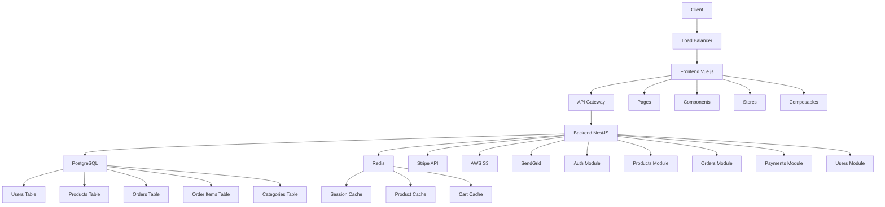
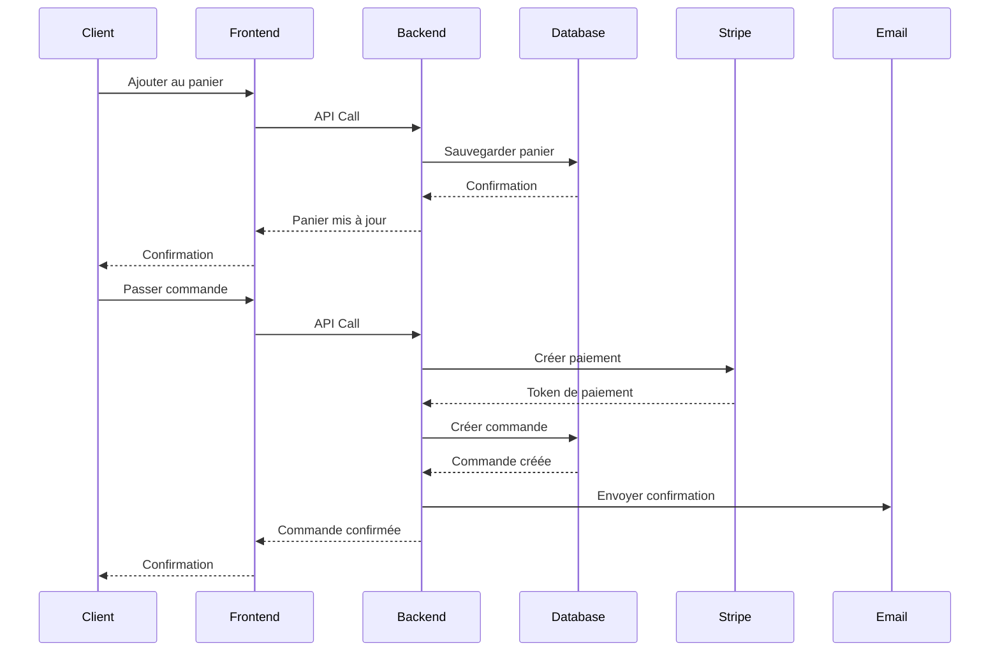
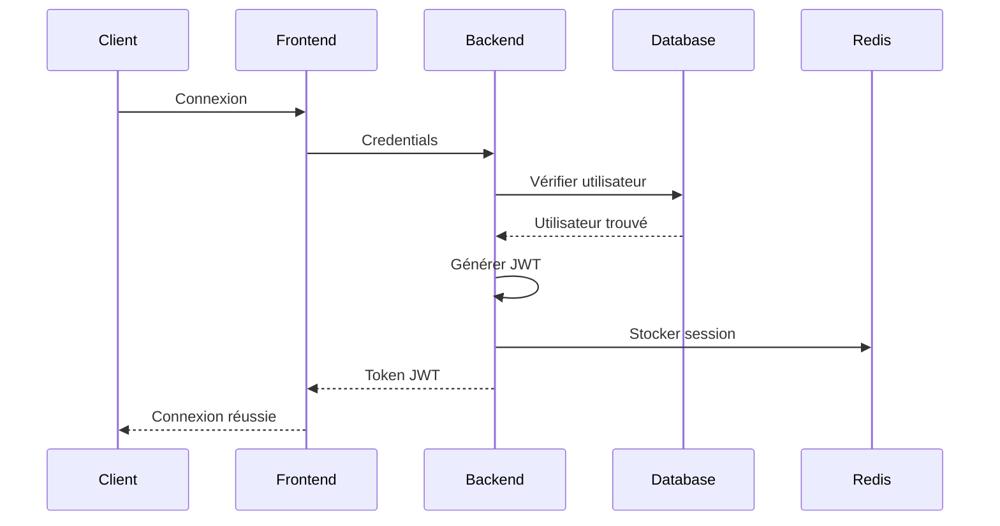

# 🛒 E-commerce : Architecture et User Stories

## 📋 Table des matières
- [Introduction](#introduction)
- [Contexte métier](#contexte-métier)
- [Besoins spécifiques](#besoins-spécifiques)
- [Stack technique recommandée](#stack-technique-recommandée)
- [Architecture détaillée](#architecture-détaillée)
- [Structure de dossiers](#structure-de-dossiers)
- [User stories types](#user-stories-types)
- [Exemples de code clés](#exemples-de-code-clés)
- [Checklist de validation](#checklist-de-validation)
- [Ressources](#ressources)

## 🎯 Introduction

Ce cas d'usage présente l'architecture complète d'une plateforme e-commerce moderne, incluant la gestion des produits, des commandes, des paiements et de l'expérience utilisateur.

### 🎯 Objectifs

- **Définir** l'architecture d'une plateforme e-commerce
- **Identifier** les besoins métier spécifiques
- **Proposer** une stack technique adaptée
- **Fournir** des user stories détaillées
- **Guider** l'implémentation complète

---

## 🏢 Contexte métier

### 📝 Description du projet

**Plateforme e-commerce moderne**
- Vente de produits en ligne
- Gestion des commandes et des stocks
- Processus de paiement sécurisé
- Interface d'administration
- Analytics et reporting

### 📊 Acteurs principaux

| Acteur | Description | Responsabilités |
|--------|-------------|-----------------|
| **Client** | Utilisateur final | Navigation, achat, gestion du compte |
| **Administrateur** | Gestionnaire de la plateforme | Gestion des produits, commandes, utilisateurs |
| **Vendeur** | Gestionnaire de produits | Gestion du catalogue, stocks, prix |
| **Support** | Équipe d'assistance | Gestion des réclamations, support client |

### 🎯 Objectifs métier

- **Vente en ligne** : Faciliter les achats des clients
- **Gestion des stocks** : Optimiser la gestion des inventaires
- **Expérience utilisateur** : Offrir une expérience fluide et intuitive
- **Scalabilité** : Supporter la croissance de l'activité
- **Sécurité** : Protéger les données et les transactions

---

## 🔍 Besoins spécifiques

### 📝 Fonctionnalités principales

#### Gestion des produits
- **Catalogue** : Affichage et recherche de produits
- **Catégories** : Organisation hiérarchique des produits
- **Variants** : Gestion des variantes (taille, couleur, etc.)
- **Stocks** : Suivi et gestion des inventaires
- **Prix** : Gestion des prix et promotions

#### Gestion des commandes
- **Panier** : Gestion du panier d'achat
- **Checkout** : Processus de commande
- **Suivi** : Suivi des commandes
- **Annulation** : Gestion des annulations
- **Retours** : Processus de retour

#### Gestion des utilisateurs
- **Authentification** : Connexion et inscription
- **Profils** : Gestion des profils utilisateurs
- **Adresses** : Gestion des adresses de livraison
- **Historique** : Historique des commandes
- **Préférences** : Préférences utilisateur

#### Gestion des paiements
- **Paiements** : Traitement des paiements
- **Moyens de paiement** : Gestion des moyens de paiement
- **Facturation** : Génération des factures
- **Remboursements** : Gestion des remboursements

#### Administration
- **Dashboard** : Tableau de bord administrateur
- **Gestion des produits** : CRUD des produits
- **Gestion des commandes** : Suivi des commandes
- **Gestion des utilisateurs** : Administration des utilisateurs
- **Analytics** : Statistiques et rapports

### 📊 Besoins non-fonctionnels

| Besoin | Description | Critères |
|--------|-------------|----------|
| **Performance** | Temps de réponse rapide | < 2s pour les pages |
| **Scalabilité** | Support de la croissance | 10k+ utilisateurs simultanés |
| **Sécurité** | Protection des données | Conformité PCI DSS |
| **Disponibilité** | Uptime élevé | 99.9% de disponibilité |
| **Maintenabilité** | Code maintenable | Architecture modulaire |

---

## 🛠️ Stack technique recommandée

### 📝 Architecture recommandée

**Architecture : Monolithe modulaire**
- **Simplicité** : Développement et déploiement simplifiés
- **Performance** : Communication locale rapide
- **Cohérence** : Base de données unique
- **Évolutivité** : Migration vers microservices possible

### 🏗️ Stack technique

| Composant | Technologie | Justification |
|-----------|-------------|---------------|
| **Frontend** | Vue.js 3 + TypeScript | Réactivité, écosystème mature |
| **Backend** | NestJS + TypeScript | Architecture modulaire, évolutivité |
| **Base de données** | PostgreSQL | ACID, requêtes complexes |
| **Cache** | Redis | Performance, sessions |
| **Paiements** | Stripe | Sécurité, conformité PCI DSS |
| **Stockage** | AWS S3 | Scalabilité, coûts optimisés |
| **Email** | SendGrid | Fiabilité, templates |
| **Monitoring** | Sentry + DataDog | Observabilité complète |

### 🔧 Outils de développement

| Outil | Usage | Justification |
|-------|-------|---------------|
| **Vite** | Build tool frontend | Performance, HMR |
| **Prisma** | ORM | Type safety, migrations |
| **Docker** | Containerisation | Environnement cohérent |
| **GitHub Actions** | CI/CD | Automatisation |
| **ESLint/Prettier** | Qualité de code | Standards cohérents |
| **Jest/Vitest** | Tests | Couverture de tests |

---

## 🏗️ Architecture détaillée

### 📊 Schéma d'architecture



### 🔄 Flux de données

#### Flux de commande


#### Flux d'authentification


---

## 📁 Structure de dossiers

### 📝 Structure complète

```
ecommerce-project/
├── frontend/                 # Application Vue.js
│   ├── src/
│   │   ├── components/       # Composants réutilisables
│   │   │   ├── atoms/        # Composants atomiques
│   │   │   │   ├── Button/
│   │   │   │   ├── Input/
│   │   │   │   └── Typography/
│   │   │   ├── molecules/    # Composants moléculaires
│   │   │   │   ├── ProductCard/
│   │   │   │   ├── UserCard/
│   │   │   │   └── SearchBox/
│   │   │   └── organisms/    # Composants organiques
│   │   │       ├── Header/
│   │   │       ├── Footer/
│   │   │       └── ProductList/
│   │   ├── pages/            # Pages de l'application
│   │   │   ├── Home/
│   │   │   ├── Products/
│   │   │   ├── ProductDetail/
│   │   │   ├── Cart/
│   │   │   ├── Checkout/
│   │   │   ├── Login/
│   │   │   ├── Register/
│   │   │   ├── Profile/
│   │   │   └── Admin/
│   │   ├── stores/           # State management
│   │   │   ├── auth.js
│   │   │   ├── products.js
│   │   │   ├── cart.js
│   │   │   └── orders.js
│   │   ├── composables/      # Composition API
│   │   │   ├── useAuth.js
│   │   │   ├── useProducts.js
│   │   │   ├── useCart.js
│   │   │   └── useOrders.js
│   │   ├── utils/            # Utilitaires
│   │   │   ├── api.js
│   │   │   ├── helpers.js
│   │   │   └── validators.js
│   │   ├── types/            # Types TypeScript
│   │   │   ├── user.types.ts
│   │   │   ├── product.types.ts
│   │   │   └── order.types.ts
│   │   └── main.ts
│   ├── public/
│   ├── package.json
│   ├── vite.config.js
│   ├── tsconfig.json
│   └── README.md
├── backend/                  # Application NestJS
│   ├── src/
│   │   ├── features/         # Modules métier
│   │   │   ├── auth/         # Authentification
│   │   │   │   ├── controllers/
│   │   │   │   ├── services/
│   │   │   │   ├── repositories/
│   │   │   │   ├── dto/
│   │   │   │   ├── entities/
│   │   │   │   └── auth.module.ts
│   │   │   ├── products/     # Gestion des produits
│   │   │   │   ├── controllers/
│   │   │   │   ├── services/
│   │   │   │   ├── repositories/
│   │   │   │   ├── dto/
│   │   │   │   ├── entities/
│   │   │   │   └── products.module.ts
│   │   │   ├── orders/       # Gestion des commandes
│   │   │   │   ├── controllers/
│   │   │   │   ├── services/
│   │   │   │   ├── repositories/
│   │   │   │   ├── dto/
│   │   │   │   ├── entities/
│   │   │   │   └── orders.module.ts
│   │   │   ├── payments/     # Gestion des paiements
│   │   │   │   ├── controllers/
│   │   │   │   ├── services/
│   │   │   │   ├── repositories/
│   │   │   │   ├── dto/
│   │   │   │   ├── entities/
│   │   │   │   └── payments.module.ts
│   │   │   └── users/        # Gestion des utilisateurs
│   │   │       ├── controllers/
│   │   │       ├── services/
│   │   │       ├── repositories/
│   │   │       ├── dto/
│   │   │       ├── entities/
│   │   │       └── users.module.ts
│   │   ├── shared/           # Code partagé
│   │   │   ├── middleware/
│   │   │   ├── services/
│   │   │   ├── utils/
│   │   │   └── types/
│   │   ├── infrastructure/   # Infrastructure
│   │   │   ├── database/
│   │   │   ├── cache/
│   │   │   └── external/
│   │   └── main.ts
│   ├── prisma/
│   │   ├── schema.prisma
│   │   └── migrations/
│   ├── package.json
│   ├── tsconfig.json
│   ├── nest-cli.json
│   └── README.md
├── infrastructure/           # Infrastructure as Code
│   ├── docker/
│   │   ├── Dockerfile.frontend
│   │   ├── Dockerfile.backend
│   │   └── docker-compose.yml
│   ├── kubernetes/
│   │   ├── frontend-deployment.yaml
│   │   ├── backend-deployment.yaml
│   │   └── ingress.yaml
│   └── terraform/
│       ├── main.tf
│       ├── variables.tf
│       └── outputs.tf
├── docs/                     # Documentation
│   ├── api/
│   ├── architecture/
│   ├── deployment/
│   └── README.md
├── scripts/                  # Scripts utilitaires
│   ├── setup.sh
│   ├── deploy.sh
│   └── backup.sh
├── .github/                  # GitHub Actions
│   └── workflows/
│       ├── ci.yml
│       └── cd.yml
├── .gitignore
├── README.md
└── package.json
```

---

## 📝 User stories types

### 👤 Client (Utilisateur final)

#### Authentification et compte
- **En tant que** client, **je veux** m'inscrire avec mon email et mot de passe **afin de** créer un compte et accéder à mes fonctionnalités personnalisées
- **En tant que** client, **je veux** me connecter avec mes identifiants **afin de** accéder à mon compte et mes commandes
- **En tant que** client, **je veux** réinitialiser mon mot de passe **afin de** regagner l'accès à mon compte en cas d'oubli
- **En tant que** client, **je veux** modifier mes informations personnelles **afin de** maintenir mes données à jour
- **En tant que** client, **je veux** gérer mes adresses de livraison **afin de** faciliter mes commandes futures

#### Navigation et recherche
- **En tant que** client, **je veux** parcourir les catégories de produits **afin de** découvrir les articles disponibles
- **En tant que** client, **je veux** rechercher des produits par nom ou description **afin de** trouver rapidement ce que je cherche
- **En tant que** client, **je veux** filtrer les produits par prix, marque, disponibilité **afin de** affiner ma recherche
- **En tant que** client, **je veux** trier les produits par pertinence, prix, popularité **afin de** trouver les meilleures options
- **En tant que** client, **je veux** voir les détails d'un produit **afin de** prendre une décision d'achat éclairée

#### Panier et commande
- **En tant que** client, **je veux** ajouter des produits à mon panier **afin de** les acheter plus tard
- **En tant que** client, **je veux** modifier les quantités dans mon panier **afin de** ajuster mes achats
- **En tant que** client, **je veux** supprimer des produits de mon panier **afin de** annuler des achats non désirés
- **En tant que** client, **je veux** voir le total de mon panier **afin de** connaître le montant de ma commande
- **En tant que** client, **je veux** passer commande **afin de** finaliser mon achat
- **En tant que** client, **je veux** choisir mon adresse de livraison **afin de** recevoir ma commande au bon endroit
- **En tant que** client, **je veux** choisir mon moyen de paiement **afin de** payer ma commande de manière sécurisée

#### Suivi et historique
- **En tant que** client, **je veux** suivre l'état de ma commande **afin de** savoir quand je vais la recevoir
- **En tant que** client, **je veux** voir l'historique de mes commandes **afin de** retrouver mes achats précédents
- **En tant que** client, **je veux** recevoir une confirmation de commande par email **afin de** avoir une preuve de mon achat
- **En tant que** client, **je veux** annuler ma commande si elle n'est pas encore expédiée **afin de** éviter des frais inutiles
- **En tant que** client, **je veux** retourner un produit défectueux **afin de** obtenir un remboursement ou un échange

### 👨‍💼 Administrateur

#### Gestion des produits
- **En tant qu'** administrateur, **je veux** ajouter de nouveaux produits **afin de** enrichir le catalogue
- **En tant qu'** administrateur, **je veux** modifier les informations des produits **afin de** maintenir le catalogue à jour
- **En tant qu'** administrateur, **je veux** supprimer des produits obsolètes **afin de** nettoyer le catalogue
- **En tant qu'** administrateur, **je veux** gérer les stocks de produits **afin de** éviter les ruptures
- **En tant qu'** administrateur, **je veux** définir les prix et promotions **afin de** optimiser les ventes
- **En tant qu'** administrateur, **je veux** organiser les produits en catégories **afin de** faciliter la navigation

#### Gestion des commandes
- **En tant qu'** administrateur, **je veux** voir toutes les commandes **afin de** suivre l'activité
- **En tant qu'** administrateur, **je veux** modifier le statut des commandes **afin de** informer les clients
- **En tant qu'** administrateur, **je veux** traiter les annulations **afin de** gérer les remboursements
- **En tant qu'** administrateur, **je veux** gérer les retours **afin de** maintenir la satisfaction client
- **En tant qu'** administrateur, **je veux** imprimer les étiquettes d'expédition **afin de** faciliter l'envoi

#### Gestion des utilisateurs
- **En tant qu'** administrateur, **je veux** voir la liste des utilisateurs **afin de** gérer la base de données
- **En tant qu'** administrateur, **je veux** modifier les informations des utilisateurs **afin de** corriger les erreurs
- **En tant qu'** administrateur, **je veux** désactiver des comptes utilisateurs **afin de** gérer les abus
- **En tant qu'** administrateur, **je veux** voir l'historique des commandes d'un utilisateur **afin de** fournir un support client

#### Analytics et reporting
- **En tant qu'** administrateur, **je veux** voir les statistiques de vente **afin de** analyser les performances
- **En tant qu'** administrateur, **je veux** voir les produits les plus vendus **afin de** optimiser l'inventaire
- **En tant qu'** administrateur, **je veux** voir les revenus par période **afin de** suivre la croissance
- **En tant qu'** administrateur, **je veux** exporter les données **afin de** faire des analyses approfondies

### 👨‍💻 Vendeur

#### Gestion du catalogue
- **En tant que** vendeur, **je veux** ajouter mes produits au catalogue **afin de** les vendre en ligne
- **En tant que** vendeur, **je veux** modifier les informations de mes produits **afin de** maintenir leur exactitude
- **En tant que** vendeur, **je veux** gérer les stocks de mes produits **afin de** éviter les ruptures
- **En tant que** vendeur, **je veux** définir les prix de mes produits **afin de** optimiser mes marges
- **En tant que** vendeur, **je veux** voir les performances de mes produits **afin de** ajuster ma stratégie

#### Gestion des commandes
- **En tant que** vendeur, **je veux** voir les commandes de mes produits **afin de** les traiter
- **En tant que** vendeur, **je veux** confirmer l'expédition de mes commandes **afin de** informer les clients
- **En tant que** vendeur, **je veux** gérer les retours de mes produits **afin de** maintenir la satisfaction client

### 🎧 Support

#### Gestion des réclamations
- **En tant que** support, **je veux** voir les réclamations des clients **afin de** les traiter rapidement
- **En tant que** support, **je veux** modifier le statut des commandes **afin de** résoudre les problèmes
- **En tant que** support, **je veux** accéder aux informations des clients **afin de** fournir un service personnalisé
- **En tant que** support, **je veux** créer des tickets de support **afin de** suivre les demandes
- **En tant que** support, **je veux** communiquer avec les clients **afin de** résoudre leurs problèmes

---

## 💻 Exemples de code clés

### 🏗️ Modèles de données

#### Modèle Product
```typescript
// backend/src/features/products/entities/product.entity.ts
import { Entity, PrimaryGeneratedColumn, Column, ManyToOne, OneToMany } from 'typeorm'
import { Category } from './category.entity'
import { OrderItem } from '../../orders/entities/order-item.entity'

@Entity('products')
export class Product {
  @PrimaryGeneratedColumn('uuid')
  id: string

  @Column({ unique: true })
  sku: string

  @Column()
  name: string

  @Column({ type: 'text', nullable: true })
  description: string

  @Column({ type: 'decimal', precision: 10, scale: 2 })
  price: number

  @Column({ type: 'decimal', precision: 10, scale: 2, nullable: true })
  comparePrice: number

  @Column({ default: 0 })
  stock: number

  @Column({ default: true })
  isActive: boolean

  @Column({ default: false })
  isFeatured: boolean

  @Column({ type: 'json', nullable: true })
  images: string[]

  @Column({ type: 'json', nullable: true })
  attributes: Record<string, any>

  @ManyToOne(() => Category, category => category.products)
  category: Category

  @OneToMany(() => OrderItem, orderItem => orderItem.product)
  orderItems: OrderItem[]

  @Column({ type: 'timestamp', default: () => 'CURRENT_TIMESTAMP' })
  createdAt: Date

  @Column({ type: 'timestamp', default: () => 'CURRENT_TIMESTAMP' })
  updatedAt: Date
}
```

#### Modèle Order
```typescript
// backend/src/features/orders/entities/order.entity.ts
import { Entity, PrimaryGeneratedColumn, Column, ManyToOne, OneToMany } from 'typeorm'
import { User } from '../../users/entities/user.entity'
import { OrderItem } from './order-item.entity'
import { Payment } from '../../payments/entities/payment.entity'

@Entity('orders')
export class Order {
  @PrimaryGeneratedColumn('uuid')
  id: string

  @Column({ unique: true })
  orderNumber: string

  @ManyToOne(() => User, user => user.orders)
  user: User

  @Column({ type: 'decimal', precision: 10, scale: 2 })
  subtotal: number

  @Column({ type: 'decimal', precision: 10, scale: 2, default: 0 })
  taxAmount: number

  @Column({ type: 'decimal', precision: 10, scale: 2, default: 0 })
  shippingAmount: number

  @Column({ type: 'decimal', precision: 10, scale: 2, default: 0 })
  discountAmount: number

  @Column({ type: 'decimal', precision: 10, scale: 2 })
  totalAmount: number

  @Column({ type: 'enum', enum: ['pending', 'confirmed', 'processing', 'shipped', 'delivered', 'cancelled', 'refunded'] })
  status: string

  @Column({ type: 'json' })
  shippingAddress: Record<string, any>

  @Column({ type: 'json' })
  billingAddress: Record<string, any>

  @OneToMany(() => OrderItem, orderItem => orderItem.order)
  items: OrderItem[]

  @OneToMany(() => Payment, payment => payment.order)
  payments: Payment[]

  @Column({ type: 'timestamp', default: () => 'CURRENT_TIMESTAMP' })
  createdAt: Date

  @Column({ type: 'timestamp', default: () => 'CURRENT_TIMESTAMP' })
  updatedAt: Date
}
```

### 🔧 Services métier

#### Service Product
```typescript
// backend/src/features/products/services/product.service.ts
import { Injectable, NotFoundException } from '@nestjs/common'
import { ProductRepository } from '../repositories/product.repository'
import { CreateProductDto, UpdateProductDto } from '../dto/product.dto'

@Injectable()
export class ProductService {
  constructor(private readonly productRepository: ProductRepository) {}

  async findAll(filters: any, pagination: any): Promise<{ products: Product[], total: number }> {
    return this.productRepository.findAll(filters, pagination)
  }

  async findById(id: string): Promise<Product> {
    const product = await this.productRepository.findById(id)
    if (!product) {
      throw new NotFoundException(`Product with ID ${id} not found`)
    }
    return product
  }

  async create(createProductDto: CreateProductDto): Promise<Product> {
    return this.productRepository.create(createProductDto)
  }

  async update(id: string, updateProductDto: UpdateProductDto): Promise<Product> {
    const product = await this.findById(id)
    return this.productRepository.update(id, updateProductDto)
  }

  async delete(id: string): Promise<void> {
    await this.findById(id)
    return this.productRepository.delete(id)
  }

  async updateStock(id: string, quantity: number): Promise<Product> {
    const product = await this.findById(id)
    product.stock = quantity
    return this.productRepository.save(product)
  }
}
```

#### Service Order
```typescript
// backend/src/features/orders/services/order.service.ts
import { Injectable, NotFoundException, BadRequestException } from '@nestjs/common'
import { OrderRepository } from '../repositories/order.repository'
import { ProductService } from '../../products/services/product.service'
import { PaymentService } from '../../payments/services/payment.service'
import { CreateOrderDto } from '../dto/order.dto'

@Injectable()
export class OrderService {
  constructor(
    private readonly orderRepository: OrderRepository,
    private readonly productService: ProductService,
    private readonly paymentService: PaymentService
  ) {}

  async create(createOrderDto: CreateOrderDto, userId: string): Promise<Order> {
    // Vérifier la disponibilité des produits
    for (const item of createOrderDto.items) {
      const product = await this.productService.findById(item.productId)
      if (product.stock < item.quantity) {
        throw new BadRequestException(`Insufficient stock for product ${product.name}`)
      }
    }

    // Créer la commande
    const order = await this.orderRepository.create({
      ...createOrderDto,
      userId,
      orderNumber: this.generateOrderNumber(),
      status: 'pending'
    })

    // Mettre à jour les stocks
    for (const item of createOrderDto.items) {
      await this.productService.updateStock(item.productId, -item.quantity)
    }

    return order
  }

  async findById(id: string): Promise<Order> {
    const order = await this.orderRepository.findById(id)
    if (!order) {
      throw new NotFoundException(`Order with ID ${id} not found`)
    }
    return order
  }

  async findByUser(userId: string): Promise<Order[]> {
    return this.orderRepository.findByUser(userId)
  }

  async updateStatus(id: string, status: string): Promise<Order> {
    const order = await this.findById(id)
    order.status = status
    return this.orderRepository.save(order)
  }

  private generateOrderNumber(): string {
    const timestamp = Date.now().toString()
    const random = Math.random().toString(36).substr(2, 5).toUpperCase()
    return `ORD-${timestamp}-${random}`
  }
}
```

### 🎨 Composants frontend

#### ProductCard
```vue
<!-- frontend/src/components/molecules/ProductCard/ProductCard.vue -->
<template>
  <div class="product-card" :class="{ 'product-card--featured': product.isFeatured }">
    <div class="product-card__image">
      
      <div v-if="product.isFeatured" class="product-card__badge">Featured</div>
    </div>
    
    <div class="product-card__content">
      <h3 class="product-card__name">{{ product.name }}</h3>
      <p class="product-card__description">{{ product.description }}</p>
      
      <div class="product-card__price">
        <span class="product-card__price-current">${{ product.price }}</span>
        <span v-if="product.comparePrice" class="product-card__price-compare">
          ${{ product.comparePrice }}
        </span>
      </div>
      
      <div class="product-card__stock" :class="{ 'product-card__stock--low': product.stock < 10 }">
        {{ product.stock > 0 ? `${product.stock} in stock` : 'Out of stock' }}
      </div>
      
      <div class="product-card__actions">
        <button 
          @click="addToCart" 
          :disabled="product.stock === 0"
          class="btn btn--primary"
        >
          Add to Cart
        </button>
        <button @click="viewDetails" class="btn btn--secondary">
          View Details
        </button>
      </div>
    </div>
  </div>
</template>

<script setup lang="ts">
import { Product } from '@/types/product.types'
import { useCart } from '@/composables/useCart'

interface Props {
  product: Product
}

const props = defineProps<Props>()
const { addItem } = useCart()

const addToCart = () => {
  addItem(props.product)
}

const viewDetails = () => {
  // Navigation vers la page de détail du produit
}
</script>

<style scoped>
.product-card {
  border: 1px solid #e0e0e0;
  border-radius: 8px;
  overflow: hidden;
  transition: transform 0.2s ease;
}

.product-card:hover {
  transform: translateY(-2px);
  box-shadow: 0 4px 12px rgba(0, 0, 0, 0.1);
}

.product-card--featured {
  border-color: #007bff;
}

.product-card__image {
  position: relative;
  height: 200px;
  overflow: hidden;
}

.product-card__image img {
  width: 100%;
  height: 100%;
  object-fit: cover;
}

.product-card__badge {
  position: absolute;
  top: 8px;
  right: 8px;
  background: #007bff;
  color: white;
  padding: 4px 8px;
  border-radius: 4px;
  font-size: 12px;
  font-weight: bold;
}

.product-card__content {
  padding: 16px;
}

.product-card__name {
  font-size: 18px;
  font-weight: 600;
  margin: 0 0 8px 0;
}

.product-card__description {
  color: #666;
  font-size: 14px;
  margin: 0 0 12px 0;
}

.product-card__price {
  display: flex;
  align-items: center;
  gap: 8px;
  margin-bottom: 8px;
}

.product-card__price-current {
  font-size: 20px;
  font-weight: bold;
  color: #007bff;
}

.product-card__price-compare {
  font-size: 16px;
  color: #999;
  text-decoration: line-through;
}

.product-card__stock {
  font-size: 14px;
  margin-bottom: 16px;
}

.product-card__stock--low {
  color: #dc3545;
}

.product-card__actions {
  display: flex;
  gap: 8px;
}

.btn {
  padding: 8px 16px;
  border: none;
  border-radius: 4px;
  cursor: pointer;
  font-size: 14px;
  font-weight: 500;
  transition: background-color 0.2s ease;
}

.btn--primary {
  background: #007bff;
  color: white;
}

.btn--primary:hover:not(:disabled) {
  background: #0056b3;
}

.btn--primary:disabled {
  background: #ccc;
  cursor: not-allowed;
}

.btn--secondary {
  background: #6c757d;
  color: white;
}

.btn--secondary:hover {
  background: #545b62;
}
</style>
```

#### Cart
```vue
<!-- frontend/src/components/organisms/Cart/Cart.vue -->
<template>
  <div class="cart">
    <div class="cart__header">
      <h2>Shopping Cart</h2>
      <span class="cart__count">{{ items.length }} items</span>
    </div>
    
    <div v-if="items.length === 0" class="cart__empty">
      <p>Your cart is empty</p>
      <button @click="continueShopping" class="btn btn--primary">
        Continue Shopping
      </button>
    </div>
    
    <div v-else class="cart__content">
      <div class="cart__items">
        <CartItem
          v-for="item in items"
          :key="item.id"
          :item="item"
          @update-quantity="updateQuantity"
          @remove="removeItem"
        />
      </div>
      
      <div class="cart__summary">
        <div class="cart__summary-row">
          <span>Subtotal:</span>
          <span>${{ subtotal.toFixed(2) }}</span>
        </div>
        <div class="cart__summary-row">
          <span>Tax:</span>
          <span>${{ tax.toFixed(2) }}</span>
        </div>
        <div class="cart__summary-row">
          <span>Shipping:</span>
          <span>${{ shipping.toFixed(2) }}</span>
        </div>
        <div class="cart__summary-row cart__summary-row--total">
          <span>Total:</span>
          <span>${{ total.toFixed(2) }}</span>
        </div>
        
        <button @click="proceedToCheckout" class="btn btn--primary btn--full">
          Proceed to Checkout
        </button>
      </div>
    </div>
  </div>
</template>

<script setup lang="ts">
import { computed } from 'vue'
import { useCart } from '@/composables/useCart'
import CartItem from '@/components/molecules/CartItem/CartItem.vue'

const { items, updateQuantity, removeItem, subtotal, tax, shipping, total } = useCart()

const continueShopping = () => {
  // Navigation vers la page des produits
}

const proceedToCheckout = () => {
  // Navigation vers la page de checkout
}
</script>

<style scoped>
.cart {
  max-width: 800px;
  margin: 0 auto;
  padding: 24px;
}

.cart__header {
  display: flex;
  justify-content: space-between;
  align-items: center;
  margin-bottom: 24px;
}

.cart__count {
  background: #007bff;
  color: white;
  padding: 4px 12px;
  border-radius: 20px;
  font-size: 14px;
}

.cart__empty {
  text-align: center;
  padding: 48px 0;
}

.cart__content {
  display: grid;
  grid-template-columns: 1fr 300px;
  gap: 24px;
}

.cart__items {
  display: flex;
  flex-direction: column;
  gap: 16px;
}

.cart__summary {
  background: #f8f9fa;
  padding: 24px;
  border-radius: 8px;
  height: fit-content;
}

.cart__summary-row {
  display: flex;
  justify-content: space-between;
  margin-bottom: 12px;
}

.cart__summary-row--total {
  border-top: 1px solid #dee2e6;
  padding-top: 12px;
  font-weight: bold;
  font-size: 18px;
}

.btn {
  padding: 12px 24px;
  border: none;
  border-radius: 4px;
  cursor: pointer;
  font-size: 16px;
  font-weight: 500;
  transition: background-color 0.2s ease;
}

.btn--primary {
  background: #007bff;
  color: white;
}

.btn--primary:hover {
  background: #0056b3;
}

.btn--full {
  width: 100%;
  margin-top: 16px;
}
</style>
```

---

## ✅ Checklist de validation

### 📋 Fonctionnalités principales

- [ ] **Authentification** utilisateur implémentée
- [ ] **Gestion des produits** complète
- [ ] **Panier d'achat** fonctionnel
- [ ] **Processus de commande** complet
- [ ] **Gestion des paiements** sécurisée
- [ ] **Interface d'administration** opérationnelle

### 📋 Architecture technique

- [ ] **Frontend Vue.js** configuré et fonctionnel
- [ ] **Backend NestJS** avec modules métier
- [ ] **Base de données PostgreSQL** avec schéma complet
- [ ] **Cache Redis** pour les performances
- [ ] **Intégration Stripe** pour les paiements
- [ ] **Stockage S3** pour les images

### 📋 Sécurité et qualité

- [ ] **Authentification JWT** sécurisée
- [ ] **Validation des données** implémentée
- [ ] **Protection XSS/CSRF** configurée
- [ ] **Tests unitaires** et d'intégration
- [ ] **Monitoring** et logging
- [ ] **CI/CD** automatisé

### 📋 Performance et scalabilité

- [ ] **Optimisation des requêtes** base de données
- [ ] **Cache** des produits et sessions
- [ ] **Compression** et minification
- [ ] **CDN** pour les assets statiques
- [ ] **Load balancing** configuré
- [ ] **Monitoring** des performances

---

## 📚 Ressources

### 🎓 Formation
- [Architecture globale](../03-architecture/global-architecture.md)
- [Architecture backend](../03-architecture/backend-architecture.md)
- [Architecture frontend](../03-architecture/frontend-architecture.md)
- [Architecture base de données](../03-architecture/database-architecture.md)

### 🛠️ Outils
- [Vue.js](https://vuejs.org/) - Framework frontend
- [NestJS](https://nestjs.com/) - Framework backend
- [PostgreSQL](https://www.postgresql.org/) - Base de données
- [Stripe](https://stripe.com/) - Paiements
- [Redis](https://redis.io/) - Cache

### 📖 Références
- [E-commerce Best Practices](https://www.oreilly.com/library/view/e-commerce-best/9781449331770/) - O'Reilly
- [Vue.js Documentation](https://vuejs.org/guide/) - Documentation officielle
- [NestJS Documentation](https://docs.nestjs.com/) - Documentation officielle
- [Stripe Documentation](https://stripe.com/docs) - Documentation officielle

---

<div align="center">

[](../../../README.md)

</div>

---

*Dernière mise à jour : Janvier 2024*
