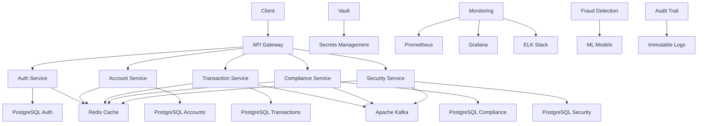
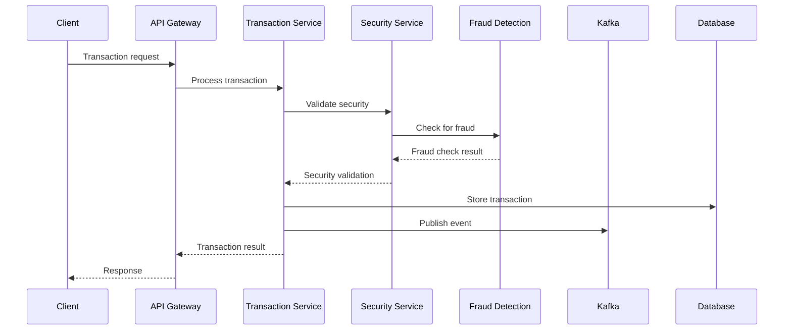
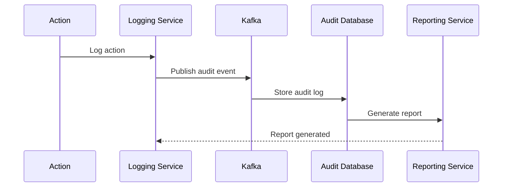

# 💰 Fintech : Conformité et Sécurité

## 📋 Table des matières
- [Introduction](#introduction)
- [Contexte métier](#contexte-métier)
- [Besoins spécifiques](#besoins-spécifiques)
- [Stack technique recommandée](#stack-technique-recommandée)
- [Architecture détaillée](#architecture-détaillée)
- [Structure de dossiers](#structure-de-dossiers)
- [User stories types](#user-stories-types)
- [Exemples de code clés](#exemples-de-code-clés)
- [Checklist de validation](#checklist-de-validation)
- [Ressources](#ressources)

## 🎯 Introduction

Ce cas d'usage présente l'architecture complète d'une plateforme fintech avec conformité réglementaire, sécurité avancée, gestion des transactions et audit complet.

### 🎯 Objectifs

- **Définir** l'architecture d'une plateforme fintech sécurisée
- **Identifier** les besoins spécifiques à la conformité financière
- **Proposer** une stack technique adaptée
- **Fournir** des user stories détaillées
- **Guider** l'implémentation complète

---

## 🏢 Contexte métier

### 📝 Description du projet

**Plateforme fintech moderne**
- Gestion des comptes et transactions
- Conformité réglementaire (PCI DSS, RGPD, PSD2)
- Sécurité avancée et audit
- Intégration avec les systèmes bancaires
- Analytics et reporting financier

### 📊 Acteurs principaux

| Acteur | Description | Responsabilités |
|--------|-------------|-----------------|
| **Customer** | Client final | Gestion de son compte, transactions |
| **Compliance Officer** | Responsable conformité | Surveillance réglementaire, audit |
| **Risk Manager** | Gestionnaire de risques | Évaluation et gestion des risques |
| **Developer** | Développeur | Intégration et maintenance |
| **Auditor** | Auditeur | Vérification et validation |

### 🎯 Objectifs métier

- **Sécurité** : Protection maximale des données financières
- **Conformité** : Respect des réglementations financières
- **Fiabilité** : Disponibilité et intégrité des transactions
- **Transparence** : Traçabilité complète des opérations
- **Performance** : Temps de traitement optimaux

---

## 🔍 Besoins spécifiques

### 📝 Fonctionnalités principales

#### Gestion des comptes
- **Création** : Ouverture de comptes sécurisée
- **Vérification** : KYC (Know Your Customer) complet
- **Authentification** : Multi-facteurs et biométrie
- **Autorisation** : Gestion des permissions granulaire
- **Audit** : Traçabilité complète des actions

#### Gestion des transactions
- **Paiements** : Traitement sécurisé des paiements
- **Virements** : Transferts internes et externes
- **Cartes** : Gestion des cartes virtuelles et physiques
- **Cryptomonnaies** : Support des cryptomonnaies
- **Réconciliation** : Rapprochement automatique

#### Conformité et réglementation
- **PCI DSS** : Conformité aux standards de sécurité
- **RGPD** : Protection des données personnelles
- **PSD2** : Directive européenne sur les services de paiement
- **AML/KYC** : Lutte contre le blanchiment d'argent
- **Reporting** : Rapports réglementaires automatiques

#### Sécurité avancée
- **Chiffrement** : Chiffrement bout en bout
- **Détection de fraude** : IA pour la détection d'anomalies
- **Monitoring** : Surveillance en temps réel
- **Incident response** : Gestion des incidents de sécurité
- **Backup** : Sauvegarde sécurisée des données

#### Analytics et reporting
- **Métriques** : KPIs financiers et opérationnels
- **Alertes** : Notifications en temps réel
- **Tableaux de bord** : Visualisation des données
- **Rapports** : Génération automatique de rapports
- **Audit trail** : Piste d'audit complète

### 📊 Besoins non-fonctionnels

| Besoin | Description | Critères |
|--------|-------------|----------|
| **Sécurité** | Protection maximale | Conformité PCI DSS Level 1 |
| **Performance** | Temps de réponse rapide | < 100ms pour les transactions |
| **Disponibilité** | Uptime élevé | 99.99% de disponibilité |
| **Conformité** | Respect des réglementations | Audit annuel réussi |
| **Auditabilité** | Traçabilité complète | Logs immutables |

---

## 🛠️ Stack technique recommandée

### 📝 Architecture recommandée

**Architecture : Microservices avec sécurité renforcée**
- **Isolation** : Séparation des responsabilités critiques
- **Sécurité** : Chiffrement et authentification avancés
- **Conformité** : Respect des standards financiers
- **Audit** : Traçabilité complète des opérations

### 🏗️ Stack technique

| Composant | Technologie | Justification |
|-----------|-------------|---------------|
| **Backend** | NestJS + TypeScript | Architecture modulaire, sécurité |
| **Base de données** | PostgreSQL + Redis | ACID, performance, sécurité |
| **Message Queue** | Apache Kafka | Fiabilité, audit trail |
| **Chiffrement** | HashiCorp Vault | Gestion sécurisée des secrets |
| **Monitoring** | Prometheus + Grafana | Observabilité complète |
| **Logs** | ELK Stack | Centralisation et analyse |
| **Security** | OWASP ZAP, SonarQube | Analyse de sécurité |

### 🔧 Outils de développement

| Outil | Usage | Justification |
|-------|-------|---------------|
| **Prisma** | ORM | Type safety, migrations |
| **Docker** | Containerisation | Environnement cohérent |
| **Kubernetes** | Orchestration | Scalabilité, sécurité |
| **GitHub Actions** | CI/CD | Automatisation sécurisée |
| **ESLint/Prettier** | Qualité de code | Standards cohérents |
| **Jest** | Tests | Couverture de tests |

---

## 🏗️ Architecture détaillée

### 📊 Schéma d'architecture



### 🔄 Flux de données

#### Flux de transaction sécurisée


#### Flux d'audit et conformité


---

## 📁 Structure de dossiers

### 📝 Structure complète

```
fintech-project/
├── services/                 # Microservices
│   ├── api-gateway/          # API Gateway
│   │   ├── src/
│   │   │   ├── controllers/
│   │   │   ├── middleware/
│   │   │   ├── routes/
│   │   │   └── main.ts
│   │   ├── package.json
│   │   └── README.md
│   ├── auth-service/         # Service d'authentification
│   │   ├── src/
│   │   │   ├── controllers/
│   │   │   ├── services/
│   │   │   ├── repositories/
│   │   │   ├── dto/
│   │   │   ├── entities/
│   │   │   └── auth.module.ts
│   │   ├── prisma/
│   │   │   ├── schema.prisma
│   │   │   └── migrations/
│   │   ├── package.json
│   │   └── README.md
│   ├── account-service/      # Service des comptes
│   │   ├── src/
│   │   │   ├── controllers/
│   │   │   ├── services/
│   │   │   ├── repositories/
│   │   │   ├── dto/
│   │   │   ├── entities/
│   │   │   └── account.module.ts
│   │   ├── prisma/
│   │   ├── package.json
│   │   └── README.md
│   ├── transaction-service/  # Service des transactions
│   │   ├── src/
│   │   │   ├── controllers/
│   │   │   ├── services/
│   │   │   ├── repositories/
│   │   │   ├── dto/
│   │   │   ├── entities/
│   │   │   └── transaction.module.ts
│   │   ├── prisma/
│   │   ├── package.json
│   │   └── README.md
│   ├── compliance-service/   # Service de conformité
│   │   ├── src/
│   │   │   ├── controllers/
│   │   │   ├── services/
│   │   │   ├── repositories/
│   │   │   ├── dto/
│   │   │   ├── entities/
│   │   │   └── compliance.module.ts
│   │   ├── prisma/
│   │   ├── package.json
│   │   └── README.md
│   ├── security-service/     # Service de sécurité
│   │   ├── src/
│   │   │   ├── controllers/
│   │   │   ├── services/
│   │   │   ├── repositories/
│   │   │   ├── dto/
│   │   │   ├── entities/
│   │   │   └── security.module.ts
│   │   ├── prisma/
│   │   ├── package.json
│   │   └── README.md
│   ├── fraud-detection-service/ # Service de détection de fraude
│   │   ├── src/
│   │   │   ├── controllers/
│   │   │   ├── services/
│   │   │   ├── repositories/
│   │   │   ├── dto/
│   │   │   ├── entities/
│   │   │   └── fraud-detection.module.ts
│   │   ├── prisma/
│   │   ├── package.json
│   │   └── README.md
│   └── audit-service/        # Service d'audit
│       ├── src/
│       │   ├── controllers/
│       │   ├── services/
│       │   ├── repositories/
│       │   ├── dto/
│       │   ├── entities/
│       │   └── audit.module.ts
│       ├── prisma/
│       ├── package.json
│       └── README.md
├── shared/                   # Code partagé
│   ├── middleware/
│   ├── services/
│   ├── utils/
│   └── types/
├── infrastructure/           # Infrastructure as Code
│   ├── docker/
│   │   ├── Dockerfile.api-gateway
│   │   ├── Dockerfile.auth-service
│   │   ├── Dockerfile.account-service
│   │   ├── Dockerfile.transaction-service
│   │   ├── Dockerfile.compliance-service
│   │   ├── Dockerfile.security-service
│   │   ├── Dockerfile.fraud-detection-service
│   │   ├── Dockerfile.audit-service
│   │   └── docker-compose.yml
│   ├── kubernetes/
│   │   ├── api-gateway-deployment.yaml
│   │   ├── auth-service-deployment.yaml
│   │   ├── account-service-deployment.yaml
│   │   ├── transaction-service-deployment.yaml
│   │   ├── compliance-service-deployment.yaml
│   │   ├── security-service-deployment.yaml
│   │   ├── fraud-detection-service-deployment.yaml
│   │   ├── audit-service-deployment.yaml
│   │   └── ingress.yaml
│   └── terraform/
│       ├── main.tf
│       ├── variables.tf
│       └── outputs.tf
├── compliance/               # Documentation de conformité
│   ├── pci-dss/
│   ├── gdpr/
│   ├── psd2/
│   └── audit/
├── security/                 # Documentation de sécurité
│   ├── threat-modeling/
│   ├── security-tests/
│   └── incident-response/
├── docs/                     # Documentation
│   ├── api/
│   ├── architecture/
│   ├── deployment/
│   └── README.md
├── scripts/                  # Scripts utilitaires
│   ├── setup.sh
│   ├── deploy.sh
│   ├── backup.sh
│   └── security-scan.sh
├── .github/                  # GitHub Actions
│   └── workflows/
│       ├── ci.yml
│       ├── cd.yml
│       └── security-scan.yml
├── .gitignore
├── README.md
└── package.json
```

---

## 📝 User stories types

### 👤 Customer

#### Gestion du compte
- **En tant que** client, **je veux** créer un compte sécurisé **afin de** accéder aux services financiers
- **En tant que** client, **je veux** vérifier mon identité **afin de** respecter les exigences KYC
- **En tant que** client, **je veux** me connecter de manière sécurisée **afin de** protéger mon compte
- **En tant que** client, **je veux** gérer mes informations personnelles **afin de** maintenir mes données à jour
- **En tant que** client, **je veux** recevoir des notifications de sécurité **afin de** être informé des activités suspectes

#### Gestion des transactions
- **En tant que** client, **je veux** effectuer des paiements sécurisés **afin de** régler mes achats
- **En tant que** client, **je veux** transférer de l'argent **afin de** gérer mes finances
- **En tant que** client, **je veux** voir l'historique de mes transactions **afin de** suivre mes dépenses
- **En tant que** client, **je veux** recevoir des confirmations de transaction **afin de** avoir une preuve de mes opérations
- **En tant que** client, **je veux** annuler une transaction **afin de** corriger une erreur

#### Gestion des cartes
- **En tant que** client, **je veux** créer une carte virtuelle **afin de** effectuer des paiements en ligne
- **En tant que** client, **je veux** gérer mes cartes **afin de** contrôler mes moyens de paiement
- **En tant que** client, **je veux** bloquer une carte **afin de** sécuriser mon compte en cas de perte
- **En tant que** client, **je veux** voir les détails de mes cartes **afin de** gérer mes informations

### 👨‍💼 Compliance Officer

#### Surveillance réglementaire
- **En tant que** compliance officer, **je veux** surveiller les transactions **afin de** détecter les activités suspectes
- **En tant que** compliance officer, **je veux** générer des rapports de conformité **afin de** respecter les exigences réglementaires
- **En tant que** compliance officer, **je veux** auditer les processus **afin de** maintenir la conformité
- **En tant que** compliance officer, **je veux** gérer les alertes de conformité **afin de** réagir rapidement aux problèmes
- **En tant que** compliance officer, **je veux** documenter les procédures **afin de** maintenir la traçabilité

#### Gestion des risques
- **En tant que** compliance officer, **je veux** évaluer les risques **afin de** prendre des mesures préventives
- **En tant que** compliance officer, **je veux** gérer les incidents de conformité **afin de** résoudre les problèmes
- **En tant que** compliance officer, **je veux** former les équipes **afin de** maintenir la sensibilisation
- **En tant que** compliance officer, **je veux** mettre à jour les politiques **afin de** s'adapter aux changements réglementaires

### 🛡️ Risk Manager

#### Gestion des risques
- **En tant que** risk manager, **je veux** identifier les risques **afin de** les évaluer et les gérer
- **En tant que** risk manager, **je veux** surveiller les indicateurs de risque **afin de** détecter les problèmes
- **En tant que** risk manager, **je veux** mettre en place des contrôles **afin de** réduire les risques
- **En tant que** risk manager, **je veux** générer des rapports de risque **afin de** informer la direction
- **En tant que** risk manager, **je veux** gérer les incidents de sécurité **afin de** minimiser l'impact

#### Analyse des données
- **En tant que** risk manager, **je veux** analyser les données de transaction **afin de** identifier les patterns suspects
- **En tant que** risk manager, **je veux** utiliser l'IA pour la détection de fraude **afin de** améliorer la sécurité
- **En tant que** risk manager, **je veux** surveiller les performances **afin de** optimiser les processus
- **En tant que** risk manager, **je veux** gérer les alertes de risque **afin de** réagir rapidement

### 👨‍💻 Developer

#### Intégration et maintenance
- **En tant que** développeur, **je veux** intégrer les services financiers **afin de** développer les fonctionnalités
- **En tant que** développeur, **je veux** respecter les standards de sécurité **afin de** maintenir la conformité
- **En tant que** développeur, **je veux** implémenter l'audit trail **afin de** assurer la traçabilité
- **En tant que** développeur, **je veux** gérer les secrets **afin de** protéger les données sensibles
- **En tant que** développeur, **je veux** tester la sécurité **afin de** valider la robustesse

#### Gestion des données
- **En tant que** développeur, **je veux** chiffrer les données sensibles **afin de** protéger les informations
- **En tant que** développeur, **je veux** gérer les clés de chiffrement **afin de** maintenir la sécurité
- **En tant que** développeur, **je veux** implémenter la sauvegarde **afin de** protéger les données
- **En tant que** développeur, **je veux** gérer les logs **afin de** assurer l'auditabilité

### 🔍 Auditor

#### Vérification et validation
- **En tant qu'** auditeur, **je veux** accéder aux logs d'audit **afin de** vérifier la conformité
- **En tant qu'** auditeur, **je veux** examiner les processus **afin de** valider l'efficacité
- **En tant qu'** auditeur, **je veux** générer des rapports d'audit **afin de** documenter les résultats
- **En tant qu'** auditeur, **je veux** identifier les non-conformités **afin de** recommander des améliorations
- **En tant qu'** auditeur, **je veux** suivre les recommandations **afin de** s'assurer de leur mise en œuvre

#### Gestion des audits
- **En tant qu'** auditeur, **je veux** planifier les audits **afin de** organiser les vérifications
- **En tant qu'** auditeur, **je veux** gérer les preuves d'audit **afin de** documenter les vérifications
- **En tant qu'** auditeur, **je veux** communiquer les résultats **afin de** informer les parties prenantes
- **En tant qu'** auditeur, **je veux** suivre les actions correctives **afin de** s'assurer de leur mise en œuvre

---

## 💻 Exemples de code clés

### 🏗️ Modèles de données

#### Modèle Account
```typescript
// services/account-service/src/entities/account.entity.ts
import { Entity, PrimaryGeneratedColumn, Column, CreateDateColumn, UpdateDateColumn } from 'typeorm'

@Entity('accounts')
export class Account {
  @PrimaryGeneratedColumn('uuid')
  id: string

  @Column({ unique: true })
  accountNumber: string

  @Column({ type: 'uuid' })
  customerId: string

  @Column({ type: 'enum', enum: ['checking', 'savings', 'business'] })
  accountType: string

  @Column({ type: 'decimal', precision: 15, scale: 2, default: 0 })
  balance: number

  @Column({ type: 'decimal', precision: 15, scale: 2, default: 0 })
  availableBalance: number

  @Column({ type: 'enum', enum: ['active', 'suspended', 'closed'] })
  status: string

  @Column({ type: 'json', nullable: true })
  kycStatus: Record<string, any>

  @Column({ type: 'json', nullable: true })
  riskProfile: Record<string, any>

  @Column({ type: 'json', nullable: true })
  limits: Record<string, any>

  @Column({ type: 'timestamp', nullable: true })
  lastTransactionAt: Date

  @CreateDateColumn()
  createdAt: Date

  @UpdateDateColumn()
  updatedAt: Date
}
```

#### Modèle Transaction
```typescript
// services/transaction-service/src/entities/transaction.entity.ts
import { Entity, PrimaryGeneratedColumn, Column, CreateDateColumn, UpdateDateColumn } from 'typeorm'

@Entity('transactions')
export class Transaction {
  @PrimaryGeneratedColumn('uuid')
  id: string

  @Column({ unique: true })
  transactionId: string

  @Column({ type: 'uuid' })
  accountId: string

  @Column({ type: 'uuid', nullable: true })
  recipientAccountId: string

  @Column({ type: 'enum', enum: ['debit', 'credit'] })
  type: string

  @Column({ type: 'enum', enum: ['payment', 'transfer', 'deposit', 'withdrawal'] })
  category: string

  @Column({ type: 'decimal', precision: 15, scale: 2 })
  amount: number

  @Column({ type: 'decimal', precision: 15, scale: 2, default: 0 })
  fee: number

  @Column({ type: 'decimal', precision: 15, scale: 2 })
  totalAmount: number

  @Column({ type: 'enum', enum: ['pending', 'processing', 'completed', 'failed', 'cancelled'] })
  status: string

  @Column({ type: 'text', nullable: true })
  description: string

  @Column({ type: 'json', nullable: true })
  metadata: Record<string, any>

  @Column({ type: 'json', nullable: true })
  fraudScore: Record<string, any>

  @Column({ type: 'json', nullable: true })
  complianceFlags: Record<string, any>

  @Column({ type: 'timestamp', nullable: true })
  processedAt: Date

  @CreateDateColumn()
  createdAt: Date

  @UpdateDateColumn()
  updatedAt: Date
}
```

### 🔧 Services métier

#### Service Transaction
```typescript
// services/transaction-service/src/services/transaction.service.ts
import { Injectable, BadRequestException, ForbiddenException } from '@nestjs/common'
import { TransactionRepository } from '../repositories/transaction.repository'
import { AccountService } from '../../account-service/src/services/account.service'
import { SecurityService } from '../../security-service/src/services/security.service'
import { FraudDetectionService } from '../../fraud-detection-service/src/services/fraud-detection.service'
import { CreateTransactionDto } from '../dto/transaction.dto'

@Injectable()
export class TransactionService {
  constructor(
    private readonly transactionRepository: TransactionRepository,
    private readonly accountService: AccountService,
    private readonly securityService: SecurityService,
    private readonly fraudDetectionService: FraudDetectionService
  ) {}

  async createTransaction(createTransactionDto: CreateTransactionDto, userId: string): Promise<Transaction> {
    // Vérifier l'authentification et l'autorisation
    await this.securityService.validateUserAccess(userId, createTransactionDto.accountId)

    // Vérifier le compte source
    const sourceAccount = await this.accountService.findById(createTransactionDto.accountId)
    if (!sourceAccount || sourceAccount.status !== 'active') {
      throw new BadRequestException('Invalid or inactive account')
    }

    // Vérifier le solde disponible
    if (sourceAccount.availableBalance < createTransactionDto.totalAmount) {
      throw new BadRequestException('Insufficient funds')
    }

    // Vérifier les limites de transaction
    await this.securityService.validateTransactionLimits(sourceAccount, createTransactionDto)

    // Détecter la fraude
    const fraudScore = await this.fraudDetectionService.analyzeTransaction(createTransactionDto)
    if (fraudScore.riskLevel === 'high') {
      throw new ForbiddenException('Transaction flagged for fraud')
    }

    // Créer la transaction
    const transaction = await this.transactionRepository.create({
      ...createTransactionDto,
      transactionId: this.generateTransactionId(),
      status: 'pending',
      fraudScore,
      complianceFlags: await this.securityService.checkComplianceFlags(createTransactionDto)
    })

    // Traiter la transaction
    await this.processTransaction(transaction)

    return transaction
  }

  private async processTransaction(transaction: Transaction): Promise<void> {
    try {
      // Mettre à jour le statut
      transaction.status = 'processing'
      await this.transactionRepository.save(transaction)

      // Débiter le compte source
      await this.accountService.debitAccount(transaction.accountId, transaction.totalAmount)

      // Créditer le compte de destination si applicable
      if (transaction.recipientAccountId) {
        await this.accountService.creditAccount(transaction.recipientAccountId, transaction.amount)
      }

      // Finaliser la transaction
      transaction.status = 'completed'
      transaction.processedAt = new Date()
      await this.transactionRepository.save(transaction)

      // Publier l'événement pour l'audit
      await this.publishTransactionEvent(transaction)

    } catch (error) {
      // Marquer la transaction comme échouée
      transaction.status = 'failed'
      await this.transactionRepository.save(transaction)
      throw error
    }
  }

  private generateTransactionId(): string {
    const timestamp = Date.now().toString()
    const random = Math.random().toString(36).substr(2, 9).toUpperCase()
    return `TXN-${timestamp}-${random}`
  }

  private async publishTransactionEvent(transaction: Transaction): Promise<void> {
    // Publier l'événement pour l'audit et la conformité
    // Implémentation avec Kafka ou autre système de messagerie
  }
}
```

#### Service Security
```typescript
// services/security-service/src/services/security.service.ts
import { Injectable, UnauthorizedException, ForbiddenException } from '@nestjs/common'
import { VaultService } from './vault.service'
import { AuditService } from '../../audit-service/src/services/audit.service'

@Injectable()
export class SecurityService {
  constructor(
    private readonly vaultService: VaultService,
    private readonly auditService: AuditService
  ) {}

  async validateUserAccess(userId: string, resourceId: string): Promise<boolean> {
    // Vérifier l'authentification
    const user = await this.vaultService.getUser(userId)
    if (!user || !user.isActive) {
      throw new UnauthorizedException('Invalid user')
    }

    // Vérifier les permissions
    const hasAccess = await this.checkUserPermissions(userId, resourceId)
    if (!hasAccess) {
      throw new ForbiddenException('Access denied')
    }

    // Logger l'accès pour l'audit
    await this.auditService.logAccess(userId, resourceId, 'READ')

    return true
  }

  async validateTransactionLimits(account: any, transaction: any): Promise<boolean> {
    const limits = account.limits || {}

    // Vérifier la limite quotidienne
    if (limits.dailyLimit) {
      const dailyTransactions = await this.getDailyTransactionAmount(account.id)
      if (dailyTransactions + transaction.amount > limits.dailyLimit) {
        throw new ForbiddenException('Daily transaction limit exceeded')
      }
    }

    // Vérifier la limite par transaction
    if (limits.perTransactionLimit && transaction.amount > limits.perTransactionLimit) {
      throw new ForbiddenException('Per transaction limit exceeded')
      }
    }

    return true
  }

  async checkComplianceFlags(transaction: any): Promise<Record<string, any>> {
    const flags = {}

    // Vérifier les montants suspects
    if (transaction.amount > 10000) {
      flags.largeAmount = true
    }

    // Vérifier les pays à risque
    if (transaction.country && this.isHighRiskCountry(transaction.country)) {
      flags.highRiskCountry = true
    }

    // Vérifier les patterns suspects
    if (await this.detectSuspiciousPattern(transaction)) {
      flags.suspiciousPattern = true
    }

    return flags
  }

  async encryptSensitiveData(data: any): Promise<string> {
    return this.vaultService.encrypt(data)
  }

  async decryptSensitiveData(encryptedData: string): Promise<any> {
    return this.vaultService.decrypt(encryptedData)
  }

  private async checkUserPermissions(userId: string, resourceId: string): Promise<boolean> {
    // Implémentation de la vérification des permissions
    return true // Placeholder
  }

  private async getDailyTransactionAmount(accountId: string): Promise<number> {
    // Implémentation de la récupération des transactions quotidiennes
    return 0 // Placeholder
  }

  private isHighRiskCountry(country: string): boolean {
    const highRiskCountries = ['AF', 'IR', 'KP', 'SY'] // Exemple
    return highRiskCountries.includes(country)
  }

  private async detectSuspiciousPattern(transaction: any): Promise<boolean> {
    // Implémentation de la détection de patterns suspects
    return false // Placeholder
  }
}
```

#### Service Fraud Detection
```typescript
// services/fraud-detection-service/src/services/fraud-detection.service.ts
import { Injectable } from '@nestjs/common'
import { TransactionRepository } from '../../transaction-service/src/repositories/transaction.repository'

@Injectable()
export class FraudDetectionService {
  constructor(
    private readonly transactionRepository: TransactionRepository
  ) {}

  async analyzeTransaction(transaction: any): Promise<Record<string, any>> {
    const fraudScore = {
      riskLevel: 'low',
      score: 0,
      factors: []
    }

    // Analyser le montant
    if (transaction.amount > 5000) {
      fraudScore.score += 20
      fraudScore.factors.push('High amount')
    }

    // Analyser la fréquence
    const recentTransactions = await this.getRecentTransactions(transaction.accountId)
    if (recentTransactions.length > 10) {
      fraudScore.score += 30
      fraudScore.factors.push('High frequency')
    }

    // Analyser l'heure
    const hour = new Date().getHours()
    if (hour < 6 || hour > 22) {
      fraudScore.score += 15
      fraudScore.factors.push('Unusual time')
    }

    // Analyser la géolocalisation
    if (await this.isUnusualLocation(transaction)) {
      fraudScore.score += 25
      fraudScore.factors.push('Unusual location')
    }

    // Analyser les patterns
    if (await this.detectPatternAnomaly(transaction)) {
      fraudScore.score += 35
      fraudScore.factors.push('Pattern anomaly')
    }

    // Déterminer le niveau de risque
    if (fraudScore.score >= 70) {
      fraudScore.riskLevel = 'high'
    } else if (fraudScore.score >= 40) {
      fraudScore.riskLevel = 'medium'
    }

    return fraudScore
  }

  async detectFraudPattern(transactions: any[]): Promise<boolean> {
    // Implémentation de la détection de patterns de fraude
    // Utilisation de l'IA et du machine learning
    return false // Placeholder
  }

  private async getRecentTransactions(accountId: string): Promise<any[]> {
    return this.transactionRepository.findRecentByAccount(accountId, 24) // 24 heures
  }

  private async isUnusualLocation(transaction: any): Promise<boolean> {
    // Implémentation de la vérification de géolocalisation
    return false // Placeholder
  }

  private async detectPatternAnomaly(transaction: any): Promise<boolean> {
    // Implémentation de la détection d'anomalies de pattern
    return false // Placeholder
  }
}
```

### 🎨 Middleware de sécurité

#### Middleware d'audit
```typescript
// shared/middleware/audit.middleware.ts
import { Injectable, NestMiddleware } from '@nestjs/common'
import { Request, Response, NextFunction } from 'express'
import { AuditService } from '../services/audit.service'

@Injectable()
export class AuditMiddleware implements NestMiddleware {
  constructor(private readonly auditService: AuditService) {}

  async use(req: Request, res: Response, next: NextFunction) {
    const startTime = Date.now()
    
    // Capturer la réponse
    const originalSend = res.send
    res.send = function(body) {
      const endTime = Date.now()
      const duration = endTime - startTime
      
      // Logger l'audit
      this.auditService.logRequest({
        method: req.method,
        url: req.url,
        userAgent: req.get('User-Agent'),
        ip: req.ip,
        userId: req['user']?.id,
        statusCode: res.statusCode,
        duration,
        timestamp: new Date()
      })
      
      return originalSend.call(this, body)
    }
    
    next()
  }
}
```

#### Middleware de chiffrement
```typescript
// shared/middleware/encryption.middleware.ts
import { Injectable, NestMiddleware } from '@nestjs/common'
import { Request, Response, NextFunction } from 'express'
import { VaultService } from '../services/vault.service'

@Injectable()
export class EncryptionMiddleware implements NestMiddleware {
  constructor(private readonly vaultService: VaultService) {}

  async use(req: Request, res: Response, next: NextFunction) {
    // Chiffrer les données sensibles dans la requête
    if (req.body && this.containsSensitiveData(req.body)) {
      req.body = await this.encryptSensitiveFields(req.body)
    }
    
    next()
  }

  private containsSensitiveData(data: any): boolean {
    const sensitiveFields = ['accountNumber', 'cardNumber', 'ssn', 'pin']
    return sensitiveFields.some(field => data[field])
  }

  private async encryptSensitiveFields(data: any): Promise<any> {
    const sensitiveFields = ['accountNumber', 'cardNumber', 'ssn', 'pin']
    const encrypted = { ...data }
    
    for (const field of sensitiveFields) {
      if (encrypted[field]) {
        encrypted[field] = await this.vaultService.encrypt(encrypted[field])
      }
    }
    
    return encrypted
  }
}
```

---

## ✅ Checklist de validation

### 📋 Fonctionnalités principales

- [ ] **Gestion des comptes** sécurisée implémentée
- [ ] **Système de transactions** fonctionnel
- [ ] **Détection de fraude** opérationnelle
- [ ] **Audit trail** complet
- [ ] **Conformité réglementaire** validée
- [ ] **Sécurité avancée** implémentée

### 📋 Architecture technique

- [ ] **Microservices** configurés et fonctionnels
- [ ] **API Gateway** sécurisé opérationnel
- [ ] **Base de données** chiffrée et sécurisée
- [ ] **Vault** pour la gestion des secrets
- [ ] **Kafka** pour l'audit trail
- [ ] **Monitoring** et observabilité

### 📋 Sécurité et conformité

- [ ] **Chiffrement** bout en bout implémenté
- [ ] **Authentification** multi-facteurs
- [ ] **Audit trail** immuable
- [ ] **Conformité PCI DSS** validée
- [ ] **Conformité RGPD** implémentée
- [ ] **Tests de sécurité** automatisés

### 📋 Performance et scalabilité

- [ ] **Optimisation des requêtes** base de données
- [ ] **Cache** sécurisé des données
- [ ] **Load balancing** configuré
- [ ] **Auto-scaling** des services
- [ ] **Monitoring** des performances
- [ ] **Gestion des ressources** optimisée

---

## 📚 Ressources

### 🎓 Formation
- [Architecture globale](../03-architecture/global-architecture.md)
- [Architecture backend](../03-architecture/backend-architecture.md)
- [Architecture base de données](../03-architecture/database-architecture.md)
- [Sécurité](../04-implementation/security.md)

### 🛠️ Outils
- [NestJS](https://nestjs.com/) - Framework backend
- [PostgreSQL](https://www.postgresql.org/) - Base de données
- [HashiCorp Vault](https://www.vaultproject.io/) - Gestion des secrets
- [Apache Kafka](https://kafka.apache.org/) - Message Queue
- [Prometheus](https://prometheus.io/) - Monitoring

### 📖 Références
- [Fintech Architecture Patterns](https://www.oreilly.com/library/view/fintech-architecture-patterns/9781449331770/) - O'Reilly
- [PCI DSS Requirements](https://www.pcisecuritystandards.org/document_library/) - PCI Security Standards Council
- [GDPR Guidelines](https://gdpr.eu/) - GDPR.eu
- [PSD2 Directive](https://eur-lex.europa.eu/legal-content/EN/TXT/?uri=CELEX:32015L2366) - European Union

---

<div align="center">

[](../../../README.md)

</div>

---

*Dernière mise à jour : Janvier 2024*
