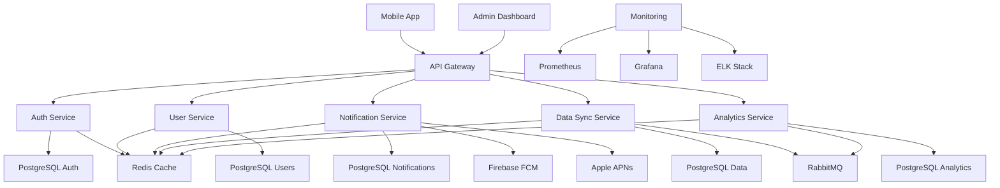
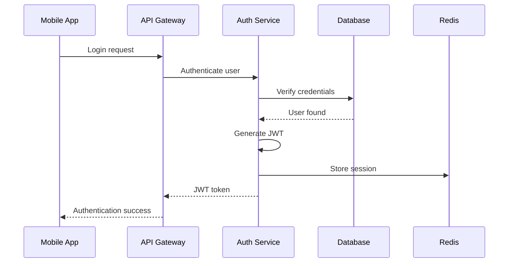
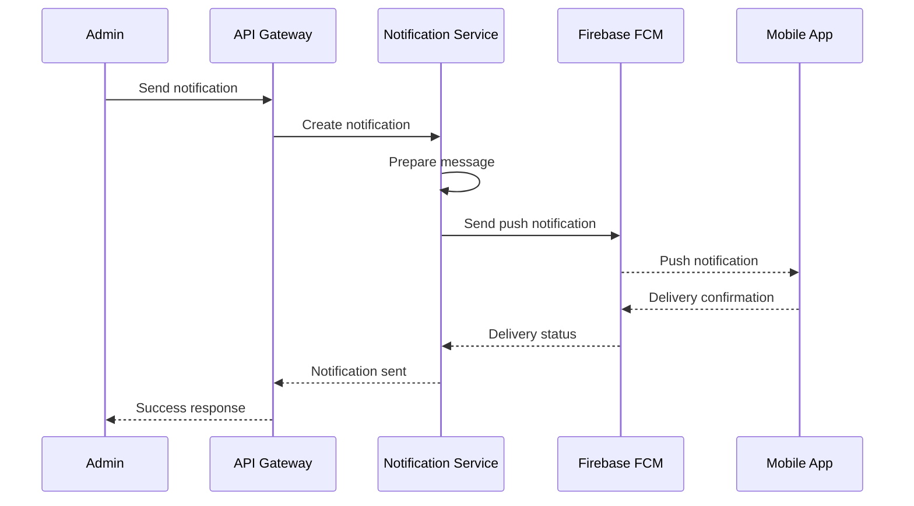

# 📱 Mobile Backend : API et Notifications

## 📋 Table des matières
- [Introduction](#introduction)
- [Contexte métier](#contexte-métier)
- [Besoins spécifiques](#besoins-spécifiques)
- [Stack technique recommandée](#stack-technique-recommandée)
- [Architecture détaillée](#architecture-détaillée)
- [Structure de dossiers](#structure-de-dossiers)
- [User stories types](#user-stories-types)
- [Exemples de code clés](#exemples-de-code-clés)
- [Checklist de validation](#checklist-de-validation)
- [Ressources](#ressources)

## 🎯 Introduction

Ce cas d'usage présente l'architecture complète d'un backend mobile avec API REST, notifications push, gestion des utilisateurs et synchronisation des données.

### 🎯 Objectifs

- **Définir** l'architecture d'un backend mobile moderne
- **Identifier** les besoins spécifiques aux applications mobiles
- **Proposer** une stack technique adaptée
- **Fournir** des user stories détaillées
- **Guider** l'implémentation complète

---

## 🏢 Contexte métier

### 📝 Description du projet

**Backend mobile moderne**
- API REST pour applications mobiles
- Notifications push en temps réel
- Gestion des utilisateurs et authentification
- Synchronisation des données
- Analytics et monitoring

### 📊 Acteurs principaux

| Acteur | Description | Responsabilités |
|--------|-------------|-----------------|
| **Mobile User** | Utilisateur de l'application mobile | Utilisation des fonctionnalités, réception des notifications |
| **Admin** | Administrateur de la plateforme | Gestion des utilisateurs, configuration, monitoring |
| **Developer** | Développeur mobile | Intégration avec l'API, gestion des notifications |
| **Support** | Équipe de support | Gestion des incidents, support utilisateur |

### 🎯 Objectifs métier

- **Performance** : Temps de réponse optimaux pour mobile
- **Fiabilité** : Disponibilité élevée et résilience
- **Scalabilité** : Support de millions d'utilisateurs
- **Sécurité** : Protection des données et communications
- **Engagement** : Notifications et interactions en temps réel

---

## 🔍 Besoins spécifiques

### 📝 Fonctionnalités principales

#### API REST
- **Endpoints** : API RESTful complète
- **Authentification** : JWT et OAuth2
- **Rate Limiting** : Limitation des requêtes
- **Versioning** : Gestion des versions d'API
- **Documentation** : Documentation automatique (Swagger)

#### Gestion des utilisateurs
- **Inscription** : Création de comptes utilisateurs
- **Authentification** : Connexion et gestion des sessions
- **Profils** : Gestion des profils utilisateurs
- **Permissions** : Système de rôles et permissions
- **Sécurité** : Protection des données sensibles

#### Notifications push
- **Push notifications** : Notifications en temps réel
- **Scheduling** : Planification des notifications
- **Segmentation** : Ciblage des utilisateurs
- **Analytics** : Suivi des performances
- **Multi-platform** : Support iOS et Android

#### Synchronisation des données
- **Offline sync** : Synchronisation hors ligne
- **Conflict resolution** : Résolution des conflits
- **Delta sync** : Synchronisation incrémentale
- **Caching** : Mise en cache intelligente
- **Background sync** : Synchronisation en arrière-plan

#### Analytics et monitoring
- **Usage analytics** : Analyse de l'utilisation
- **Performance monitoring** : Surveillance des performances
- **Error tracking** : Suivi des erreurs
- **User behavior** : Analyse du comportement
- **Business metrics** : Métriques métier

### 📊 Besoins non-fonctionnels

| Besoin | Description | Critères |
|--------|-------------|----------|
| **Performance** | Temps de réponse rapide | < 500ms pour les API |
| **Scalabilité** | Support de la croissance | 1M+ utilisateurs simultanés |
| **Sécurité** | Protection des données | Conformité RGPD |
| **Disponibilité** | Uptime élevé | 99.99% de disponibilité |
| **Maintenabilité** | Code maintenable | Architecture modulaire |

---

## 🛠️ Stack technique recommandée

### 📝 Architecture recommandée

**Architecture : Microservices avec API Gateway**
- **Scalabilité** : Services indépendants et évolutifs
- **Performance** : Optimisation pour mobile
- **Résilience** : Tolérance aux pannes
- **Flexibilité** : Déploiement indépendant des services

### 🏗️ Stack technique

| Composant | Technologie | Justification |
|-----------|-------------|---------------|
| **API Gateway** | Kong / AWS API Gateway | Gestion centralisée des API |
| **Backend** | NestJS + TypeScript | Architecture modulaire, évolutivité |
| **Base de données** | PostgreSQL + Redis | ACID, performance |
| **Message Queue** | RabbitMQ | Communication asynchrone |
| **Notifications** | Firebase FCM / APNs | Notifications push |
| **Storage** | AWS S3 | Stockage des fichiers |
| **Monitoring** | Prometheus + Grafana | Observabilité complète |
| **Logs** | ELK Stack | Centralisation des logs |

### 🔧 Outils de développement

| Outil | Usage | Justification |
|-------|-------|---------------|
| **Prisma** | ORM | Type safety, migrations |
| **Docker** | Containerisation | Environnement cohérent |
| **Kubernetes** | Orchestration | Scalabilité, gestion des ressources |
| **GitHub Actions** | CI/CD | Automatisation |
| **ESLint/Prettier** | Qualité de code | Standards cohérents |
| **Jest** | Tests | Couverture de tests |

---

## 🏗️ Architecture détaillée

### 📊 Schéma d'architecture



### 🔄 Flux de données

#### Flux d'authentification


#### Flux de notification push


---

## 📁 Structure de dossiers

### 📝 Structure complète

```
mobile-backend-project/
├── services/                 # Microservices
│   ├── api-gateway/          # API Gateway
│   │   ├── src/
│   │   │   ├── controllers/
│   │   │   ├── middleware/
│   │   │   ├── routes/
│   │   │   └── main.ts
│   │   ├── package.json
│   │   └── README.md
│   ├── auth-service/         # Service d'authentification
│   │   ├── src/
│   │   │   ├── controllers/
│   │   │   ├── services/
│   │   │   ├── repositories/
│   │   │   ├── dto/
│   │   │   ├── entities/
│   │   │   └── auth.module.ts
│   │   ├── prisma/
│   │   │   ├── schema.prisma
│   │   │   └── migrations/
│   │   ├── package.json
│   │   └── README.md
│   ├── user-service/         # Service des utilisateurs
│   │   ├── src/
│   │   │   ├── controllers/
│   │   │   ├── services/
│   │   │   ├── repositories/
│   │   │   ├── dto/
│   │   │   ├── entities/
│   │   │   └── user.module.ts
│   │   ├── prisma/
│   │   ├── package.json
│   │   └── README.md
│   ├── notification-service/ # Service de notifications
│   │   ├── src/
│   │   │   ├── controllers/
│   │   │   ├── services/
│   │   │   ├── repositories/
│   │   │   ├── dto/
│   │   │   ├── entities/
│   │   │   └── notification.module.ts
│   │   ├── prisma/
│   │   ├── package.json
│   │   └── README.md
│   ├── data-sync-service/    # Service de synchronisation
│   │   ├── src/
│   │   │   ├── controllers/
│   │   │   ├── services/
│   │   │   ├── repositories/
│   │   │   ├── dto/
│   │   │   ├── entities/
│   │   │   └── data-sync.module.ts
│   │   ├── prisma/
│   │   ├── package.json
│   │   └── README.md
│   └── analytics-service/    # Service d'analytics
│       ├── src/
│       │   ├── controllers/
│       │   ├── services/
│       │   ├── repositories/
│       │   ├── dto/
│       │   ├── entities/
│       │   └── analytics.module.ts
│       ├── prisma/
│       ├── package.json
│       └── README.md
├── shared/                   # Code partagé
│   ├── middleware/
│   ├── services/
│   ├── utils/
│   └── types/
├── infrastructure/           # Infrastructure as Code
│   ├── docker/
│   │   ├── Dockerfile.api-gateway
│   │   ├── Dockerfile.auth-service
│   │   ├── Dockerfile.user-service
│   │   ├── Dockerfile.notification-service
│   │   ├── Dockerfile.data-sync-service
│   │   ├── Dockerfile.analytics-service
│   │   └── docker-compose.yml
│   ├── kubernetes/
│   │   ├── api-gateway-deployment.yaml
│   │   ├── auth-service-deployment.yaml
│   │   ├── user-service-deployment.yaml
│   │   ├── notification-service-deployment.yaml
│   │   ├── data-sync-service-deployment.yaml
│   │   ├── analytics-service-deployment.yaml
│   │   └── ingress.yaml
│   └── terraform/
│       ├── main.tf
│       ├── variables.tf
│       └── outputs.tf
├── admin-dashboard/          # Dashboard d'administration
│   ├── src/
│   │   ├── components/
│   │   ├── pages/
│   │   ├── stores/
│   │   ├── utils/
│   │   └── main.ts
│   ├── package.json
│   └── README.md
├── docs/                     # Documentation
│   ├── api/
│   ├── architecture/
│   ├── deployment/
│   └── README.md
├── scripts/                  # Scripts utilitaires
│   ├── setup.sh
│   ├── deploy.sh
│   └── backup.sh
├── .github/                  # GitHub Actions
│   └── workflows/
│       ├── ci.yml
│       └── cd.yml
├── .gitignore
├── README.md
└── package.json
```

---

## 📝 User stories types

### 👤 Mobile User

#### Authentification et profil
- **En tant qu'** utilisateur mobile, **je veux** m'inscrire avec mon email **afin de** créer un compte
- **En tant qu'** utilisateur mobile, **je veux** me connecter avec mes identifiants **afin de** accéder à l'application
- **En tant qu'** utilisateur mobile, **je veux** réinitialiser mon mot de passe **afin de** regagner l'accès à mon compte
- **En tant qu'** utilisateur mobile, **je veux** modifier mon profil **afin de** maintenir mes informations à jour
- **En tant qu'** utilisateur mobile, **je veux** me déconnecter **afin de** sécuriser mon compte

#### Utilisation de l'application
- **En tant qu'** utilisateur mobile, **je veux** utiliser les fonctionnalités de l'application **afin de** accomplir mes tâches
- **En tant qu'** utilisateur mobile, **je veux** synchroniser mes données **afin de** accéder à mes informations sur tous mes appareils
- **En tant qu'** utilisateur mobile, **je veux** utiliser l'application hors ligne **afin de** continuer à travailler sans connexion
- **En tant qu'** utilisateur mobile, **je veux** recevoir des notifications **afin de** être informé des événements importants
- **En tant qu'** utilisateur mobile, **je veux** voir l'historique de mes activités **afin de** suivre mes actions

#### Gestion des données
- **En tant qu'** utilisateur mobile, **je veux** sauvegarder mes données **afin de** ne pas les perdre
- **En tant qu'** utilisateur mobile, **je veux** exporter mes données **afin de** les utiliser ailleurs
- **En tant qu'** utilisateur mobile, **je veux** supprimer mes données **africtif** respecter ma vie privée
- **En tant qu'** utilisateur mobile, **je veux** restaurer mes données **afin de** récupérer mes informations

### 👨‍💼 Admin

#### Gestion des utilisateurs
- **En tant qu'** admin, **je veux** voir la liste des utilisateurs **afin de** gérer la base de données
- **En tant qu'** admin, **je veux** modifier les informations des utilisateurs **afin de** corriger les erreurs
- **En tant qu'** admin, **je veux** suspendre des comptes utilisateurs **afin de** gérer les abus
- **En tant qu'** admin, **je veux** voir l'activité des utilisateurs **afin de** surveiller l'utilisation
- **En tant qu'** admin, **je veux** gérer les permissions des utilisateurs **afin de** contrôler l'accès

#### Gestion des notifications
- **En tant qu'** admin, **je veux** envoyer des notifications push **afin de** informer les utilisateurs
- **En tant qu'** admin, **je veux** planifier des notifications **afin de** envoyer des messages au bon moment
- **En tant qu'** admin, **je veux** segmenter les utilisateurs **afin de** cibler les notifications
- **En tant qu'** admin, **je veux** voir les statistiques des notifications **afin de** analyser les performances
- **En tant qu'** admin, **je veux** gérer les templates de notifications **afin de** standardiser les messages

#### Monitoring et analytics
- **En tant qu'** admin, **je veux** voir le dashboard de monitoring **afin de** surveiller la plateforme
- **En tant qu'** admin, **je veux** voir les métriques de performance **afin de** optimiser l'application
- **En tant qu'** admin, **je veux** voir les logs d'erreur **afin de** diagnostiquer les problèmes
- **En tant qu'** admin, **je veux** voir les analytics d'utilisation **afin de** comprendre le comportement des utilisateurs
- **En tant qu'** admin, **je veux** configurer les alertes **afin de** être informé des problèmes

### 👨‍💻 Developer

#### Intégration API
- **En tant que** développeur mobile, **je veux** accéder à la documentation de l'API **afin de** comprendre les endpoints
- **En tant que** développeur mobile, **je veux** tester les endpoints API **afin de** valider l'intégration
- **En tant que** développeur mobile, **je veux** gérer l'authentification **afin de** sécuriser les appels API
- **En tant que** développeur mobile, **je veux** gérer les erreurs API **afin de** offrir une expérience utilisateur fluide
- **En tant que** développeur mobile, **je veux** optimiser les appels API **afin de** améliorer les performances

#### Gestion des notifications
- **En tant que** développeur mobile, **je veux** intégrer les notifications push **afin de** informer les utilisateurs
- **En tant que** développeur mobile, **je veux** gérer les tokens de notification **afin de** recevoir les messages
- **En tant que** développeur mobile, **je veux** personnaliser les notifications **afin de** offrir une expérience personnalisée
- **En tant que** développeur mobile, **je veux** gérer les permissions de notification **afin de** respecter les préférences utilisateur

### 🎧 Support

#### Gestion des incidents
- **En tant que** support, **je veux** voir les incidents signalés **afin de** les traiter rapidement
- **En tant que** support, **je veux** accéder aux informations des utilisateurs **afin de** fournir un support personnalisé
- **En tant que** support, **je veux** voir l'historique des interactions **afin de** comprendre le contexte
- **En tant que** support, **je veux** créer des tickets de support **afin de** suivre les demandes
- **En tant que** support, **je veux** communiquer avec les utilisateurs **afin de** résoudre leurs problèmes

---

## 💻 Exemples de code clés

### 🏗️ Modèles de données

#### Modèle User
```typescript
// services/user-service/src/entities/user.entity.ts
import { Entity, PrimaryGeneratedColumn, Column, CreateDateColumn, UpdateDateColumn } from 'typeorm'

@Entity('users')
export class User {
  @PrimaryGeneratedColumn('uuid')
  id: string

  @Column({ unique: true })
  email: string

  @Column()
  firstName: string

  @Column()
  lastName: string

  @Column({ type: 'text', nullable: true })
  password: string

  @Column({ default: true })
  isActive: boolean

  @Column({ type: 'enum', enum: ['user', 'admin'] })
  role: string

  @Column({ type: 'json', nullable: true })
  profile: Record<string, any>

  @Column({ type: 'json', nullable: true })
  deviceTokens: string[]

  @Column({ type: 'timestamp', nullable: true })
  lastLoginAt: Date

  @Column({ type: 'timestamp', nullable: true })
  lastSyncAt: Date

  @CreateDateColumn()
  createdAt: Date

  @UpdateDateColumn()
  updatedAt: Date
}
```

#### Modèle Notification
```typescript
// services/notification-service/src/entities/notification.entity.ts
import { Entity, PrimaryGeneratedColumn, Column, CreateDateColumn, UpdateDateColumn } from 'typeorm'

@Entity('notifications')
export class Notification {
  @PrimaryGeneratedColumn('uuid')
  id: string

  @Column()
  title: string

  @Column({ type: 'text' })
  body: string

  @Column({ type: 'json', nullable: true })
  data: Record<string, any>

  @Column({ type: 'enum', enum: ['push', 'email', 'sms'] })
  type: string

  @Column({ type: 'enum', enum: ['pending', 'sent', 'delivered', 'failed'] })
  status: string

  @Column({ type: 'uuid', nullable: true })
  userId: string

  @Column({ type: 'timestamp', nullable: true })
  scheduledAt: Date

  @Column({ type: 'timestamp', nullable: true })
  sentAt: Date

  @Column({ type: 'timestamp', nullable: true })
  deliveredAt: Date

  @CreateDateColumn()
  createdAt: Date

  @UpdateDateColumn()
  updatedAt: Date
}
```

### 🔧 Services métier

#### Service Notification
```typescript
// services/notification-service/src/services/notification.service.ts
import { Injectable, NotFoundException } from '@nestjs/common'
import { NotificationRepository } from '../repositories/notification.repository'
import { FirebaseService } from './firebase.service'
import { CreateNotificationDto } from '../dto/notification.dto'

@Injectable()
export class NotificationService {
  constructor(
    private readonly notificationRepository: NotificationRepository,
    private readonly firebaseService: FirebaseService
  ) {}

  async create(createNotificationDto: CreateNotificationDto): Promise<Notification> {
    const notification = await this.notificationRepository.create(createNotificationDto)
    
    // Si la notification est immédiate, l'envoyer
    if (!createNotificationDto.scheduledAt) {
      await this.sendNotification(notification)
    }
    
    return notification
  }

  async sendNotification(notification: Notification): Promise<void> {
    try {
      // Envoyer via Firebase FCM
      await this.firebaseService.sendPushNotification({
        title: notification.title,
        body: notification.body,
        data: notification.data,
        userId: notification.userId
      })

      // Mettre à jour le statut
      notification.status = 'sent'
      notification.sentAt = new Date()
      await this.notificationRepository.save(notification)
    } catch (error) {
      notification.status = 'failed'
      await this.notificationRepository.save(notification)
      throw error
    }
  }

  async scheduleNotification(notificationId: string, scheduledAt: Date): Promise<Notification> {
    const notification = await this.notificationRepository.findById(notificationId)
    if (!notification) {
      throw new NotFoundException(`Notification with ID ${notificationId} not found`)
    }

    notification.scheduledAt = scheduledAt
    notification.status = 'pending'
    return this.notificationRepository.save(notification)
  }

  async getNotificationsByUser(userId: string): Promise<Notification[]> {
    return this.notificationRepository.findByUser(userId)
  }

  async markAsDelivered(notificationId: string): Promise<Notification> {
    const notification = await this.notificationRepository.findById(notificationId)
    if (!notification) {
      throw new NotFoundException(`Notification with ID ${notificationId} not found`)
    }

    notification.status = 'delivered'
    notification.deliveredAt = new Date()
    return this.notificationRepository.save(notification)
  }
}
```

#### Service Data Sync
```typescript
// services/data-sync-service/src/services/data-sync.service.ts
import { Injectable, ConflictException } from '@nestjs/common'
import { DataSyncRepository } from '../repositories/data-sync.repository'
import { CreateSyncDto, UpdateSyncDto } from '../dto/data-sync.dto'

@Injectable()
export class DataSyncService {
  constructor(private readonly dataSyncRepository: DataSyncRepository) {}

  async syncData(userId: string, syncData: CreateSyncDto[]): Promise<{ synced: any[], conflicts: any[] }> {
    const synced = []
    const conflicts = []

    for (const item of syncData) {
      try {
        // Vérifier s'il y a un conflit
        const existingItem = await this.dataSyncRepository.findByClientId(item.clientId)
        
        if (existingItem && existingItem.updatedAt > item.updatedAt) {
          // Conflit détecté
          conflicts.push({
            clientId: item.clientId,
            serverVersion: existingItem,
            clientVersion: item
          })
        } else {
          // Synchroniser l'élément
          const syncedItem = await this.dataSyncRepository.upsert({
            ...item,
            userId,
            syncedAt: new Date()
          })
          synced.push(syncedItem)
        }
      } catch (error) {
        conflicts.push({
          clientId: item.clientId,
          error: error.message
        })
      }
    }

    return { synced, conflicts }
  }

  async getDeltaSync(userId: string, lastSyncAt: Date): Promise<any[]> {
    return this.dataSyncRepository.findUpdatedSince(userId, lastSyncAt)
  }

  async resolveConflict(conflictId: string, resolution: 'server' | 'client', clientData?: any): Promise<any> {
    const conflict = await this.dataSyncRepository.findConflict(conflictId)
    if (!conflict) {
      throw new ConflictException(`Conflict with ID ${conflictId} not found`)
    }

    if (resolution === 'server') {
      // Garder la version serveur
      return conflict.serverVersion
    } else {
      // Utiliser la version client
      return this.dataSyncRepository.update(conflict.serverVersion.id, clientData)
    }
  }
}
```

### 🎨 API Gateway

#### Middleware d'authentification
```typescript
// services/api-gateway/src/middleware/auth.middleware.ts
import { Injectable, NestMiddleware, UnauthorizedException } from '@nestjs/common'
import { Request, Response, NextFunction } from 'express'
import { JwtService } from '@nestjs/jwt'

@Injectable()
export class AuthMiddleware implements NestMiddleware {
  constructor(private readonly jwtService: JwtService) {}

  async use(req: Request, res: Response, next: NextFunction) {
    const token = this.extractTokenFromHeader(req)
    
    if (!token) {
      throw new UnauthorizedException('No token provided')
    }

    try {
      const payload = await this.jwtService.verifyAsync(token)
      req['user'] = payload
      next()
    } catch (error) {
      throw new UnauthorizedException('Invalid token')
    }
  }

  private extractTokenFromHeader(request: Request): string | undefined {
    const [type, token] = request.headers.authorization?.split(' ') ?? []
    return type === 'Bearer' ? token : undefined
  }
}
```

#### Rate Limiting
```typescript
// services/api-gateway/src/middleware/rate-limit.middleware.ts
import { Injectable, NestMiddleware, TooManyRequestsException } from '@nestjs/common'
import { Request, Response, NextFunction } from 'express'
import { RedisService } from '../services/redis.service'

@Injectable()
export class RateLimitMiddleware implements NestMiddleware {
  constructor(private readonly redisService: RedisService) {}

  async use(req: Request, res: Response, next: NextFunction) {
    const key = `rate_limit:${req.ip}:${req.route?.path}`
    const limit = 100 // 100 requêtes par minute
    const window = 60 // 60 secondes

    const current = await this.redisService.incr(key)
    
    if (current === 1) {
      await this.redisService.expire(key, window)
    }

    if (current > limit) {
      throw new TooManyRequestsException('Rate limit exceeded')
    }

    res.setHeader('X-RateLimit-Limit', limit)
    res.setHeader('X-RateLimit-Remaining', Math.max(0, limit - current))
    
    next()
  }
}
```

### 📱 Exemple d'intégration mobile

#### Service API Client
```typescript
// mobile-app/src/services/api.service.ts
class ApiService {
  private baseURL = 'https://api.mobile-backend.com'
  private token: string | null = null

  async login(email: string, password: string): Promise<{ user: User, token: string }> {
    const response = await fetch(`${this.baseURL}/auth/login`, {
      method: 'POST',
      headers: { 'Content-Type': 'application/json' },
      body: JSON.stringify({ email, password })
    })

    if (!response.ok) {
      throw new Error('Login failed')
    }

    const data = await response.json()
    this.token = data.token
    return data
  }

  async syncData(data: any[]): Promise<{ synced: any[], conflicts: any[] }> {
    const response = await fetch(`${this.baseURL}/sync`, {
      method: 'POST',
      headers: {
        'Content-Type': 'application/json',
        'Authorization': `Bearer ${this.token}`
      },
      body: JSON.stringify(data)
    })

    if (!response.ok) {
      throw new Error('Sync failed')
    }

    return response.json()
  }

  async getDeltaSync(lastSyncAt: Date): Promise<any[]> {
    const response = await fetch(`${this.baseURL}/sync/delta?since=${lastSyncAt.toISOString()}`, {
      headers: {
        'Authorization': `Bearer ${this.token}`
      }
    })

    if (!response.ok) {
      throw new Error('Delta sync failed')
    }

    return response.json()
  }
}
```

---

## ✅ Checklist de validation

### 📋 Fonctionnalités principales

- [ ] **API REST** complètement implémentée
- [ ] **Authentification** JWT fonctionnelle
- [ ] **Notifications push** opérationnelles
- [ ] **Synchronisation des données** implémentée
- [ ] **Rate limiting** configuré
- [ ] **Documentation API** générée

### 📋 Architecture technique

- [ ] **Microservices** configurés et fonctionnels
- [ ] **API Gateway** opérationnel
- [ ] **Base de données** optimisée
- [ ] **Cache Redis** pour les performances
- [ ] **Message Queue** pour la communication
- [ ] **Monitoring** et observabilité

### 📋 Sécurité et qualité

- [ ] **Authentification JWT** sécurisée
- [ ] **Validation des données** implémentée
- [ ] **Rate limiting** configuré
- [ ] **Tests unitaires** et d'intégration
- [ ] **Monitoring** et logging
- [ ] **CI/CD** automatisé

### 📋 Performance et scalabilité

- [ ] **Optimisation des requêtes** base de données
- [ ] **Cache** des données fréquemment utilisées
- [ ] **Load balancing** configuré
- [ ] **Auto-scaling** des services
- [ ] **Monitoring** des performances
- [ ] **Gestion des ressources** optimisée

---

## 📚 Ressources

### 🎓 Formation
- [Architecture globale](../03-architecture/global-architecture.md)
- [Architecture backend](../03-architecture/backend-architecture.md)
- [Architecture base de données](../03-architecture/database-architecture.md)

### 🛠️ Outils
- [NestJS](https://nestjs.com/) - Framework backend
- [PostgreSQL](https://www.postgresql.org/) - Base de données
- [Redis](https://redis.io/) - Cache
- [Firebase FCM](https://firebase.google.com/docs/cloud-messaging) - Notifications push
- [RabbitMQ](https://www.rabbitmq.com/) - Message Queue

### 📖 Références
- [Mobile Backend Architecture](https://www.oreilly.com/library/view/mobile-backend-architecture/9781449331770/) - O'Reilly
- [NestJS Documentation](https://docs.nestjs.com/) - Documentation officielle
- [Firebase Documentation](https://firebase.google.com/docs) - Documentation officielle
- [PostgreSQL Documentation](https://www.postgresql.org/docs/) - Documentation officielle

---

<div align="center">

[](../../../README.md)

</div>

---

*Dernière mise à jour : Janvier 2024*
