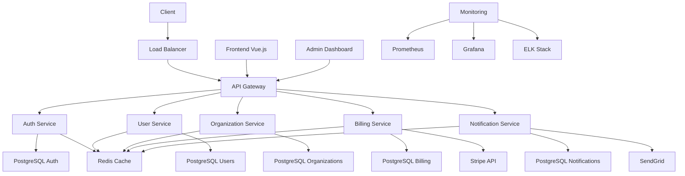
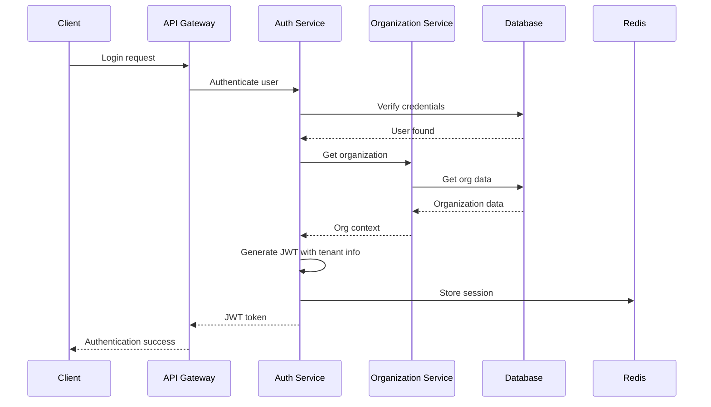
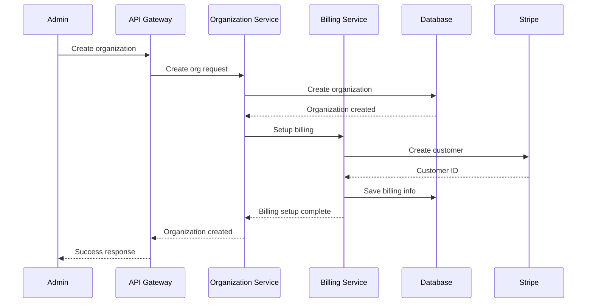

# 🏢 SaaS B2B : Architecture Multi-tenant

## 📋 Table des matières
- [Introduction](#introduction)
- [Contexte métier](#contexte-métier)
- [Besoins spécifiques](#besoins-spécifiques)
- [Stack technique recommandée](#stack-technique-recommandée)
- [Architecture détaillée](#architecture-détaillée)
- [Structure de dossiers](#structure-de-dossiers)
- [User stories types](#user-stories-types)
- [Exemples de code clés](#exemples-de-code-clés)
- [Checklist de validation](#checklist-de-validation)
- [Ressources](#ressources)

## 🎯 Introduction

Ce cas d'usage présente l'architecture complète d'une plateforme SaaS B2B avec multi-tenancy, incluant la gestion des organisations, des utilisateurs, des permissions et de la facturation.

### 🎯 Objectifs

- **Définir** l'architecture d'une plateforme SaaS B2B
- **Identifier** les besoins spécifiques au multi-tenancy
- **Proposer** une stack technique adaptée
- **Fournir** des user stories détaillées
- **Guider** l'implémentation complète

---

## 🏢 Contexte métier

### 📝 Description du projet

**Plateforme SaaS B2B moderne**
- Gestion multi-tenant des organisations
- Système de permissions granulaire
- Facturation et abonnements
- Interface d'administration complète
- Analytics et reporting par tenant

### 📊 Acteurs principaux

| Acteur | Description | Responsabilités |
|--------|-------------|-----------------|
| **Super Admin** | Administrateur de la plateforme | Gestion globale, support, facturation |
| **Tenant Admin** | Administrateur d'organisation | Gestion des utilisateurs de son organisation |
| **User** | Utilisateur final | Utilisation des fonctionnalités métier |
| **Billing Manager** | Gestionnaire de facturation | Gestion des abonnements et paiements |

### 🎯 Objectifs métier

- **Multi-tenancy** : Isolation complète des données par organisation
- **Scalabilité** : Support de milliers d'organisations
- **Sécurité** : Isolation et protection des données
- **Flexibilité** : Configuration par tenant
- **Monétisation** : Facturation et abonnements

---

## 🔍 Besoins spécifiques

### 📝 Fonctionnalités principales

#### Gestion des organisations
- **Création** : Création de nouvelles organisations
- **Configuration** : Paramétrage par organisation
- **Isolation** : Séparation complète des données
- **Limites** : Gestion des quotas et limites
- **Billing** : Facturation par organisation

#### Gestion des utilisateurs
- **Authentification** : Connexion multi-tenant
- **Permissions** : Système de rôles granulaire
- **Invitations** : Invitation d'utilisateurs
- **SSO** : Intégration avec des systèmes d'authentification externes
- **Profils** : Gestion des profils utilisateurs

#### Gestion des données
- **Isolation** : Séparation des données par tenant
- **Backup** : Sauvegarde par organisation
- **Export** : Export des données par tenant
- **Import** : Import de données existantes
- **Archivage** : Archivage des données inactives

#### Facturation et abonnements
- **Plans** : Gestion des plans d'abonnement
- **Facturation** : Génération des factures
- **Paiements** : Traitement des paiements
- **Métriques** : Suivi de l'utilisation
- **Limites** : Gestion des quotas

#### Administration
- **Dashboard** : Tableau de bord global
- **Analytics** : Statistiques par tenant
- **Support** : Gestion du support client
- **Monitoring** : Surveillance de la plateforme
- **Logs** : Journalisation des activités

### 📊 Besoins non-fonctionnels

| Besoin | Description | Critères |
|--------|-------------|----------|
| **Performance** | Temps de réponse rapide | < 1s pour les opérations courantes |
| **Scalabilité** | Support de la croissance | 1000+ organisations |
| **Sécurité** | Isolation des données | Conformité SOC 2 |
| **Disponibilité** | Uptime élevé | 99.99% de disponibilité |
| **Maintenabilité** | Code maintenable | Architecture modulaire |

---

## 🛠️ Stack technique recommandée

### 📝 Architecture recommandée

**Architecture : Microservices avec multi-tenancy**
- **Scalabilité** : Services indépendants et évolutifs
- **Isolation** : Séparation des responsabilités
- **Flexibilité** : Déploiement indépendant des services
- **Résilience** : Tolérance aux pannes

### 🏗️ Stack technique

| Composant | Technologie | Justification |
|-----------|-------------|---------------|
| **Frontend** | Vue.js 3 + TypeScript | Réactivité, écosystème mature |
| **Backend** | NestJS + TypeScript | Architecture modulaire, évolutivité |
| **Base de données** | PostgreSQL | ACID, requêtes complexes |
| **Cache** | Redis | Performance, sessions |
| **Message Queue** | RabbitMQ | Communication asynchrone |
| **Storage** | AWS S3 | Scalabilité, coûts optimisés |
| **Monitoring** | Prometheus + Grafana | Observabilité complète |
| **Logs** | ELK Stack | Centralisation des logs |

### 🔧 Outils de développement

| Outil | Usage | Justification |
|-------|-------|---------------|
| **Vite** | Build tool frontend | Performance, HMR |
| **Prisma** | ORM | Type safety, migrations |
| **Docker** | Containerisation | Environnement cohérent |
| **Kubernetes** | Orchestration | Scalabilité, gestion des ressources |
| **GitHub Actions** | CI/CD | Automatisation |
| **ESLint/Prettier** | Qualité de code | Standards cohérents |

---

## 🏗️ Architecture détaillée

### 📊 Schéma d'architecture



### 🔄 Flux de données

#### Flux d'authentification multi-tenant


#### Flux de création d'organisation


---

## 📁 Structure de dossiers

### 📝 Structure complète

```
saas-b2b-project/
├── frontend/                 # Application Vue.js
│   ├── src/
│   │   ├── components/       # Composants réutilisables
│   │   │   ├── atoms/        # Composants atomiques
│   │   │   │   ├── Button/
│   │   │   │   ├── Input/
│   │   │   │   └── Badge/
│   │   │   ├── molecules/    # Composants moléculaires
│   │   │   │   ├── UserCard/
│   │   │   │   ├── OrganizationCard/
│   │   │   │   └── BillingCard/
│   │   │   └── organisms/    # Composants organiques
│   │   │       ├── Header/
│   │   │       ├── Sidebar/
│   │   │       └── DataTable/
│   │   ├── pages/            # Pages de l'application
│   │   │   ├── Dashboard/
│   │   │   ├── Organizations/
│   │   │   ├── Users/
│   │   │   ├── Billing/
│   │   │   ├── Settings/
│   │   │   └── Admin/
│   │   ├── stores/           # State management
│   │   │   ├── auth.js
│   │   │   ├── organization.js
│   │   │   ├── users.js
│   │   │   └── billing.js
│   │   ├── composables/      # Composition API
│   │   │   ├── useAuth.js
│   │   │   ├── useOrganization.js
│   │   │   ├── useUsers.js
│   │   │   └── useBilling.js
│   │   ├── utils/            # Utilitaires
│   │   │   ├── api.js
│   │   │   ├── tenant.js
│   │   │   └── permissions.js
│   │   ├── types/            # Types TypeScript
│   │   │   ├── user.types.ts
│   │   │   ├── organization.types.ts
│   │   │   └── billing.types.ts
│   │   └── main.ts
│   ├── public/
│   ├── package.json
│   ├── vite.config.js
│   ├── tsconfig.json
│   └── README.md
├── backend/                  # Services NestJS
│   ├── services/             # Microservices
│   │   ├── auth-service/     # Service d'authentification
│   │   │   ├── src/
│   │   │   │   ├── controllers/
│   │   │   │   ├── services/
│   │   │   │   ├── repositories/
│   │   │   │   ├── dto/
│   │   │   │   ├── entities/
│   │   │   │   └── auth.module.ts
│   │   │   ├── prisma/
│   │   │   │   ├── schema.prisma
│   │   │   │   └── migrations/
│   │   │   ├── package.json
│   │   │   └── README.md
│   │   ├── user-service/     # Service des utilisateurs
│   │   │   ├── src/
│   │   │   │   ├── controllers/
│   │   │   │   ├── services/
│   │   │   │   ├── repositories/
│   │   │   │   ├── dto/
│   │   │   │   ├── entities/
│   │   │   │   └── user.module.ts
│   │   │   ├── prisma/
│   │   │   ├── package.json
│   │   │   └── README.md
│   │   ├── organization-service/ # Service des organisations
│   │   │   ├── src/
│   │   │   │   ├── controllers/
│   │   │   │   ├── services/
│   │   │   │   ├── repositories/
│   │   │   │   ├── dto/
│   │   │   │   ├── entities/
│   │   │   │   └── organization.module.ts
│   │   │   ├── prisma/
│   │   │   ├── package.json
│   │   │   └── README.md
│   │   ├── billing-service/  # Service de facturation
│   │   │   ├── src/
│   │   │   │   ├── controllers/
│   │   │   │   ├── services/
│   │   │   │   ├── repositories/
│   │   │   │   ├── dto/
│   │   │   │   ├── entities/
│   │   │   │   └── billing.module.ts
│   │   │   ├── prisma/
│   │   │   ├── package.json
│   │   │   └── README.md
│   │   └── notification-service/ # Service de notifications
│   │       ├── commentators/
│   │       │   ├── src/
│   │       │   ├── prisma/
│   │       │   ├── package.json
│   │       │   └── README.md
│   ├── shared/               # Code partagé
│   │   ├── middleware/
│   │   ├── services/
│   │   ├── utils/
│   │   └── types/
│   └── infrastructure/       # Infrastructure
│       ├── api-gateway/      # API Gateway
│       ├── load-balancer/    # Load Balancer
│       └── monitoring/       # Monitoring
├── infrastructure/           # Infrastructure as Code
│   ├── docker/
│   │   ├── Dockerfile.frontend
│   │   ├── Dockerfile.auth-service
│   │   ├── Dockerfile.user-service
│   │   ├── Dockerfile.organization-service
│   │   ├── Dockerfile.billing-service
│   │   ├── Dockerfile.notification-service
│   │   └── docker-compose.yml
│   ├── kubernetes/
│   │   ├── frontend-deployment.yaml
│   │   ├── auth-service-deployment.yaml
│   │   ├── user-service-deployment.yaml
│   │   ├── organization-service-deployment.yaml
│   │   ├── billing-service-deployment.yaml
│   │   ├── notification-service-deployment.yaml
│   │   ├── api-gateway-deployment.yaml
│   │   └── ingress.yaml
│   └── terraform/
│       ├── main.tf
│       ├── variables.tf
│       └── outputs.tf
├── docs/                     # Documentation
│   ├── api/
│   ├── architecture/
│   ├── deployment/
│   └── README.md
├── scripts/                  # Scripts utilitaires
│   ├── setup.sh
│   ├── deploy.sh
│   └── backup.sh
├── .github/                  # GitHub Actions
│   └── workflows/
│       ├── ci.yml
│       └── cd.yml
├── .gitignore
├── README.md
└── package.json
```

---

## 📝 User stories types

### 👤 Super Admin

#### Gestion globale
- **En tant que** super admin, **je veux** voir le dashboard global **afin de** surveiller l'état de la plateforme
- **En tant que** super admin, **je veux** gérer les organisations **afin de** créer et configurer de nouveaux tenants
- **En tant que** super admin, **je veux** voir les statistiques d'utilisation **afin de** analyser les performances de la plateforme
- **En tant que** super admin, **je veux** gérer les plans d'abonnement **afin de** définir les offres disponibles
- **En tant que** super admin, **je veux** accéder aux logs de la plateforme **afin de** diagnostiquer les problèmes

#### Support et maintenance
- **En tant que** super admin, **je veux** accéder aux données de n'importe quelle organisation **afin de** fournir un support technique
- **En tant que** super admin, **je veux** suspendre une organisation **afin de** gérer les comptes en défaut de paiement
- **En tant que** super admin, **je veux** modifier les limites d'une organisation **afin de** ajuster les quotas selon les besoins
- **En tant que** super admin, **je veux** gérer les utilisateurs de la plateforme **afin de** maintenir la sécurité

### 👨‍💼 Tenant Admin

#### Gestion de l'organisation
- **En tant que** tenant admin, **je veux** configurer les paramètres de mon organisation **afin de** personnaliser l'expérience
- **En tant que** tenant admin, **je veux** gérer les utilisateurs de mon organisation **afin de** contrôler l'accès
- **En tant que** tenant admin, **je veux** définir les rôles et permissions **afin de** sécuriser les données
- **En tant que** tenant admin, **je veux** inviter de nouveaux utilisateurs **afin de** étendre l'équipe
- **En tant que** tenant admin, **je veux** voir l'activité de mon organisation **afin de** surveiller l'utilisation

#### Gestion des abonnements
- **En tant que** tenant admin, **je veux** voir les détails de mon abonnement **afin de** comprendre les coûts
- **En tant que** tenant admin, **je veux** modifier mon plan d'abonnement **afin de** ajuster les fonctionnalités
- **En tant que** tenant admin, **je veux** voir l'historique de facturation **afin de** suivre les paiements
- **En tant que** tenant admin, **je veux** gérer les moyens de paiement **afin de** maintenir les paiements automatiques

### 👤 User

#### Utilisation des fonctionnalités
- **En tant qu'** utilisateur, **je veux** me connecter avec mes identifiants **afin de** accéder à la plateforme
- **En tant qu'** utilisateur, **je veux** voir le dashboard de mon organisation **afin de** accéder aux fonctionnalités
- **En tant qu'** utilisateur, **je veux** utiliser les fonctionnalités selon mes permissions **afin de** accomplir mes tâches
- **En tant qu'** utilisateur, **je veux** modifier mon profil **afin de** maintenir mes informations à jour
- **En tant qu'** utilisateur, **je veux** recevoir des notifications **afin de** être informé des événements importants

#### Collaboration
- **En tant qu'** utilisateur, **je veux** collaborer avec d'autres utilisateurs de mon organisation **afin de** partager les informations
- **En tant qu'** utilisateur, **je veux** voir l'activité de mon équipe **afin de** rester synchronisé
- **En tant qu'** utilisateur, **je veux** accéder aux données partagées **afin de** travailler efficacement

### 💰 Billing Manager

#### Gestion de la facturation
- **En tant que** billing manager, **je veux** voir tous les abonnements **afin de** gérer la facturation
- **En tant que** billing manager, **je veux** générer des factures **afin de** facturer les clients
- **En tant que** billing manager, **je veux** traiter les paiements **afin de** recevoir les fonds
- **En tant que** billing manager, **je veux** gérer les remboursements **afin de** résoudre les litiges
- **En tant que** billing manager, **je veux** voir les métriques de revenus **afin de** analyser les performances

#### Gestion des clients
- **En tant que** billing manager, **je veux** voir les informations de facturation des clients **afin de** gérer les comptes
- **En tant que** billing manager, **je veux** suspendre les comptes en défaut **afin de** protéger les revenus
- **En tant que** billing manager, **je veux** gérer les plans d'abonnement **afin de** optimiser les revenus

---

## 💻 Exemples de code clés

### 🏗️ Modèles de données

#### Modèle Organization
```typescript
// backend/services/organization-service/src/entities/organization.entity.ts
import { Entity, PrimaryGeneratedColumn, Column, OneToMany, CreateDateColumn, UpdateDateColumn } from 'typeorm'
import { User } from './user.entity'
import { BillingInfo } from './billing-info.entity'

@Entity('organizations')
export class Organization {
  @PrimaryGeneratedColumn('uuid')
  id: string

  @Column({ unique: true })
  name: string

  @Column({ unique: true })
  slug: string

  @Column({ type: 'text', nullable: true })
  description: string

  @Column({ default: true })
  isActive: boolean

  @Column({ type: 'json', nullable: true })
  settings: Record<string, any>

  @Column({ type: 'json', nullable: true })
  limits: Record<string, any>

  @Column({ type: 'enum', enum: ['trial', 'basic', 'premium', 'enterprise'] })
  plan: string

  @OneToMany(() => User, user => user.organization)
  users: User[]

  @OneToMany(() => BillingInfo, billingInfo => billingInfo.organization)
  billingInfo: BillingInfo[]

  @CreateDateColumn()
  createdAt: Date

  @UpdateDateColumn()
  updatedAt: Date
}
```

#### Modèle User
```typescript
// backend/services/user-service/src/entities/user.entity.ts
import { Entity, PrimaryGeneratedColumn, Column, ManyToOne, CreateDateColumn, UpdateDateColumn } from 'typeorm'
import { Organization } from './organization.entity'

@Entity('users')
export class User {
  @PrimaryGeneratedColumn('uuid')
  id: string

  @Column({ unique: true })
  email: string

  @Column()
  firstName: string

  @Column()
  lastName: string

  @Column({ type: 'text', nullable: true })
  password: string

  @Column({ default: true })
  isActive: boolean

  @Column({ type: 'enum', enum: ['super_admin', 'tenant_admin', 'user'] })
  role: string

  @Column({ type: 'json', nullable: true })
  permissions: string[]

  @Column({ type: 'json', nullable: true })
  profile: Record<string, any>

  @ManyToOne(() => Organization, organization => organization.users)
  organization: Organization

  @Column({ type: 'timestamp', nullable: true })
  lastLoginAt: Date

  @CreateDateColumn()
  createdAt: Date

  @UpdateDateColumn()
  updatedAt: Date
}
```

### 🔧 Services métier

#### Service Organization
```typescript
// backend/services/organization-service/src/services/organization.service.ts
import { Injectable, NotFoundException, BadRequestException } from '@nestjs/common'
import { OrganizationRepository } from '../repositories/organization.repository'
import { CreateOrganizationDto, UpdateOrganizationDto } from '../dto/organization.dto'

@Injectable()
export class OrganizationService {
  constructor(private readonly organizationRepository: OrganizationRepository) {}

  async findAll(pagination: any): Promise<{ organizations: Organization[], total: number }> {
    return this.organizationRepository.findAll(pagination)
  }

  async findById(id: string): Promise<Organization> {
    const organization = await this.organizationRepository.findById(id)
    if (!organization) {
      throw new NotFoundException(`Organization with ID ${id} not found`)
    }
    return organization
  }

  async findBySlug(slug: string): Promise<Organization> {
    const organization = await this.organizationRepository.findBySlug(slug)
    if (!organization) {
      throw new NotFoundException(`Organization with slug ${slug} not found`)
    }
    return organization
  }

  async create(createOrganizationDto: CreateOrganizationDto): Promise<Organization> {
    // Vérifier l'unicité du slug
    const existingOrg = await this.organizationRepository.findBySlug(createOrganizationDto.slug)
    if (existingOrg) {
      throw new BadRequestException(`Organization with slug ${createOrganizationDto.slug} already exists`)
    }

    return this.organizationRepository.create(createOrganizationDto)
  }

  async update(id: string, updateOrganizationDto: UpdateOrganizationDto): Promise<Organization> {
    const organization = await this.findById(id)
    return this.organizationRepository.update(id, updateOrganizationDto)
  }

  async delete(id: string): Promise<void> {
    await this.findById(id)
    return this.organizationRepository.delete(id)
  }

  async updatePlan(id: string, plan: string): Promise<Organization> {
    const organization = await this.findById(id)
    organization.plan = plan
    return this.organizationRepository.save(organization)
  }

  async updateLimits(id: string, limits: Record<string, any>): Promise<Organization> {
    const organization = await this.findById(id)
    organization.limits = limits
    return this.organizationRepository.save(organization)
  }
}
```

#### Service Auth
```typescript
// backend/services/auth-service/src/services/auth.service.ts
import { Injectable, UnauthorizedException, BadRequestException } from '@nestjs/common'
import { JwtService } from '@nestjs/jwt'
import { UserService } from '../../user-service/src/services/user.service'
import { OrganizationService } from '../../organization-service/src/services/organization.service'
import { LoginDto, RegisterDto } from '../dto/auth.dto'

@Injectable()
export class AuthService {
  constructor(
    private readonly userService: UserService,
    private readonly organizationService: OrganizationService,
    private readonly jwtService: JwtService
  ) {}

  async login(loginDto: LoginDto): Promise<{ user: User, token: string, organization: Organization }> {
    const user = await this.userService.findByEmail(loginDto.email)
    if (!user || !user.isActive) {
      throw new UnauthorizedException('Invalid credentials')
    }

    // Vérifier le mot de passe
    const isPasswordValid = await this.validatePassword(loginDto.password, user.password)
    if (!isPasswordValid) {
      throw new UnauthorizedException('Invalid credentials')
    }

    // Récupérer l'organisation
    const organization = await this.organizationService.findById(user.organizationId)
    if (!organization || !organization.isActive) {
      throw new UnauthorizedException('Organization is not active')
    }

    // Générer le token JWT
    const payload = {
      sub: user.id,
      email: user.email,
      role: user.role,
      organizationId: organization.id,
      organizationSlug: organization.slug
    }

    const token = this.jwtService.sign(payload)

    // Mettre à jour la dernière connexion
    await this.userService.updateLastLogin(user.id)

    return {
      user,
      token,
      organization
    }
  }

  async register(registerDto: RegisterDto): Promise<{ user: User, token: string, organization: Organization }> {
    // Vérifier si l'utilisateur existe déjà
    const existingUser = await this.userService.findByEmail(registerDto.email)
    if (existingUser) {
      throw new BadRequestException('User with this email already exists')
    }

    // Créer l'organisation
    const organization = await this.organizationService.create({
      name: registerDto.organizationName,
      slug: this.generateSlug(registerDto.organizationName),
      plan: 'trial',
      limits: this.getDefaultLimits('trial')
    })

    // Créer l'utilisateur
    const hashedPassword = await this.hashPassword(registerDto.password)
    const user = await this.userService.create({
      ...registerDto,
      password: hashedPassword,
      organizationId: organization.id,
      role: 'tenant_admin'
    })

    // Générer le token JWT
    const payload = {
      sub: user.id,
      email: user.email,
      role: user.role,
      organizationId: organization.id,
      organizationSlug: organization.slug
    }

    const token = this.jwtService.sign(payload)

    return {
      user,
      token,
      organization
    }
  }

  private async validatePassword(password: string, hashedPassword: string): Promise<boolean> {
    // Implémentation de la validation du mot de passe
    return true // Placeholder
  }

  private async hashPassword(password: string): Promise<string> {
    // Implémentation du hachage du mot de passe
    return password // Placeholder
  }

  private generateSlug(name: string): string {
    return name
      .toLowerCase()
      .replace(/[^a-z0-9]+/g, '-')
      .replace(/(^-|-$)/g, '')
  }

  private getDefaultLimits(plan: string): Record<string, any> {
    const limits = {
      trial: { users: 5, storage: '1GB', apiCalls: 1000 },
      basic: { users: 25, storage: '10GB', apiCalls: 10000 },
      premium: { users: 100, storage: '100GB', apiCalls: 100000 },
      enterprise: { users: -1, storage: '1TB', apiCalls: -1 }
    }
    return limits[plan] || limits.trial
  }
}
```

### 🎨 Composants frontend

#### OrganizationCard
```vue
<!-- frontend/src/components/molecules/OrganizationCard/OrganizationCard.vue -->
<template>
  <div class="organization-card" :class="{ 'organization-card--inactive': !organization.isActive }">
    <div class="organization-card__header">
      <h3 class="organization-card__name">{{ organization.name }}</h3>
      <span class="organization-card__plan" :class="`organization-card__plan--${organization.plan}`">
        {{ organization.plan }}
      </span>
    </div>
    
    <div class="organization-card__content">
      <p class="organization-card__description">{{ organization.description }}</p>
      
      <div class="organization-card__stats">
        <div class="organization-card__stat">
          <span class="organization-card__stat-label">Users:</span>
          <span class="organization-card__stat-value">{{ organization.users?.length || 0 }}</span>
        </div>
        <div class="organization-card__stat">
          <span class="organization-card__stat-label">Plan:</span>
          <span class="organization-card__stat-value">{{ organization.plan }}</span>
        </div>
      </div>
      
      <div class="organization-card__actions">
        <button @click="viewDetails" class="btn btn--primary">
          View Details
        </button>
        <button @click="editOrganization" class="btn btn--secondary">
          Edit
        </button>
        <button @click="suspendOrganization" class="btn btn--danger">
          Suspend
        </button>
      </div>
    </div>
  </div>
</template>

<script setup lang="ts">
import { Organization } from '@/types/organization.types'

interface Props {
  organization: Organization
}

const props = defineProps<Props>()

const viewDetails = () => {
  // Navigation vers la page de détail de l'organisation
}

const editOrganization = () => {
  // Ouverture du modal d'édition
}

const suspendOrganization = () => {
  // Confirmation et suspension de l'organisation
}
</script>

<style scoped>
.organization-card {
  border: 1px solid #e0e0e0;
  border-radius: 8px;
  padding: 24px;
  background: white;
  transition: transform 0.2s ease;
}

.organization-card:hover {
  transform: translateY(-2px);
  box-shadow: 0 4px 12px rgba(0, 0, 0, 0.1);
}

.organization-card--inactive {
  opacity: 0.6;
  border-color: #dc3545;
}

.organization-card__header {
  display: flex;
  justify-content: space-between;
  align-items: center;
  margin-bottom: 16px;
}

.organization-card__name {
  font-size: 20px;
  font-weight: 600;
  margin: 0;
}

.organization-card__plan {
  padding: 4px 12px;
  border-radius: 20px;
  font-size: 12px;
  font-weight: bold;
  text-transform: uppercase;
}

.organization-card__plan--trial {
  background: #f8f9fa;
  color: #6c757d;
}

.organization-card__plan--basic {
  background: #d1ecf1;
  color: #0c5460;
}

.organization-card__plan--premium {
  background: #d4edda;
  color: #155724;
}

.organization-card__plan--enterprise {
  background: #f8d7da;
  color: #721c24;
}

.organization-card__description {
  color: #666;
  margin: 0 0 16px 0;
}

.organization-card__stats {
  display: flex;
  gap: 24px;
  margin-bottom: 20px;
}

.organization-card__stat {
  display: flex;
  flex-direction: column;
}

.organization-card__stat-label {
  font-size: 12px;
  color: #666;
  text-transform: uppercase;
}

.organization-card__stat-value {
  font-size: 16px;
  font-weight: 600;
}

.organization-card__actions {
  display: flex;
  gap: 8px;
}

.btn {
  padding: 8px 16px;
  border: none;
  border-radius: 4px;
  cursor: pointer;
  font-size: 14px;
  font-weight: 500;
  transition: background-color 0.2s ease;
}

.btn--primary {
  background: #007bff;
  color: white;
}

.btn--primary:hover {
  background: #0056b3;
}

.btn--secondary {
  background: #6c757d;
  color: white;
}

.btn--secondary:hover {
  background: #545b62;
}

.btn--danger {
  background: #dc3545;
  color: white;
}

.btn--danger:hover {
  background: #c82333;
}
</style>
```

#### UserManagement
```vue
<!-- frontend/src/components/organisms/UserManagement/UserManagement.vue -->
<template>
  <div class="user-management">
    <div class="user-management__header">
      <h2>User Management</h2>
      <button @click="inviteUser" class="btn btn--primary">
        Invite User
      </button>
    </div>
    
    <div class="user-management__filters">
      <input
        v-model="searchQuery"
        type="text"
        placeholder="Search users..."
        class="input"
      />
      <select v-model="roleFilter" class="select">
        <option value="">All Roles</option>
        <option value="tenant_admin">Tenant Admin</option>
        <option value="user">User</option>
      </select>
    </div>
    
    <div class="user-management__table">
      <table class="table">
        <thead>
          <tr>
            <th>Name</th>
            <th>Email</th>
            <th>Role</th>
            <th>Status</th>
            <th>Last Login</th>
            <th>Actions</th>
          </tr>
        </thead>
        <tbody>
          <tr v-for="user in filteredUsers" :key="user.id">
            <td>{{ user.firstName }} {{ user.lastName }}</td>
            <td>{{ user.email }}</td>
            <td>
              <span class="badge" :class="`badge--${user.role}`">
                {{ user.role }}
              </span>
            </td>
            <td>
              <span class="badge" :class="user.isActive ? 'badge--active' : 'badge--inactive'">
                {{ user.isActive ? 'Active' : 'Inactive' }}
              </span>
            </td>
            <td>{{ formatDate(user.lastLoginAt) }}</td>
            <td>
              <div class="user-management__actions">
                <button @click="editUser(user)" class="btn btn--sm btn--secondary">
                  Edit
                </button>
                <button @click="toggleUserStatus(user)" class="btn btn--sm" :class="user.isActive ? 'btn--danger' : 'btn--success'">
                  {{ user.isActive ? 'Deactivate' : 'Activate' }}
                </button>
              </div>
            </td>
          </tr>
        </tbody>
      </table>
    </div>
  </div>
</template>

<script setup lang="ts">
import { ref, computed } from 'vue'
import { User } from '@/types/user.types'
import { useUsers } from '@/composables/useUsers'

const { users, inviteUser: inviteUserService, updateUser, toggleUserStatus: toggleStatus } = useUsers()

const searchQuery = ref('')
const roleFilter = ref('')

const filteredUsers = computed(() => {
  return users.value.filter(user => {
    const matchesSearch = user.firstName.toLowerCase().includes(searchQuery.value.toLowerCase()) ||
                         user.lastName.toLowerCase().includes(searchQuery.value.toLowerCase()) ||
                         user.email.toLowerCase().includes(searchQuery.value.toLowerCase())
    
    const matchesRole = !roleFilter.value || user.role === roleFilter.value
    
    return matchesSearch && matchesRole
  })
})

const editUser = (user: User) => {
  // Ouverture du modal d'édition
}

const toggleUserStatus = async (user: User) => {
  await toggleStatus(user.id)
}

const formatDate = (date: Date | null): string => {
  if (!date) return 'Never'
  return new Date(date).toLocaleDateString()
}
</script>

<style scoped>
.user-management {
  padding: 24px;
}

.user-management__header {
  display: flex;
  justify-content: space-between;
  align-items: center;
  margin-bottom: 24px;
}

.user-management__filters {
  display: flex;
  gap: 16px;
  margin-bottom: 24px;
}

.input, .select {
  padding: 8px 12px;
  border: 1px solid #ddd;
  border-radius: 4px;
  font-size: 14px;
}

.input {
  flex: 1;
}

.table {
  width: 100%;
  border-collapse: collapse;
  background: white;
  border-radius: 8px;
  overflow: hidden;
  box-shadow: 0 2px 4px rgba(0, 0, 0, 0.1);
}

.table th,
.table td {
  padding: 12px 16px;
  text-align: left;
  border-bottom: 1px solid #e0e0e0;
}

.table th {
  background: #f8f9fa;
  font-weight: 600;
  color: #495057;
}

.badge {
  padding: 4px 8px;
  border-radius: 12px;
  font-size: 12px;
  font-weight: 500;
  text-transform: uppercase;
}

.badge--tenant_admin {
  background: #d1ecf1;
  color: #0c5460;
}

.badge--user {
  background: #d4edda;
  color: #155724;
}

.badge--active {
  background: #d4edda;
  color: #155724;
}

.badge--inactive {
  background: #f8d7da;
  color: #721c24;
}

.user-management__actions {
  display: flex;
  gap: 8px;
}

.btn {
  padding: 8px 16px;
  border: none;
  border-radius: 4px;
  cursor: pointer;
  font-size: 14px;
  font-weight: 500;
  transition: background-color 0.2s ease;
}

.btn--sm {
  padding: 4px 8px;
  font-size: 12px;
}

.btn--primary {
  background: #007bff;
  color: white;
}

.btn--primary:hover {
  background: #0056b3;
}

.btn--secondary {
  background: #6c757d;
  color: white;
}

.btn--secondary:hover {
  background: #545b62;
}

.btn--success {
  background: #28a745;
  color: white;
}

.btn--success:hover {
  background: #1e7e34;
}

.btn--danger {
  background: #dc3545;
  color: white;
}

.btn--danger:hover {
  background: #c82333;
}
</style>
```

---

## ✅ Checklist de validation

### 📋 Fonctionnalités principales

- [ ] **Multi-tenancy** complètement implémenté
- [ ] **Authentification** multi-tenant fonctionnelle
- [ ] **Gestion des organisations** opérationnelle
- [ ] **Système de permissions** granulaire
- [ ] **Facturation** et abonnements
- [ ] **Interface d'administration** complète

### 📋 Architecture technique

- [ ] **Microservices** configurés et fonctionnels
- [ ] **API Gateway** opérationnel
- [ ] **Base de données** multi-tenant
- [ ] **Cache Redis** pour les performances
- [ ] **Message Queue** pour la communication
- [ ] **Monitoring** et observabilité

### 📋 Sécurité et qualité

- [ ] **Isolation des données** par tenant
- [ ] **Authentification JWT** sécurisée
- [ ] **Validation des données** implémentée
- [ ] **Tests unitaires** et d'intégration
- [ ] **Monitoring** et logging
- [ ] **CI/CD** automatisé

### 📋 Performance et scalabilité

- [ ] **Optimisation des requêtes** base de données
- [ ] **Cache** des données fréquemment utilisées
- [ ] **Load balancing** configuré
- [ ] **Auto-scaling** des services
- [ ] **Monitoring** des performances
- [ ] **Gestion des ressources** optimisée

---

## 📚 Ressources

### 🎓 Formation
- [Architecture globale](../03-architecture/global-architecture.md)
- [Architecture backend](../03-architecture/backend-architecture.md)
- [Architecture frontend](../03-architecture/frontend-architecture.md)
- [Architecture base de données](../03-architecture/database-architecture.md)

### 🛠️ Outils
- [Vue.js](https://vuejs.org/) - Framework frontend
- [NestJS](https://nestjs.com/) - Framework backend
- [PostgreSQL](https://www.postgresql.org/) - Base de données
- [Redis](https://redis.io/) - Cache
- [RabbitMQ](https://www.rabbitmq.com/) - Message Queue

### 📖 Références
- [SaaS Architecture Patterns](https://www.oreilly.com/library/view/saas-architecture-patterns/9781449331770/) - O'Reilly
- [Multi-tenancy Best Practices](https://docs.microsoft.com/en-us/azure/sql-database/saas-tenancy-elastic-tools-multi-tenant-row-level-security) - Microsoft
- [Vue.js Documentation](https://vuejs.org/guide/) - Documentation officielle
- [NestJS Documentation](https://docs.nestjs.com/) - Documentation officielle

---

<div align="center">

[](../../../README.md)

</div>

---

*Dernière mise à jour : Janvier 2024*
