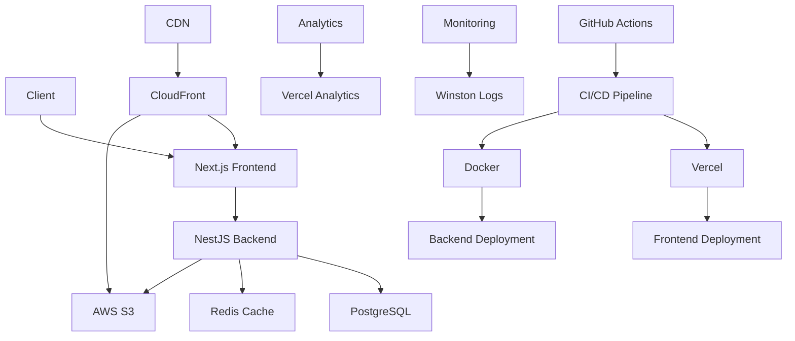
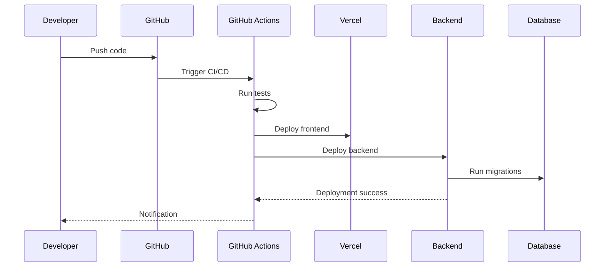
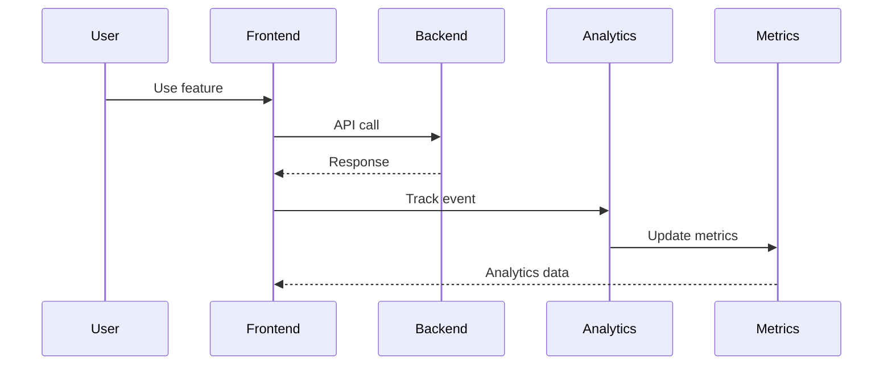

# 🚀 Startup MVP : Stack Lean

## 📋 Table des matières
- [Introduction](#introduction)
- [Contexte métier](#contexte-métier)
- [Besoins spécifiques](#besoins-spécifiques)
- [Stack technique recommandée](#stack-technique-recommandée)
- [Architecture détaillée](#architecture-détaillée)
- [Structure de dossiers](#structure-de-dossiers)
- [User stories types](#user-stories-types)
- [Exemples de code clés](#exemples-de-code-clés)
- [Checklist de validation](#checklist-de-validation)
- [Ressources](#ressources)

## 🎯 Introduction

Ce cas d'usage présente l'architecture complète d'une startup MVP avec stack lean, incluant la rapidité de développement, la scalabilité progressive et l'optimisation des coûts.

### 🎯 Objectifs

- **Définir** l'architecture d'une startup MVP efficace
- **Identifier** les besoins spécifiques au développement rapide
- **Proposer** une stack technique optimisée
- **Fournir** des user stories détaillées
- **Guider** l'implémentation complète

---

## 🏢 Contexte métier

### 📝 Description du projet

**Startup MVP moderne**
- Développement rapide et itératif
- Stack technique simplifiée et efficace
- Coûts optimisés pour le démarrage
- Scalabilité progressive
- Time-to-market réduit

### 📊 Acteurs principaux

| Acteur | Description | Responsabilités |
|--------|-------------|-----------------|
| **Founder** | Fondateur de la startup | Vision produit, stratégie |
| **Developer** | Développeur full-stack | Développement et maintenance |
| **User** | Utilisateur final | Test et feedback du produit |
| **Investor** | Investisseur | Financement et validation |
| **Advisor** | Conseiller | Guidance et expertise |

### 🎯 Objectifs métier

- **Rapidité** : Time-to-market optimisé
- **Simplicité** : Stack technique simplifiée
- **Coût** : Optimisation des coûts de développement
- **Scalabilité** : Évolutivité progressive
- **Validation** : Validation rapide du concept

---

## 🔍 Besoins spécifiques

### 📝 Fonctionnalités principales

#### Développement rapide
- **Setup rapide** : Configuration et déploiement simplifiés
- **Développement itératif** : Cycles de développement courts
- **Hot reload** : Rechargement automatique du code
- **Tests automatisés** : Validation continue
- **CI/CD** : Déploiement automatique

#### Stack technique simplifiée
- **Monolithe modulaire** : Architecture simple mais évolutive
- **Base de données unique** : PostgreSQL pour tous les besoins
- **Cache simple** : Redis pour les performances
- **Storage cloud** : AWS S3 pour les fichiers
- **CDN** : CloudFront pour la distribution

#### Coûts optimisés
- **Infrastructure cloud** : Coûts variables selon l'usage
- **Services tiers** : Utilisation de services existants
- **Monitoring simple** : Outils gratuits ou low-cost
- **Développement local** : Environnement de développement gratuit
- **Déploiement simple** : Plateformes de déploiement abordables

#### Scalabilité progressive
- **Architecture évolutive** : Passage facile au microservices
- **Base de données scalable** : Migration progressive
- **Cache distribué** : Évolution du cache
- **Load balancing** : Équilibrage de charge
- **Auto-scaling** : Mise à l'échelle automatique

#### Validation rapide
- **Analytics** : Suivi des utilisateurs et comportements
- **A/B testing** : Tests de fonctionnalités
- **Feedback** : Collecte de retours utilisateurs
- **Métriques** : KPIs de validation
- **Itérations** : Cycles de validation courts

### 📊 Besoins non-fonctionnels

| Besoin | Description | Critères |
|--------|-------------|----------|
| **Rapidité** | Développement rapide | MVP en 2-4 semaines |
| **Simplicité** | Stack technique simple | Moins de 10 technologies |
| **Coût** | Coûts optimisés | < 100€/mois au démarrage |
| **Scalabilité** | Évolutivité progressive | Support de 10k+ utilisateurs |
| **Maintenabilité** | Code maintenable | Architecture modulaire |

---

## 🛠️ Stack technique recommandée

### 📝 Architecture recommandée

**Architecture : Monolithe modulaire avec stack lean**
- **Simplicité** : Architecture monolithique modulaire
- **Rapidité** : Développement et déploiement rapides
- **Coût** : Coûts optimisés pour le démarrage
- **Évolutivité** : Migration progressive vers microservices

### 🏗️ Stack technique

| Composant | Technologie | Justification |
|-----------|-------------|---------------|
| **Frontend** | Next.js + TypeScript | SSR, performance, écosystème |
| **Backend** | NestJS + TypeScript | Architecture modulaire, évolutivité |
| **Base de données** | PostgreSQL | ACID, requêtes complexes |
| **Cache** | Redis | Performance, sessions |
| **Storage** | AWS S3 | Scalabilité, coûts optimisés |
| **CDN** | CloudFront | Distribution des assets |
| **Monitoring** | Vercel Analytics | Monitoring simple et gratuit |
| **Logs** | Winston | Logging simple et efficace |

### 🔧 Outils de développement

| Outil | Usage | Justification |
|-------|-------|---------------|
| **Prisma** | ORM | Type safety, migrations |
| **Docker** | Containerisation | Environnement cohérent |
| **Vercel** | Déploiement | Déploiement simple et gratuit |
| **GitHub Actions** | CI/CD | Automatisation |
| **ESLint/Prettier** | Qualité de code | Standards cohérents |
| **Jest** | Tests | Couverture de tests |

---

## 🏗️ Architecture détaillée

### 📊 Schéma d'architecture



### 🔄 Flux de données

#### Flux de développement


#### Flux de validation


---

## 📁 Structure de dossiers

### 📝 Structure complète

```
startup-mvp-project/
├── frontend/                 # Application Next.js
│   ├── src/
│   │   ├── components/       # Composants réutilisables
│   │   │   ├── ui/           # Composants UI de base
│   │   │   │   ├── Button/
│   │   │   │   ├── Input/
│   │   │   │   ├── Modal/
│   │   │   │   └── Card/
│   │   │   ├── features/     # Composants par fonctionnalité
│   │   │   │   ├── auth/
│   │   │   │   ├── dashboard/
│   │   │   │   └── profile/
│   │   │   └── layout/       # Composants de layout
│   │   │       ├── Header/
│   │   │       ├── Footer/
│   │   │       └── Sidebar/
│   │   ├── pages/            # Pages de l'application
│   │   │   ├── index.tsx     # Page d'accueil
│   │   │   ├── auth/
│   │   │   │   ├── login.tsx
│   │   │   │   └── register.tsx
│   │   │   ├── dashboard/
│   │   │   │   ├── index.tsx
│   │   │   │   └── profile.tsx
│   │   │   └── api/          # API routes
│   │   │       ├── auth/
│   │   │       └── users/
│   │   ├── hooks/            # Hooks personnalisés
│   │   │   ├── useAuth.ts
│   │   │   ├── useApi.ts
│   │   │   └── useLocalStorage.ts
│   │   ├── utils/            # Utilitaires
│   │   │   ├── api.ts
│   │   │   ├── auth.ts
│   │   │   └── helpers.ts
│   │   ├── types/            # Types TypeScript
│   │   │   ├── auth.types.ts
│   │   │   ├── user.types.ts
│   │   │   └── api.types.ts
│   │   ├── styles/           # Styles globaux
│   │   │   ├── globals.css
│   │   │   └── components.css
│   │   └── lib/              # Configuration
│   │       ├── auth.ts
│   │       ├── api.ts
│   │       └── utils.ts
│   ├── public/               # Fichiers publics
│   ├── package.json
│   ├── next.config.js
│   ├── tsconfig.json
│   ├── tailwind.config.js
│   └── README.md
├── backend/                  # Application NestJS
│   ├── src/
│   │   ├── modules/          # Modules métier
│   │   │   ├── auth/         # Authentification
│   │   │   │   ├── controllers/
│   │   │   │   ├── services/
│   │   │   │   ├── repositories/
│   │   │   │   ├── dto/
│   │   │   │   ├── entities/
│   │   │   │   └── auth.module.ts
│   │   │   ├── users/        # Gestion des utilisateurs
│   │   │   │   ├── controllers/
│   │   │   │   ├── services/
│   │   │   │   ├── repositories/
│   │   │   │   ├── dto/
│   │   │   │   ├── entities/
│   │   │   │   └── users.module.ts
│   │   │   ├── dashboard/    # Dashboard
│   │   │   │   ├── controllers/
│   │   │   │   ├── services/
│   │   │   │   ├── repositories/
│   │   │   │   ├── dto/
│   │   │   │   ├── entities/
│   │   │   │   └── dashboard.module.ts
│   │   │   └── analytics/    # Analytics
│   │   │       ├── controllers/
│   │   │       ├── services/
│   │   │       ├── repositories/
│   │   │       ├── dto/
│   │   │       ├── entities/
│   │   │       └── analytics.module.ts
│   │   ├── shared/           # Code partagé
│   │   │   ├── middleware/
│   │   │   ├── services/
│   │   │   ├── utils/
│   │   │   └── types/
│   │   ├── infrastructure/   # Infrastructure
│   │   │   ├── database/
│   │   │   ├── cache/
│   │   │   └── storage/
│   │   └── main.ts
│   ├── prisma/
│   │   ├── schema.prisma
│   │   └── migrations/
│   ├── package.json
│   ├── tsconfig.json
│   ├── nest-cli.json
│   └── README.md
├── infrastructure/           # Infrastructure as Code
│   ├── docker/
│   │   ├── Dockerfile.frontend
│   │   ├── Dockerfile.backend
│   │   └── docker-compose.yml
│   ├── vercel/
│   │   ├── vercel.json
│   │   └── env.example
│   └── scripts/
│       ├── setup.sh
│       ├── deploy.sh
│       └── backup.sh
├── docs/                     # Documentation
│   ├── api/
│   ├── architecture/
│   ├── deployment/
│   └── README.md
├── .github/                  # GitHub Actions
│   └── workflows/
│       ├── ci.yml
│       └── cd.yml
├── .gitignore
├── README.md
└── package.json
```

---

## 📝 User stories types

### 👤 Founder

#### Vision et stratégie
- **En tant que** fondateur, **je veux** définir la vision du produit **afin de** aligner l'équipe sur les objectifs
- **En tant que** fondateur, **je veux** valider le concept rapidement **afin de** confirmer la demande du marché
- **En tant que** fondateur, **je veux** suivre les métriques clés **afin de** mesurer le succès du produit
- **En tant que** fondateur, **je veux** itérer rapidement sur le produit **afin de** s'adapter aux retours utilisateurs
- **En tant que** fondateur, **je veux** optimiser les coûts de développement **afin de** maximiser le ROI

#### Gestion de l'équipe
- **En tant que** fondateur, **je veux** recruter les bonnes personnes **afin de** construire une équipe efficace
- **En tant que** fondateur, **je veux** définir les priorités de développement **afin de** maximiser l'impact
- **En tant que** fondateur, **je veux** communiquer la vision **afin de** motiver l'équipe
- **En tant que** fondateur, **je veux** gérer les ressources **afin de** optimiser l'efficacité

### 👨‍💻 Developer

#### Développement rapide
- **En tant que** développeur, **je veux** configurer rapidement l'environnement **afin de** commencer à développer
- **En tant que** développeur, **je veux** utiliser une stack technique simple **afin de** me concentrer sur les fonctionnalités
- **En tant que** développeur, **je veux** déployer facilement **afin de** tester rapidement les changements
- **En tant que** développeur, weux** itérer rapidement sur le code **afin de** répondre aux besoins du produit
- **En tant que** développeur, **je veux** maintenir un code de qualité **afin de** faciliter la maintenance

#### Gestion des fonctionnalités
- **En tant que** développeur, **je veux** implémenter les fonctionnalités core **afin de** valider le concept
- **En tant que** développeur, **je veux** ajouter des analytics **afin de** mesurer l'usage
- **En tant que** développeur, **je veux** optimiser les performances **afin de** offrir une bonne expérience
- **En tant que** développeur, **je veux** gérer les erreurs **afin de** maintenir la stabilité

### 👤 User

#### Utilisation du produit
- **En tant qu'** utilisateur, **je veux** découvrir le produit facilement **afin de** comprendre sa valeur
- **En tant qu'** utilisateur, **je veux** utiliser les fonctionnalités principales **afin de** accomplir mes tâches
- **En tant qu'** utilisateur, **je veux** avoir une expérience fluide **afin de** continuer à utiliser le produit
- **En tant qu'** utilisateur, **je veux** donner mon feedback **afin de** améliorer le produit
- **En tant qu'** utilisateur, **je veux** voir les améliorations **afin de** rester engagé

#### Gestion du compte
- **En tant qu'** utilisateur, **je veux** créer un compte facilement **afin de** accéder au produit
- **En tant qu'** utilisateur, **je veux** me connecter rapidement **afin de** accéder à mes données
- **En tant qu'** utilisateur, **je veux** gérer mes informations **afin de** personnaliser mon expérience
- **En tant qu'** utilisateur, **je veux** recevoir des notifications **afin de** rester informé

### 💰 Investor

#### Validation du concept
- **En tant qu'** investisseur, **je veux** voir un MVP fonctionnel **afin de** évaluer le potentiel
- **En tant qu'** investisseur, **je veux** analyser les métriques d'usage **afin de** mesurer l'adoption
- **En tant qu'** investisseur, **je veux** comprendre la stratégie de monétisation **afin de** évaluer la viabilité
- **En tant qu'** investisseur, **je veux** voir la roadmap de développement **afin de** planifier l'investissement
- **En tant qu'** investisseur, **je veux** évaluer l'équipe **afin de** confirmer la capacité d'exécution

#### Suivi de la performance
- **En tant qu'** investisseur, **je veux** suivre les KPIs clés **afin de** mesurer les progrès
- **En tant qu'** investisseur, **je veux** recevoir des rapports réguliers **afin de** rester informé
- **En tant qu'** investisseur, **je veux** voir les retours utilisateurs **afin de** valider la demande
- **En tant qu'** investisseur, **je veux** comprendre les défis **afin de** apporter du support

### 🎯 Advisor

#### Guidance et expertise
- **En tant que** conseiller, **je veux** partager mon expertise **afin de** guider la startup
- **En tant que** conseiller, **je veux** identifier les risques **afin de** les atténuer
- **En tant que** conseiller, **je veux** suggérer des améliorations **afin de** optimiser le produit
- **En tant que** conseiller, **je veux** faciliter les connexions **afin de** accélérer la croissance
- **En tant que** conseiller, **je veux** valider la stratégie **afin de** confirmer la direction

#### Support opérationnel
- **En tant que** conseiller, **je veux** aider à la planification **afin de** structurer le développement
- **En tant que** conseiller, **je veux** partager les bonnes pratiques **afin de** éviter les erreurs
- **En tant que** conseiller, **je veux** faciliter le recrutement **afin de** renforcer l'équipe
- **En tant que** conseiller, **je veux** préparer les levées de fonds **afin de** sécuriser le financement

---

## 💻 Exemples de code clés

### 🏗️ Modèles de données

#### Modèle User
```typescript
// backend/src/modules/users/entities/user.entity.ts
import { Entity, PrimaryGeneratedColumn, Column, CreateDateColumn, UpdateDateColumn } from 'typeorm'

@Entity('users')
export class User {
  @PrimaryGeneratedColumn('uuid')
  id: string

  @Column({ unique: true })
  email: string

  @Column()
  firstName: string

  @Column()
  lastName: string

  @Column({ type: 'text', nullable: true })
  password: string

  @Column({ default: true })
  isActive: boolean

  @Column({ type: 'json', nullable: true })
  profile: Record<string, any>

  @Column({ type: 'json', nullable: true })
  preferences: Record<string, any>

  @Column({ type: 'timestamp', nullable: true })
  lastLoginAt: Date

  @CreateDateColumn()
  createdAt: Date

  @UpdateDateColumn()
  updatedAt: Date
}
```

#### Modèle Analytics
```typescript
// backend/src/modules/analytics/entities/analytics.entity.ts
import { Entity, PrimaryGeneratedColumn, Column, CreateDateColumn } from 'typeorm'

@Entity('analytics')
export class Analytics {
  @PrimaryGeneratedColumn('uuid')
  id: string

  @Column({ type: 'uuid', nullable: true })
  userId: string

  @Column()
  event: string

  @Column({ type: 'json', nullable: true })
  properties: Record<string, any>

  @Column({ type: 'json', nullable: true })
  context: Record<string, any>

  @Column({ type: 'timestamp' })
  timestamp: Date

  @CreateDateColumn()
  createdAt: Date
}
```

### 🔧 Services métier

#### Service User
```typescript
// backend/src/modules/users/services/user.service.ts
import { Injectable, NotFoundException } from '@nestjs/common'
import { UserRepository } from '../repositories/user.repository'
import { CreateUserDto, UpdateUserDto } from '../dto/user.dto'

@Injectable()
export class UserService {
  constructor(private readonly userRepository: UserRepository) {}

  async findAll(pagination: any): Promise<{ users: User[], total: number }> {
    return this.userRepository.findAll(pagination)
  }

  async findById(id: string): Promise<User> {
    const user = await this.userRepository.findById(id)
    if (!user) {
      throw new NotFoundException(`User with ID ${id} not found`)
    }
    return user
  }

  async findByEmail(email: string): Promise<User | null> {
    return this.userRepository.findByEmail(email)
  }

  async create(createUserDto: CreateUserDto): Promise<User> {
    return this.userRepository.create(createUserDto)
  }

  async update(id: string, updateUserDto: UpdateUserDto): Promise<User> {
    const user = await this.findById(id)
    return this.userRepository.update(id, updateUserDto)
  }

  async delete(id: string): Promise<void> {
    await this.findById(id)
    return this.userRepository.delete(id)
  }

  async updateLastLogin(id: string): Promise<User> {
    const user = await this.findById(id)
    user.lastLoginAt = new Date()
    return this.userRepository.save(user)
  }
}
```

#### Service Analytics
```typescript
// backend/src/modules/analytics/services/analytics.service.ts
import { Injectable } from '@nestjs/common'
import { AnalyticsRepository } from '../repositories/analytics.repository'
import { TrackEventDto } from '../dto/analytics.dto'

@Injectable()
export class AnalyticsService {
  constructor(private readonly analyticsRepository: AnalyticsRepository) {}

  async trackEvent(trackEventDto: TrackEventDto): Promise<Analytics> {
    return this.analyticsRepository.create({
      ...trackEventDto,
      timestamp: new Date()
    })
  }

  async getEventStats(event: string, startDate: Date, endDate: Date): Promise<any> {
    return this.analyticsRepository.getEventStats(event, startDate, endDate)
  }

  async getUserActivity(userId: string, limit: number = 100): Promise<Analytics[]> {
    return this.analyticsRepository.findByUser(userId, limit)
  }

  async getPopularEvents(limit: number = 10): Promise<any[]> {
    return this.analyticsRepository.getPopularEvents(limit)
  }

  async getDailyStats(startDate: Date, endDate: Date): Promise<any[]> {
    return this.analyticsRepository.getDailyStats(startDate, endDate)
  }
}
```

### 🎨 Composants frontend

#### Button Component
```tsx
// frontend/src/components/ui/Button/Button.tsx
import React from 'react'
import { cn } from '@/lib/utils'

interface ButtonProps extends React.ButtonHTMLAttributes<HTMLButtonElement> {
  variant?: 'primary' | 'secondary' | 'outline' | 'ghost'
  size?: 'sm' | 'md' | 'lg'
  loading?: boolean
}

const Button = React.forwardRef<HTMLButtonElement, ButtonProps>(
  ({ className, variant = 'primary', size = 'md', loading = false, children, ...props }, ref) => {
    return (
      <button
        className={cn(
          'inline-flex items-center justify-center rounded-md font-medium transition-colors focus-visible:outline-none focus-visible:ring-2 focus-visible:ring-ring focus-visible:ring-offset-2 disabled:opacity-50 disabled:pointer-events-none',
          {
            'bg-primary text-primary-foreground hover:bg-primary/90': variant === 'primary',
            'bg-secondary text-secondary-foreground hover:bg-secondary/80': variant === 'secondary',
            'border border-input hover:bg-accent hover:text-accent-foreground': variant === 'outline',
            'hover:bg-accent hover:text-accent-foreground': variant === 'ghost',
            'h-9 px-3 text-sm': size === 'sm',
            'h-10 px-4 py-2': size === 'md',
            'h-11 px-8 text-lg': size === 'lg'
          },
          className
        )}
        disabled={loading}
        ref={ref}
        {...props}
      >
        {loading && (
          <svg className="mr-2 h-4 w-4 animate-spin" viewBox="0 0 24 24">
            <circle
              className="opacity-25"
              cx="12"
              cy="12"
              r="10"
              stroke="currentColor"
              strokeWidth="4"
              fill="none"
            />
            <path
              className="opacity-75"
              fill="currentColor"
              d="M4 12a8 8 0 018-8V0C5.373 0 0 5.373 0 12h4zm2 5.291A7.962 7.962 0 014 12H0c0 3.042 1.135 5.824 3 7.938l3-2.647z"
            />
          </svg>
        )}
        {children}
      </button>
    )
  }
)

Button.displayName = 'Button'

export { Button }
```

#### useAuth Hook
```typescript
// frontend/src/hooks/useAuth.ts
import { useState, useEffect } from 'react'
import { useRouter } from 'next/router'
import { api } from '@/utils/api'

interface User {
  id: string
  email: string
  firstName: string
  lastName: string
}

interface AuthState {
  user: User | null
  loading: boolean
  error: string | null
}

export function useAuth() {
  const [state, setState] = useState<AuthState>({
    user: null,
    loading: true,
    error: null
  })
  
  const router = useRouter()

  useEffect(() => {
    checkAuth()
  }, [])

  const checkAuth = async () => {
    try {
      const token = localStorage.getItem('token')
      if (!token) {
        setState({ user: null, loading: false, error: null })
        return
      }

      const response = await api.get('/auth/me')
      setState({ user: response.data, loading: false, error: null })
    } catch (error) {
      localStorage.removeItem('token')
      setState({ user: null, loading: false, error: 'Authentication failed' })
    }
  }

  const login = async (email: string, password: string) => {
    try {
      setState(prev => ({ ...prev, loading: true, error: null }))
      
      const response = await api.post('/auth/login', { email, password })
      const { token, user } = response.data
      
      localStorage.setItem('token', token)
      setState({ user, loading: false, error: null })
      
      router.push('/dashboard')
    } catch (error) {
      setState(prev => ({ 
        ...prev, 
        loading: false, 
        error: error.response?.data?.message || 'Login failed' 
      }))
    }
  }

  const register = async (userData: any) => {
    try {
      setState(prev => ({ ...prev, loading: true, error: null }))
      
      const response = await api.post('/auth/register', userData)
      const { token, user } = response.data
      
      localStorage.setItem('token', token)
      setState({ user, loading: false, error: null })
      
      router.push('/dashboard')
    } catch (error) {
      setState(prev => ({ 
        ...prev, 
        loading: false, 
        error: error.response?.data?.message || 'Registration failed' 
      }))
    }
  }

  const logout = () => {
    localStorage.removeItem('token')
    setState({ user: null, loading: false, error: null })
    router.push('/')
  }

  return {
    ...state,
    login,
    register,
    logout,
    isAuthenticated: !!state.user
  }
}
```

#### Dashboard Page
```tsx
// frontend/src/pages/dashboard/index.tsx
import React, { useEffect, useState } from 'react'
import { useAuth } from '@/hooks/useAuth'
import { api } from '@/utils/api'
import { Button } from '@/components/ui/Button'
import { Card } from '@/components/ui/Card'

interface DashboardStats {
  totalUsers: number
  activeUsers: number
  totalEvents: number
  conversionRate: number
}

export default function Dashboard() {
  const { user, isAuthenticated, logout } = useAuth()
  const [stats, setStats] = useState<DashboardStats | null>(null)
  const [loading, setLoading] = useState(true)

  useEffect(() => {
    if (isAuthenticated) {
      fetchStats()
    }
  }, [isAuthenticated])

  const fetchStats = async () => {
    try {
      const response = await api.get('/analytics/stats')
      setStats(response.data)
    } catch (error) {
      console.error('Failed to fetch stats:', error)
    } finally {
      setLoading(false)
    }
  }

  if (!isAuthenticated) {
    return <div>Please log in to access the dashboard.</div>
  }

  return (
    <div className="min-h-screen bg-gray-50">
      <header className="bg-white shadow">
        <div className="max-w-7xl mx-auto px-4 sm:px-6 lg:px-8">
          <div className="flex justify-between items-center py-6">
            <h1 className="text-3xl font-bold text-gray-900">Dashboard</h1>
            <div className="flex items-center space-x-4">
              <span className="text-gray-700">Welcome, {user?.firstName}!</span>
              <Button variant="outline" onClick={logout}>
                Logout
              </Button>
            </div>
          </div>
        </div>
      </header>

      <main className="max-w-7xl mx-auto py-6 sm:px-6 lg:px-8">
        <div className="px-4 py-6 sm:px-0">
          {loading ? (
            <div className="flex justify-center items-center h-64">
              <div className="animate-spin rounded-full h-32 w-32 border-b-2 border-gray-900"></div>
            </div>
          ) : (
            <div className="grid grid-cols-1 gap-6 sm:grid-cols-2 lg:grid-cols-4">
              <Card>
                <div className="p-6">
                  <div className="flex items-center">
                    <div className="flex-shrink-0">
                      <div className="w-8 h-8 bg-blue-500 rounded-md flex items-center justify-center">
                        <span className="text-white text-sm font-medium">U</span>
                      </div>
                    </div>
                    <div className="ml-5 w-0 flex-1">
                      <dl>
                        <dt className="text-sm font-medium text-gray-500 truncate">
                          Total Users
                        </dt>
                        <dd className="text-lg font-medium text-gray-900">
                          {stats?.totalUsers || 0}
                        </dd>
                      </dl>
                    </div>
                  </div>
                </div>
              </Card>

              <Card>
                <div className="p-6">
                  <div className="flex items-center">
                    <div className="flex-shrink-0">
                      <div className="w-8 h-8 bg-green-500 rounded-md flex items-center justify-center">
                        <span className="text-white text-sm font-medium">A</span>
                      </div>
                    </div>
                    <div className="ml-5 w-0 flex-1">
                      <dl>
                        <dt className="text-sm font-medium text-gray-500 truncate">
                          Active Users
                        </dt>
                        <dd className="text-lg font-medium text-gray-900">
                          {stats?.activeUsers || 0}
                        </dd>
                      </dl>
                    </div>
                  </div>
                </div>
              </Card>

              <Card>
                <div className="p-6">
                  <div className="flex items-center">
                    <div className="flex-shrink-0">
                      <div className="w-8 h-8 bg-yellow-500 rounded-md flex items-center justify-center">
                        <span className="text-white text-sm font-medium">E</span>
                      </div>
                    </div>
                    <div className="ml-5 w-0 flex-1">
                      <dl>
                        <dt className="text-sm font-medium text-gray-500 truncate">
                          Total Events
                        </dt>
                        <dd className="text-lg font-medium text-gray-900">
                          {stats?.totalEvents || 0}
                        </dd>
                      </dl>
                    </div>
                  </div>
                </div>
              </Card>

              <Card>
                <div className="p-6">
                  <div className="flex items-center">
                    <div className="flex-shrink-0">
                      <div className="w-8 h-8 bg-purple-500 rounded-md flex items-center justify-center">
                        <span className="text-white text-sm font-medium">C💧</span>
                      </div>
                    </div>
                    <div className="ml-5 w-0 flex-1">
                      <dl>
                        <dt className="text-sm font-medium text-gray-500 truncate">
                          Conversion Rate
                        </dt>
                        <dd className="text-lg font-medium text-gray-900">
                          {stats?.conversionRate || 0}%
                        </dd>
                      </dl>
                    </div>
                  </div>
                </div>
              </Card>
            </div>
          )}
        </div>
      </main>
    </div>
  )
}
```

---

## ✅ Checklist de validation

### 📋 Fonctionnalités principales

- [ ] **Authentification** utilisateur implémentée
- [ ] **Dashboard** fonctionnel
- [ ] **Analytics** de base opérationnels
- [ ] **API REST** complète
- [ ] **Interface utilisateur** responsive
- [ ] **Déploiement** automatisé

### 📋 Architecture technique

- [ ] **Frontend Next.js** configuré et fonctionnel
- [ ] **Backend NestJS** avec modules métier
- [ ] **Base de données PostgreSQL** avec schéma complet
- [ ] **Cache Redis** pour les performances
- [ ] **Storage S3** pour les fichiers
- [ ] **CDN CloudFront** pour la distribution

### 📋 Développement et déploiement

- [ ] **Environnement de développement** configuré
- [ ] **Tests automatisés** implémentés
- [ ] **CI/CD** avec GitHub Actions
- [ ] **Déploiement Vercel** configuré
- [ ] **Monitoring** de base opérationnel
- [ ] **Documentation** complète

### 📋 Performance et coûts

- [ ] **Optimisation des performances** implémentée
- [ ] **Cache** des données fréquemment utilisées
- [ ] **Optimisation des images** automatique
- [ ] **CDN** pour la distribution
- [ ] **Coûts optimisés** pour le démarrage
- [ ] **Scalabilité** progressive planifiée

---

## 📚 Ressources

### 🎓 Formation
- [Architecture globale](../03-architecture/global-architecture.md)
- [Architecture backend](../03-architecture/backend-architecture.md)
- [Architecture frontend](../03-architecture/frontend-architecture.md)
- [Setup de projet](../04-implementation/project-setup.md)

### 🛠️ Outils
- [Next.js](https://nextjs.org/) - Framework React
- [NestJS](https://nestjs.com/) - Framework backend
- [PostgreSQL](https://www.postgresql.org/) - Base de données
- [Vercel](https://vercel.com/) - Plateforme de déploiement
- [Prisma](https://www.prisma.io/) - ORM

### 📖 Références
- [Startup MVP Best Practices](https://www.oreilly.com/library/view/startup-mvp-best-practices/9781449331770/) - O'Reilly
- [Next.js Documentation](https://nextjs.org/docs) - Documentation officielle
- [NestJS Documentation](https://docs.nestjs.com/) - Documentation officielle
- [Vercel Documentation](https://vercel.com/docs) - Documentation officielle

---

<div align="center">

[](../../../README.md)

</div>

---

*Dernière mise à jour : Janvier 2024*
