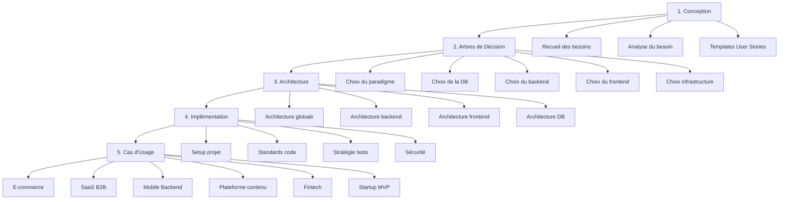
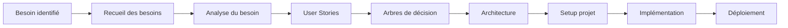

# 🎯 Méthodologie de Conception et d'Architecture de Stack Technique

## 📋 Table des matières
- [Introduction](#introduction)
- [Vue d'ensemble](#vue-densemble)
- [Processus méthodologique](#processus-méthodologique)
- [Guides détaillés](#guides-détaillés)
- [Cas d'usage](#cas-dusage)
- [Ressources](#ressources)

## 🚀 Introduction

Cette méthodologie complète vous guide dans la conception, l'architecture et l'implémentation d'une stack technique robuste et évolutive. Elle couvre tous les aspects depuis le recueil des besoins jusqu'à la mise en production, en passant par les choix architecturaux et les bonnes pratiques.

### 🎯 Objectifs

- **Guider les décisions** : Arbres de décision pour chaque choix technique
- **Standardiser les processus** : Méthodologies reproductibles
- **Accélérer le développement** : Templates et exemples concrets
- **Assurer la qualité** : Bonnes pratiques et standards
- **Faciliter la maintenance** : Architecture évolutive

---

## 🏗️ Vue d'ensemble

### 📊 Processus en 5 phases

---

## 🔄 Processus méthodologique

### 1️⃣ Phase de Conception
**Objectif** : Comprendre et formaliser les besoins

| Étape | Description | Livrable |
|-------|-------------|----------|
| **Recueil des besoins** | Interviews, ateliers, questionnaires | Document de besoins |
| **Analyse du besoin** | Transformation en spécifications | Spécifications techniques |
| **User Stories** | Templates et exemples | Backlog priorisé |

### 2️⃣ Arbres de Décision
**Objectif** : Guider les choix techniques

| Choix | Critères | Impact |
|-------|----------|--------|
| **Paradigme** | POO vs Fonctionnel | Architecture, maintenabilité |
| **Base de données** | SQL vs NoSQL | Performance, scalabilité |
| **Backend** | Framework, architecture | Développement, déploiement |
| **Frontend** | Framework, approche | UX, performance |
| **Infrastructure** | Cloud, containerisation | Coûts, opérationnel |

### 3️⃣ Architecture Technique
**Objectif** : Concevoir l'architecture globale

| Composant | Aspects | Standards |
|-----------|---------|-----------|
| **Globale** | Flux, sécurité, communication | Patterns établis |
| **Backend** | Couches, patterns, structure | Architecture hexagonale |
| **Frontend** | Composants, state, routing | Architecture modulaire |
| **Base de données** | Modélisation, performance | Normalisation, indexation |

### 4️⃣ Implémentation
**Objectif** : Mettre en œuvre selon les standards

| Aspect | Outils | Bonnes pratiques |
|--------|--------|------------------|
| **Setup** | Repositories, config, env | Structure standardisée |
| **Code** | Linting, formatting, docs | Standards équipe |
| **Tests** | Unitaires, intégration, E2E | Coverage, TDD/BDD |
| **Sécurité** | Auth, validation, audit | OWASP, RGPD |

### 5️⃣ Cas d'Usage
**Objectif** : Adapter selon le contexte métier

| Type d'entreprise | Spécificités | Stack recommandée |
|-------------------|--------------|-------------------|
| **E-commerce** | Paiements, stock, catalogues | Vue + NestJS + PostgreSQL |
| **SaaS B2B** | Multi-tenancy, facturation | React + Node.js + MongoDB |
| **Mobile Backend** | API, notifications, offline | Express + Redis + PostgreSQL |
| **Plateforme contenu** | CMS, SEO, performance | Nuxt + Strapi + PostgreSQL |
| **Fintech** | Sécurité, conformité, audit | NestJS + PostgreSQL + Redis |
| **Startup MVP** | Rapidité, coûts, scalabilité | Vue + Express + MongoDB |

---

## 📚 Guides détaillés

### 🎯 Phase de Conception

#### [📋 Recueil des besoins](./01-conception/requirements-gathering.md)
- Méthodologies de recueil (interviews, ateliers, questionnaires)
- Analyse des parties prenantes
- Documentation des besoins fonctionnels et non-fonctionnels
- Priorisation (MoSCoW, Kano)
- Templates et checklist

#### [🔍 Analyse et expression du besoin](./01-conception/needs-analysis.md)
- Transformation des besoins en spécifications
- Identification des contraintes techniques
- Analyse de faisabilité
- Définition du MVP vs produit complet
- Estimation de la charge

#### [📝 Templates de User Stories](./01-conception/user-stories-templates.md)
- Templates génériques par type (CRUD, authentification, paiement, notifications, etc.)
- Templates par domaine métier (e-commerce, SaaS, fintech, etc.)
- Critères d'acceptation types
- Exemples concrets et bonnes pratiques
- Format Gherkin pour les tests

### 🌳 Arbres de Décision

#### [🧩 Choix du paradigme](./02-decision-trees/paradigm-choice.md)
- Arbre de décision POO vs Fonctionnel
- Cas d'usage détaillés
- Approche hybride
- Impact sur l'architecture

#### [🗄️ Choix de la base de données](./02-decision-trees/database-choice.md)
- SQL vs NoSQL
- Choix du moteur (PostgreSQL, MySQL, MongoDB, etc.)
- Architecture de données
- Scalabilité et performance

#### [🚀 Choix du backend](./02-decision-trees/backend-choice.md)
- Node.js vs autres runtimes
- Framework (NestJS, Express, Fastify)
- Architecture (monolithe, microservices, serverless)
- Patterns et structure

#### [🎨 Choix du frontend](./02-decision-trees/frontend-choice.md)
- Framework (Vue, React, Angular, Svelte)
- SSR vs SPA vs SSG vs Hybrid
- State management
- Architecture des composants
- Styling (CSS, Tailwind, CSS-in-JS)

#### [☁️ Choix de l'infrastructure](./02-decision-trees/infrastructure-choice.md)
- Cloud vs On-premise
- Containerisation (Docker, Kubernetes)
- CI/CD
- Monitoring et logging

### 🏗️ Architecture Technique

#### [🌐 Architecture globale](./03-architecture/global-architecture.md)
- Schémas d'architecture
- Flux de données
- Communication entre services
- Sécurité et authentification
- Gestion des erreurs

#### [🔧 Architecture backend](./03-architecture/backend-architecture.md)
- Structure des dossiers
- Couches applicatives (hexagonale)
- Patterns (Repository, Factory, Strategy, etc.)
- Gestion des dépendances
- Configuration et environnements

#### [💻 Architecture frontend](./03-architecture/frontend-architecture.md)
- Structure des dossiers
- Architecture des composants
- State management
- Routing et navigation
- Gestion des API calls

#### [🗃️ Architecture base de données](./03-architecture/database-architecture.md)
- Modélisation des données
- Relations et contraintes
- Indexation et performance
- Migrations et versioning
- Backup et réplication

### ⚙️ Implémentation

#### [🚀 Setup du projet](./04-implementation/project-setup.md)
- Initialisation des repositories
- Configuration des outils
- Structure de base
- Dependencies management
- Environnements (dev, staging, prod)

#### [📏 Standards de code](./04-implementation/coding-standards.md)
- Conventions de nommage
- Formatage (Prettier, ESLint)
- Documentation du code
- Git workflow
- Code review

#### [🧪 Tests](./04-implementation/testing-strategy.md)
- Stratégie de tests (unitaires, intégration, E2E)
- Coverage et qualité
- TDD/BDD
- Mocking et fixtures
- CI/CD pour les tests

#### [🔒 Sécurité](./04-implementation/security.md)
- Authentification et autorisation
- Validation des données
- Protection CSRF, XSS, injection SQL
- Secrets management
- Audit et logging

---

## 🎯 Cas d'usage

### [🛒 E-commerce](./05-use-cases/ecommerce.md)
- Besoins spécifiques (paiements, stock, catalogues)
- Stack recommandée (Vue + NestJS + PostgreSQL)
- Architecture type
- User stories exemples

### [🏢 SaaS B2B](./05-use-cases/saas-b2b.md)
- Multi-tenancy
- Facturation et abonnements
- Intégrations
- Analytics

### [📱 Application mobile backend](./05-use-cases/mobile-backend.md)
- API design
- Push notifications
- Offline-first
- Synchronisation

### [📄 Plateforme de contenu](./05-use-cases/content-platform.md)
- CMS headless
- Gestion des médias
- SEO
- Performance

### [💰 Fintech](./05-use-cases/fintech.md)
- Conformité et régulation
- Sécurité renforcée
- Transactions
- Audit trail

### [🚀 Startup MVP](./05-use-cases/startup-mvp.md)
- Rapidité de développement
- Scalabilité future
- Coûts optimisés
- Stack lean

---

## 📈 Guide de démarrage rapide

### 🎯 Pour commencer

1. **Identifiez votre contexte** : Consultez les [cas d'usage](./05-use-cases/) pour votre type d'entreprise
2. **Recueillez les besoins** : Suivez le [guide de recueil](./01-conception/requirements-gathering.md)
3. **Prenez vos décisions** : Utilisez les [arbres de décision](./02-decision-trees/)
4. **Concevez l'architecture** : Consultez les [guides d'architecture](./03-architecture/)
5. **Implémentez** : Suivez les [guides d'implémentation](./04-implementation/)

### 🔄 Workflow recommandé

---

## 📚 Ressources

### 🎓 Formation
- [Architecture Hexagonale](../architecture/README.md)
- [Design Patterns](../patterns/README.md)
- [Microservices](../architecture/microservices-complete-guide.md)

### 🛠️ Outils
- [Node.js](../nodejs/README.md)
- [Vue.js](../vuejs/README.md)
- [NestJS](../nestjs/README.md)
- [PostgreSQL](../databases/postgresql.md)
- [Docker](../docker/README.md)

### 🧪 Tests
- [Jest](../testing/jest.md)
- [Vitest](../testing/vitest.md)
- [Playwright](../testing/playwright.md)
- [Cypress](../testing/cypress.md)

### 🤖 IA
- [RAG Systems](../ai/rag-systems.md)
- [Prompt Engineering](../ai/prompt-engineering.md)
- [AI Agents](../ai/ai-agents.md)

---

## 🤝 Contribution

Cette méthodologie évolue avec les retours d'expérience. N'hésitez pas à :
- Signaler des améliorations
- Proposer de nouveaux cas d'usage
- Partager vos retours d'expérience
- Contribuer aux templates

---

---

*Dernière mise à jour : Janvier 2024*
