# 🚀 Guide Complet : Méthodologie de Conception et d'Architecture de Stack Technique

## 📋 Table des matières
- [Introduction](#introduction)
- [Vue d'ensemble du processus](#vue-densemble-du-processus)
- [Phase 1 : Conception](#phase-1--conception)
- [Phase 2 : Arbres de Décision](#phase-2--arbres-de-décision)
- [Phase 3 : Architecture](#phase-3--architecture)
- [Phase 4 : Implémentation](#phase-4--implémentation)
- [Phase 5 : Cas d'Usage](#phase-5--cas-dusage)
- [Checklist de validation](#checklist-de-validation)
- [Ressources](#ressources)

## 🎯 Introduction

Ce guide vous accompagne dans la création d'une stack technique complète, depuis l'identification des besoins jusqu'à la mise en production. Il s'agit d'une méthodologie éprouvée qui respecte les meilleures pratiques et vous guide dans chaque décision technique.

### 🎯 Objectifs

- **Structurer le processus** : Méthodologie claire et reproductible
- **Guider les décisions** : Arbres de décision pour chaque choix
- **Accélérer le développement** : Templates et exemples concrets
- **Assurer la qualité** : Standards et bonnes pratiques
- **Faciliter la maintenance** : Architecture évolutive

---

## 🏗️ Vue d'ensemble du processus

### 📊 Processus en 5 phases

```mermaid
graph TD
    A[1. Conception<br/>📋 Recueil & Analyse] --> B[2. Arbres de Décision<br/>🌳 Choix techniques]
    B --> C[3. Architecture<br/>🏗️ Design technique]
    C --> D[4. Implémentation<br/>⚙️ Développement]
    D --> E[5. Cas d'Usage<br/>🎯 Adaptation métier]
    
    A --> A1[Recueil des besoins]
    A --> A2[Analyse du besoin]
    A --> A3[Templates User Stories]
    
    B --> B1[Paradigme POO/Fonctionnel]
    B --> B2[Base de données]
    B --> B3[Backend]
    B --> B4[Frontend]
    B --> B5[Infrastructure]
    
    C --> C1[Architecture globale]
    C --> C2[Architecture backend]
    C --> C3[Architecture frontend]
    C --> C4[Architecture DB]
    
    D --> D1[Setup projet]
    D --> D2[Standards code]
    D --> D3[Stratégie tests]
    D --> D4[Sécurité]
    
    E --> E1[E-commerce]
    E --> E2[SaaS B2B]
    E --> E3[Mobile Backend]
    E --> E4[Plateforme contenu]
    E --> E5[Fintech]
    E --> E6[Startup MVP]
```

### ⏱️ Estimation temporelle

| Phase | Durée estimée | Livrables |
|-------|---------------|-----------|
| **Conception** | 1-2 semaines | Besoins, spécifications, user stories |
| **Arbres de Décision** | 2-3 jours | Stack technique choisie |
| **Architecture** | 1 semaine | Schémas, patterns, structure |
| **Implémentation** | 2-4 semaines | Code, tests, déploiement |
| **Cas d'Usage** | En continu | Adaptation selon le contexte |

---

## 📋 Phase 1 : Conception

### 🎯 Objectif
Comprendre et formaliser les besoins du projet

### 📝 Étapes

#### 1.1 Recueil des besoins
**Durée** : 3-5 jours

- **Interviews** avec les parties prenantes
- **Ateliers** de co-conception
- **Questionnaires** structurés
- **Analyse** des processus existants

**Livrable** : [Document de recueil des besoins](./01-conception/requirements-gathering.md)

#### 1.2 Analyse et expression du besoin
**Durée** : 2-3 jours

- **Transformation** des besoins en spécifications
- **Identification** des contraintes techniques
- **Analyse** de faisabilité
- **Définition** du MVP vs produit complet

**Livrable** : [Spécifications techniques](./01-conception/needs-analysis.md)

#### 1.3 Templates de User Stories
**Durée** : 1-2 jours

- **Templates génériques** (CRUD, auth, paiement, etc.)
- **Templates par domaine** (e-commerce, SaaS, fintech, etc.)
- **Critères d'acceptation** types
- **Format Gherkin** pour les tests

**Livrable** : [Backlog priorisé](./01-conception/user-stories-templates.md)

### ✅ Checklist Phase 1

- [ ] Besoins fonctionnels documentés
- [ ] Besoins non-fonctionnels identifiés
- [ ] Parties prenantes identifiées
- [ ] Contraintes techniques listées
- [ ] MVP défini
- [ ] User stories créées
- [ ] Priorisation effectuée

---

## 🌳 Phase 2 : Arbres de Décision

### 🎯 Objectif
Guider les choix techniques selon le contexte

### 📝 Étapes

#### 2.1 Choix du paradigme
**Durée** : 1 jour

- **POO vs Fonctionnel** selon le contexte
- **Approche hybride** si nécessaire
- **Impact** sur l'architecture

**Guide** : [Arbre de décision paradigme](./02-decision-trees/paradigm-choice.md)

#### 2.2 Choix de la base de données
**Durée** : 1 jour

- **SQL vs NoSQL** selon les besoins
- **Choix du moteur** (PostgreSQL, MongoDB, etc.)
- **Architecture** de données
- **Scalabilité** et performance

**Guide** : [Arbre de décision base de données](./02-decision-trees/database-choice.md)

#### 2.3 Choix du backend
**Durée** : 1 jour

- **Node.js vs autres** runtimes
- **Framework** (NestJS, Express, Fastify)
- **Architecture** (monolithe, microservices, serverless)
- **Patterns** et structure

**Guide** : [Arbre de décision backend](./02-decision-trees/backend-choice.md)

#### 2.4 Choix du frontend
**Durée** : 1 jour

- **Framework** (Vue, React, Angular, Svelte)
- **SSR vs SPA vs SSG** vs Hybrid
- **State management**
- **Architecture** des composants
- **Styling** (CSS, Tailwind, CSS-in-JS)

**Guide** : [Arbre de décision frontend](./02-decision-trees/frontend-choice.md)

#### 2.5 Choix de l'infrastructure
**Durée** : 1 jour

- **Cloud vs On-premise**
- **Containerisation** (Docker, Kubernetes)
- **CI/CD**
- **Monitoring** et logging

**Guide** : [Arbre de décision infrastructure](./02-decision-trees/infrastructure-choice.md)

### ✅ Checklist Phase 2

- [ ] Paradigme choisi (POO/Fonctionnel/Hybride)
- [ ] Base de données sélectionnée
- [ ] Framework backend choisi
- [ ] Framework frontend choisi
- [ ] Infrastructure définie
- [ ] Justifications documentées

---

## 🏗️ Phase 3 : Architecture

### 🎯 Objectif
Concevoir l'architecture technique globale

### 📝 Étapes

#### 3.1 Architecture globale
**Durée** : 2-3 jours

- **Schémas** d'architecture
- **Flux** de données
- **Communication** entre services
- **Sécurité** et authentification
- **Gestion** des erreurs

**Guide** : [Architecture globale](./03-architecture/global-architecture.md)

#### 3.2 Architecture backend
**Durée** : 2-3 jours

- **Structure** des dossiers
- **Couches** applicatives (hexagonale)
- **Patterns** (Repository, Factory, Strategy, etc.)
- **Gestion** des dépendances
- **Configuration** et environnements

**Guide** : [Architecture backend](./03-architecture/backend-architecture.md)

#### 3.3 Architecture frontend
**Durée** : 2-3 jours

- **Structure** des dossiers
- **Architecture** des composants
- **State management**
- **Routing** et navigation
- **Gestion** des API calls

**Guide** : [Architecture frontend](./03-architecture/frontend-architecture.md)

#### 3.4 Architecture base de données
**Durée** : 1-2 jours

- **Modélisation** des données
- **Relations** et contraintes
- **Indexation** et performance
- **Migrations** et versioning
- **Backup** et réplication

**Guide** : [Architecture base de données](./03-architecture/database-architecture.md)

### ✅ Checklist Phase 3

- [ ] Schémas d'architecture créés
- [ ] Flux de données définis
- [ ] Patterns identifiés
- [ ] Structure des dossiers définie
- [ ] Sécurité intégrée
- [ ] Performance anticipée

---

## ⚙️ Phase 4 : Implémentation

### 🎯 Objectif
Mettre en œuvre selon les standards et bonnes pratiques

### 📝 Étapes

#### 4.1 Setup du projet
**Durée** : 1-2 jours

- **Initialisation** des repositories
- **Configuration** des outils
- **Structure** de base
- **Dependencies** management
- **Environnements** (dev, staging, prod)

**Guide** : [Setup du projet](./04-implementation/project-setup.md)

#### 4.2 Standards de code
**Durée** : 1 jour

- **Conventions** de nommage
- **Formatage** (Prettier, ESLint)
- **Documentation** du code
- **Git workflow**
- **Code review**

**Guide** : [Standards de code](./04-implementation/coding-standards.md)

#### 4.3 Stratégie de tests
**Durée** : 2-3 jours

- **Stratégie** de tests (unitaires, intégration, E2E)
- **Coverage** et qualité
- **TDD/BDD**
- **Mocking** et fixtures
- **CI/CD** pour les tests

**Guide** : [Stratégie de tests](./04-implementation/testing-strategy.md)

#### 4.4 Sécurité
**Durée** : 2-3 jours

- **Authentification** et autorisation
- **Validation** des données
- **Protection** CSRF, XSS, injection SQL
- **Secrets** management
- **Audit** et logging

**Guide** : [Sécurité](./04-implementation/security.md)

### ✅ Checklist Phase 4

- [ ] Projet initialisé
- [ ] Outils configurés
- [ ] Standards appliqués
- [ ] Tests implémentés
- [ ] Sécurité intégrée
- [ ] CI/CD configuré

---

## 🎯 Phase 5 : Cas d'Usage

### 🎯 Objectif
Adapter la stack selon le contexte métier

### 📝 Types d'entreprises couverts

#### 5.1 E-commerce
- **Besoins spécifiques** : Paiements, stock, catalogues
- **Stack recommandée** : Vue + NestJS + PostgreSQL
- **Architecture type** : Monolithe modulaire

**Guide** : [Cas d'usage E-commerce](./05-use-cases/ecommerce.md)

#### 5.2 SaaS B2B
- **Besoins spécifiques** : Multi-tenancy, facturation, intégrations
- **Stack recommandée** : React + Node.js + MongoDB
- **Architecture type** : Microservices

**Guide** : [Cas d'usage SaaS B2B](./05-use-cases/saas-b2b.md)

#### 5.3 Application mobile backend
- **Besoins spécifiques** : API, notifications, offline
- **Stack recommandée** : Express + Redis + PostgreSQL
- **Architecture type** : API-first

**Guide** : [Cas d'usage Mobile Backend](./05-use-cases/mobile-backend.md)

#### 5.4 Plateforme de contenu
- **Besoins spécifiques** : CMS, SEO, performance
- **Stack recommandée** : Nuxt + Strapi + PostgreSQL
- **Architecture type** : JAMstack

**Guide** : [Cas d'usage Plateforme de contenu](./05-use-cases/content-platform.md)

#### 5.5 Fintech
- **Besoins spécifiques** : Sécurité, conformité, audit
- **Stack recommandée** : NestJS + PostgreSQL + Redis
- **Architecture type** : Sécurisée

**Guide** : [Cas d'usage Fintech](./05-use-cases/fintech.md)

#### 5.6 Startup MVP
- **Besoins spécifiques** : Rapidité, coûts, scalabilité
- **Stack recommandée** : Vue + Express + MongoDB
- **Architecture type** : Lean

**Guide** : [Cas d'usage Startup MVP](./05-use-cases/startup-mvp.md)

### ✅ Checklist Phase 5

- [ ] Type d'entreprise identifié
- [ ] Besoins spécifiques listés
- [ ] Stack adaptée
- [ ] Architecture ajustée
- [ ] User stories adaptées

---

## ✅ Checklist de validation globale

### 📋 Avant de commencer

- [ ] **Contexte clair** : Type d'entreprise, objectifs, contraintes
- [ ] **Équipe identifiée** : Rôles, compétences, disponibilités
- [ ] **Budget défini** : Coûts développement, infrastructure, maintenance
- [ ] **Timeline établie** : Dates clés, livrables, jalons

### 📋 Phase de conception

- [ ] **Besoins fonctionnels** documentés et validés
- [ ] **Besoins non-fonctionnels** identifiés (performance, sécurité, etc.)
- [ ] **Parties prenantes** identifiées et impliquées
- [ ] **Contraintes techniques** listées (budget, temps, compétences)
- [ ] **MVP défini** avec périmètre clair
- [ ] **User stories** créées avec critères d'acceptation
- [ ] **Priorisation** effectuée (MoSCoW, Kano)

### 📋 Arbres de décision

- [ ] **Paradigme choisi** avec justification
- [ ] **Base de données** sélectionnée selon les besoins
- [ ] **Framework backend** choisi selon l'équipe et les contraintes
- [ ] **Framework frontend** choisi selon l'UX et les performances
- [ ] **Infrastructure** définie selon le budget et la scalabilité
- [ ] **Justifications** documentées pour chaque choix

### 📋 Architecture

- [ ] **Schémas d'architecture** créés et validés
- [ ] **Flux de données** définis et documentés
- [ ] **Patterns** identifiés et appliqués
- [ ] **Structure des dossiers** définie
- [ ] **Sécurité** intégrée dès la conception
- [ ] **Performance** anticipée et optimisée
- [ ] **Scalabilité** prise en compte

### 📋 Implémentation

- [ ] **Projet initialisé** avec la bonne structure
- [ ] **Outils configurés** (linting, formatting, testing)
- [ ] **Standards appliqués** (conventions, documentation)
- [ ] **Tests implémentés** (unitaires, intégration, E2E)
- [ ] **Sécurité intégrée** (auth, validation, protection)
- [ ] **CI/CD configuré** (build, test, déploiement)
- [ ] **Monitoring** mis en place

### 📋 Cas d'usage

- [ ] **Type d'entreprise** identifié et documenté
- [ ] **Besoins spécifiques** listés et priorisés
- [ ] **Stack adaptée** selon le contexte
- [ ] **Architecture ajustée** pour le domaine
- [ ] **User stories adaptées** au métier
- [ ] **Exemples concrets** fournis

---

## 🚀 Démarrage rapide

### 🎯 Pour commencer immédiatement

1. **Identifiez votre contexte** : Consultez les [cas d'usage](./05-use-cases/) pour votre type d'entreprise
2. **Recueillez les besoins** : Suivez le [guide de recueil](./01-conception/requirements-gathering.md)
3. **Prenez vos décisions** : Utilisez les [arbres de décision](./02-decision-trees/)
4. **Concevez l'architecture** : Consultez les [guides d'architecture](./03-architecture/)
5. **Implémentez** : Suivez les [guides d'implémentation](./04-implementation/)

### 🔄 Workflow recommandé

```mermaid
graph LR
    A[Besoin identifié] --> B[Recueil des besoins]
    B --> C[Analyse du besoin]
    C --> D[User Stories]
    D --> E[Arbres de décision]
    E --> F[Architecture]
    F --> G[Setup projet]
    G --> H[Implémentation]
    H --> I[Déploiement]
```

### ⚡ Templates de démarrage

- **E-commerce** : Vue + NestJS + PostgreSQL + Stripe
- **SaaS B2B** : React + Node.js + MongoDB + Auth0
- **Mobile Backend** : Express + Redis + PostgreSQL + Firebase
- **Plateforme contenu** : Nuxt + Strapi + PostgreSQL + Vercel
- **Fintech** : NestJS + PostgreSQL + Redis + AWS
- **Startup MVP** : Vue + Express + MongoDB + Heroku

---

## 📚 Ressources

### 🎓 Formation
- [Architecture Hexagonale](../architecture/README.md)
- [Design Patterns](../patterns/README.md)
- [Microservices](../architecture/microservices-complete-guide.md)

### 🛠️ Outils
- [Node.js](../nodejs/README.md)
- [Vue.js](../vuejs/README.md)
- [NestJS](../nestjs/README.md)
- [PostgreSQL](../databases/postgresql.md)
- [Docker](../docker/README.md)

### 🧪 Tests
- [Jest](../testing/jest.md)
- [Vitest](../testing/vitest.md)
- [Playwright](../testing/playwright.md)
- [Cypress](../testing/cypress.md)

### 🤖 IA
- [RAG Systems](../ai/rag-systems.md)
- [Prompt Engineering](../ai/prompt-engineering.md)
- [AI Agents](../ai/ai-agents.md)

---

## 🤝 Contribution

Cette méthodologie évolue avec les retours d'expérience. N'hésitez pas à :
- Signaler des améliorations
- Proposer de nouveaux cas d'usage
- Partager vos retours d'expérience
- Contribuer aux templates

---

---

*Dernière mise à jour : Janvier 2024*
