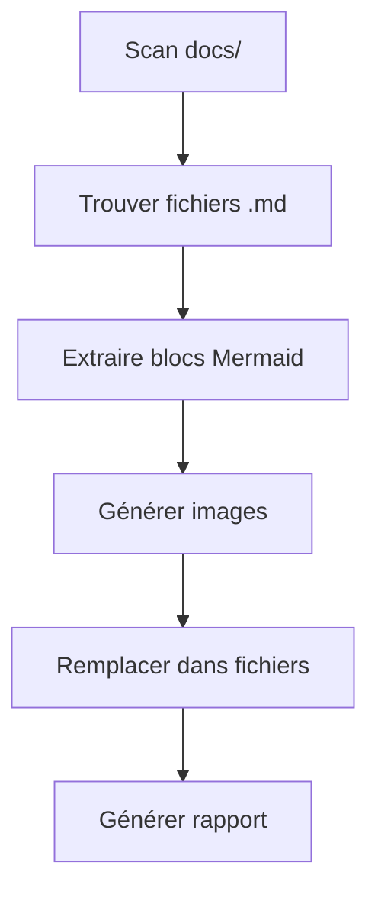
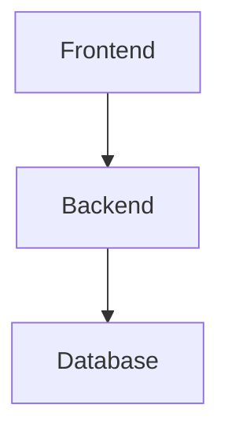

# 🎨 Générateur d'Images Mermaid pour GitHub Profile

Ce script Node.js moderne automatise la génération d'images à partir de vos diagrammes Mermaid pour les utiliser dans votre profil GitHub.

## 🚀 Installation

```bash
# Aller dans le dossier scripts
cd scripts

# Installer les dépendances
npm install

# Ou avec yarn
yarn install
```

## 📋 Prérequis

- Node.js 18+ (ES Modules)
- Puppeteer (installé automatiquement)

## 🎯 Utilisation

### Génération basique

```bash
# Génère toutes les images PNG
npm run generate

# Génère en format SVG
npm run generate:svg

# Génère en format PNG haute résolution
npm run generate:png
```

### Configuration

```bash
# Afficher la configuration actuelle
node config.js show

# Changer le thème
node config.js theme dark

# Changer le format
node config.js format svg

# Changer l'échelle (pour haute résolution)
node config.js scale 3

# Réinitialiser la configuration
node config.js reset
```

## 📁 Structure des fichiers

```
scripts/
├── generate-mermaid-images.js  # Script principal
├── config.js                   # Gestionnaire de configuration
├── package.json               # Dépendances et scripts
└── mermaid-config.json        # Configuration (généré automatiquement)

assets/
└── mermaid/                   # Images générées
    ├── *.png                  # Images PNG
    ├── *.svg                  # Images SVG
    └── generation-report.json # Rapport de génération
```

## ⚙️ Configuration

Le fichier `mermaid-config.json` contient :

```json
{
  "imageFormat": "png",        // Format de sortie (png/svg)
  "imageScale": 2,             // Échelle pour haute résolution
  "theme": "default",          // Thème Mermaid
  "backgroundColor": "white",  // Couleur de fond
  "width": 1200,               // Largeur de la page
  "height": 800,               // Hauteur de la page
  "quality": 90,               // Qualité PNG (1-100)
  "includeSource": false,      // Inclure le code source
  "customCSS": "",             // CSS personnalisé
  "mermaidConfig": {           // Configuration Mermaid
    "flowchart": {
      "useMaxWidth": true,
      "htmlLabels": true
    }
  }
}
```

## 🎨 Thèmes disponibles

- `default` - Thème par défaut
- `dark` - Thème sombre
- `forest` - Thème forest
- `neutral` - Thème neutre
- `base` - Thème de base

## 📊 Fonctionnalités

### ✅ Ce que fait le script

1. **Scan automatique** : Trouve tous les fichiers `.md` dans `docs/`
2. **Extraction** : Identifie les blocs ````mermaid`
3. **Génération** : Crée des images PNG/SVG via Puppeteer
4. **Remplacement** : Met à jour les fichiers avec les liens d'images
5. **Rapport** : Génère un rapport détaillé

### 🔄 Workflow



## 🛠️ Scripts disponibles

```bash
# Génération
npm run generate          # Génère toutes les images
npm run generate:svg      # Force le format SVG
npm run generate:png      # Force le format PNG

# Nettoyage
npm run clean            # Supprime toutes les images générées
```

## 📝 Exemple d'utilisation

### Avant (diagramme Mermaid)
````markdown

````

### Après (image générée)
```markdown

```

## 🚨 Résolution de problèmes

### Erreur Puppeteer
```bash
# Sur Linux, installer les dépendances système
sudo apt-get install -y gconf-service libasound2 libatk1.0-0 libc6 libcairo2 libcups2 libdbus-1-3 libexpat1 libfontconfig1 libgcc1 libgconf-2-4 libgdk-pixbuf2.0-0 libglib2.0-0 libgtk-3-0 libnspr4 libpango-1.0-0 libpangocairo-1.0-0 libstdc++6 libx11-6 libx11-xcb1 libxcb1 libxcomposite1 libxcursor1 libxdamage1 libxext6 libxfixes3 libxi6 libxrandr2 libxrender1 libxss1 libxtst6 ca-certificates fonts-liberation libappindicator1 libnss3 lsb-release xdg-utils wget
```

### Erreur de mémoire
```bash
# Augmenter la limite de mémoire Node.js
node --max-old-space-size=4096 generate-mermaid-images.js
```

### Images de mauvaise qualité
```bash
# Augmenter l'échelle
node config.js scale 3
```

## 📈 Performance

- **Vitesse** : ~2-5 secondes par diagramme
- **Mémoire** : ~100-200MB par diagramme
- **Taille** : PNG ~50-200KB, SVG ~10-50KB

## 🔧 Personnalisation avancée

### CSS personnalisé
```json
{
  "customCSS": ".mermaid { background: linear-gradient(45deg, #f0f0f0, #e0e0e0); }"
}
```

### Configuration Mermaid avancée
```json
{
  "mermaidConfig": {
    "flowchart": {
      "curve": "basis",
      "padding": 20
    },
    "sequence": {
      "actorMargin": 100
    }
  }
}
```

## 📞 Support

Pour toute question ou problème :
1. Vérifiez les logs de génération
2. Consultez le rapport dans `assets/mermaid/generation-report.json`
3. Testez avec un diagramme simple d'abord

---

*Script créé pour automatiser la génération d'images Mermaid pour GitHub Profile*
